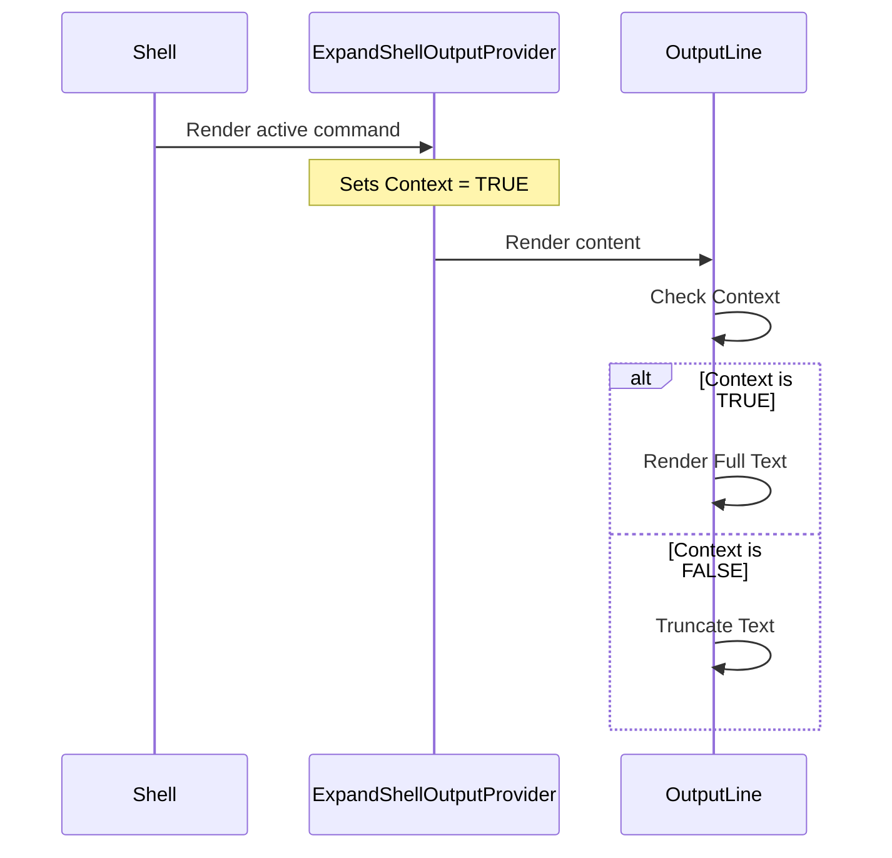

# Chapter 1: Output Visibility Context

Welcome to the **Shell** project tutorial! In this first chapter, we will explore a foundational mechanism that helps keep our terminal clean and readable: the **Output Visibility Context**.

## Motivation: The Cluttered Terminal Problem

Imagine you run a command that produces 500 lines of output (like reading a large file).
1.  **Right now:** You want to see *all* 500 lines to find specific information.
2.  **10 minutes later:** You run five other commands. That old 500-line output is now just cluttering your scrollback history. You only need a summary of it.

We need a way to tell the shell: *"Hey, for this specific command I just ran, show me everything! But for the older stuff, keep it short."*

This is exactly what the **Output Visibility Context** does. It acts like a spotlight. When the spotlight is on a component, it reveals full detail. When the spotlight moves away, the component automatically collapses or truncates itself to save space.

## Key Concepts

To understand this, we need to look at three simple parts:

1.  **The Signal (Context):** A hidden boolean flag (`true` or `false`) passed down the component tree.
2.  **The Switch (Provider):** A wrapper component that turns the signal to `true`.
3.  **The Viewer (Consumer):** The text component that checks the signal to decide: "Should I show 5 lines or 500 lines?"

## How to Use It

Using this context is very straightforward. You wrap any section of your UI that deserves "Full Attention" inside the `ExpandShellOutputProvider`.

### Example Scenario
Let's say we have a component called `<CommandResult />`. By default, it might truncate long text. To force it to show everything, we wrap it like this:

```tsx
import { ExpandShellOutputProvider } from './ExpandShellOutputContext';

function ActiveCommandArea() {
  return (
    // We wrap the result in the Provider to say: 
    // "Everything inside here is important! Show it fully."
    <ExpandShellOutputProvider>
       <CommandResult output="...very long output..." />
    </ExpandShellOutputProvider>
  );
}
```

In the code above, `<CommandResult />` (or any of its children) can detect that it is inside the provider and behave accordingly.

## Internal Implementation

Let's peek under the hood to see how this is built. It relies on standard React Context, but creates a specific vocabulary for our shell.

### High-Level Flow

When the shell renders output, it asks a question: "Is this the most recent user command?" If yes, it flips the switch.



### The Code Details

There are two main files involved. Let's break them down.

#### 1. The Context Definition
File: `ExpandShellOutputContext.tsx`

First, we create the context. Think of this as creating the "frequency" that our components will listen to.

```tsx
import * as React from 'react';
import { useContext } from 'react';

// Default is false (truncated/compact view)
const ExpandShellOutputContext = React.createContext(false);

// Helper hook to let components listen to the signal
export function useExpandShellOutput() {
  return useContext(ExpandShellOutputContext);
}
```

**Explanation:** We create a context defaulting to `false`. We also export a custom hook `useExpandShellOutput()` so we don't have to type `useContext(...)` every time we want to check the value.

#### 2. The Provider Component
File: `ExpandShellOutputContext.tsx`

This is the wrapper component. It doesn't render any UI of its own; it just sets the context value to `true` for its children.

```tsx
export function ExpandShellOutputProvider({ children }) {
  return (
    // Any child inside here will see the value as TRUE
    <ExpandShellOutputContext.Provider value={true}>
      {children}
    </ExpandShellOutputContext.Provider>
  );
}
```

**Explanation:** This is the "Switch." Any component placed inside `{children}` will now receive `true` when they ask for the visibility context.

#### 3. The Consumer Logic
File: `OutputLine.tsx`

Finally, here is where the decision happens. The `OutputLine` component (which renders text) checks the context.

```tsx
export function OutputLine({ content, verbose }) {
  // 1. Check the context signal
  const expandShellOutput = useExpandShellOutput();

  // 2. Decide visibility: 
  // Show full if manually set to verbose OR if context says expand
  const shouldShowFull = verbose || expandShellOutput;

  // ... rendering logic continues ...
}
```

**Explanation:**
1.  We call our hook `useExpandShellOutput()`.
2.  We calculate `shouldShowFull`. If the context is `true`, `shouldShowFull` becomes `true`.
3.  Later in the code (covered in the next chapter), this boolean determines if we run the truncation logic or the full-text logic.

## Summary

In this chapter, we learned about the **Output Visibility Context**:

1.  It solves the problem of terminal clutter by allowing specific parts of the tree to be "expanded" automatically.
2.  It uses a **Provider** to define a zone where output should be fully visible.
3.  It uses a **Hook** (`useExpandShellOutput`) to let components know if they are inside that zone.

Now that we know *how* to tell a component to show full text, we need to understand how the shell actually renders that text, handles colors, and truncates it when necessary.

[Next Chapter: Smart Output Line Rendering](02_smart_output_line_rendering.md)

---

Generated by [Code IQ](https://github.com/adityasoni99/Code-IQ)