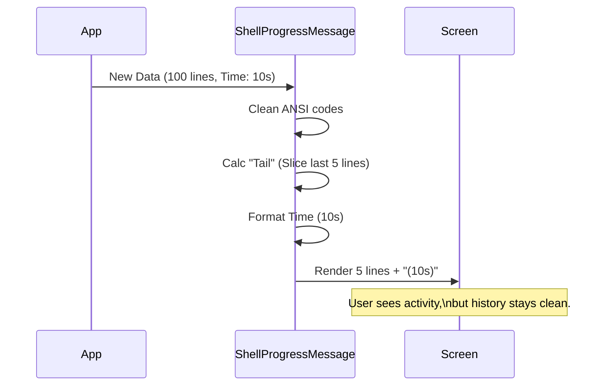

# Chapter 3: Execution Progress Feedback

Welcome back! In the previous chapter, [Smart Output Line Rendering](02_smart_output_line_rendering.md), we learned how to make static text look beautiful by formatting JSON and creating clickable links.

However, a shell isn't just about showing results—it's about running tasks. Some tasks take a long time.

## Motivation: The "Is It Stuck?" Problem

Imagine running a script that installs dependencies or compiles code. It takes 2 minutes.

**Without Progress Feedback:**
You see a blinking cursor. You stare at it.
*   "Is it working?"
*   "Did it freeze?"
*   "Should I press Ctrl+C?"

**With Standard Output:**
The script prints 5,000 lines of "Installing x..." "Verifying y..."
Your terminal scrollbar goes crazy. You lose context of what you were doing before.

**The Solution:**
We need a **Dashboard**. We want a component that sits at the bottom of the screen, updates in real-time to show us the command is alive, but **only shows the most recent activity** (the "tail") so it doesn't flood our history.

## Key Concepts

To build this dashboard, we need three specific elements:

1.  **The Tail:** A sliding window that only shows the last few lines of output (e.g., the last 5 lines).
2.  **The Clock:** A timer that counts up (e.g., `(12s)`) so you know the shell is responsive.
3.  **The Stats:** Summary data like "1000 lines generated" or "5MB processed," so you know work is happening even if text isn't printing.

## How to Use It

The main component is `<ShellProgressMessage />`. It acts as the manager for active processes.

### Basic Usage

You pass the current output and the elapsed time to the component.

```tsx
import { ShellProgressMessage } from './ShellProgressMessage';

function ActiveTask() {
  // Imagine this output is growing every second
  const currentOutput = "Step 1... \nStep 2... \nStep 3...";
  
  return (
    <ShellProgressMessage 
      output={currentOutput}
      elapsedTimeSeconds={12} 
    />
  );
}
```

**What the user sees:**
```text
Step 1...
Step 2...
Step 3...
(12s)
```

If `currentOutput` grew to 100 lines, the user would still only see the last 5 lines, keeping the UI clean.

## Internal Implementation

How does the shell manage this "Live Dashboard"? It relies on a render loop that checks the output length and the clock.

### High-Level Flow



### Code Deep Dive

Let's look at the implementation. We have two files: one for the clock, and one for the message logic.

#### 1. The Clock (`ShellTimeDisplay.tsx`)

This component is simple. It takes a number (seconds) and formats it into a human-readable string.

```tsx
import { Text } from '../../ink.js';
import { formatDuration } from '../../utils/format.js';

export function ShellTimeDisplay({ elapsedTimeSeconds, timeoutMs }) {
  if (elapsedTimeSeconds === undefined) return null;

  // Convert seconds to milliseconds for formatting
  const elapsed = formatDuration(elapsedTimeSeconds * 1000);

  // Render text in a dim color so it's not distracting
  return <Text dimColor>({elapsed})</Text>;
}
```

**Explanation:**
1.  We check if `elapsedTimeSeconds` exists.
2.  We use a helper `formatDuration` to turn `12` into `"12s"` or `65` into `"1m 5s"`.
3.  We render it using `dimColor` (grey) because the time is metadata, not the main content.

#### 2. The Logic (`ShellProgressMessage.tsx`)

This is where the magic happens. We need to decide what to show based on the **Output Visibility Context** (from [Chapter 1](01_output_visibility_context.md)).

**Step A: Preparing the Data**
First, we clean the input. Raw output often contains hidden "ANSI" codes (colors, cursor movements) that can mess up our line counting.

```tsx
import stripAnsi from 'strip-ansi';

export function ShellProgressMessage({ output, verbose }) {
  // 1. Clean the text so we can count lines accurately
  const strippedOutput = stripAnsi(output.trim());
  
  // 2. Split into an array of lines
  const lines = strippedOutput.split("\n");
  
  // ... continued below
```

**Step B: The "Tail" Logic**
Here is the core decision: Do we show everything, or just the tail?

```tsx
  // ... inside ShellProgressMessage
  
  // If 'verbose' is true (Chapter 1), show EVERYTHING.
  // Otherwise, slice the array to take only the last 5 elements.
  const displayLines = verbose 
      ? output 
      : lines.slice(-5).join("\n");

  const extraLines = Math.max(0, lines.length - 5);
```

**Explanation:**
1.  If `verbose` is true (the user wants full details), we ignore the tail logic.
2.  If `verbose` is false (default), `lines.slice(-5)` throws away the history and keeps the active bottom section.
3.  We calculate `extraLines` to tell the user what they are missing (e.g., "+ 45 lines").

**Step C: Rendering the Dashboard**
Finally, we combine the text, the "hidden lines" counter, and the clock.

```tsx
  return (
    <Box flexDirection="column">
      {/* 1. The Output Window */}
      <Box height={verbose ? undefined : 5} overflow="hidden">
        <Text dimColor>{displayLines}</Text>
      </Box>

      {/* 2. The Status Footer */}
      <Box flexDirection="row" gap={1}>
        {/* Show how many lines are hidden */}
        {!verbose && extraLines > 0 && (
           <Text dimColor>+{extraLines} lines</Text>
        )}
        
        {/* Show the Clock */}
        <ShellTimeDisplay elapsedTimeSeconds={elapsedTimeSeconds} />
      </Box>
    </Box>
  );
}
```

**Explanation:**
1.  We create a `Box` to hold our output. If not verbose, we lock the height to `5`.
2.  We render the `displayLines`.
3.  Below that, we create a footer row.
4.  We show `+X lines` so the user knows, "Hey, there's more data here hidden to save space."
5.  We add the `<ShellTimeDisplay />` we built earlier.

## Summary

In this chapter, we built **Execution Progress Feedback**.

1.  We solved the "frozen terminal" anxiety by adding a **Live Clock**.
2.  We solved the "wall of text" problem by implementing a **Tail (Sliding Window)** that only shows the last 5 lines.
3.  We integrated with the concepts from [Chapter 1](01_output_visibility_context.md) to allow the user to toggle between "Dashboard Mode" (summary) and "Full Mode" (verbose).

At this point, you have a fully functional shell UI system! You can control visibility, render pretty text, and provide real-time feedback during long tasks.

**This concludes the beginner tutorial for the Shell project.**

---

Generated by [Code IQ](https://github.com/adityasoni99/Code-IQ)