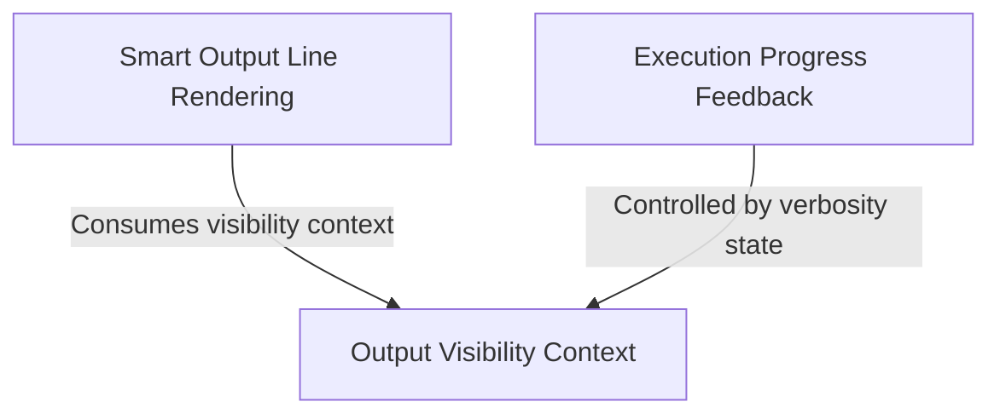

# Tutorial: shell

This project provides a **React-based terminal UI** for shell interactions, focusing on readability and user feedback. It features **Smart Output Line Rendering** to prettify JSON and linkify text, **Execution Progress Feedback** to show live timers and output tails for running commands, and an **Output Visibility Context** to intelligently manage **verbosity** (auto-expanding or truncating content) across the component tree.

## Chapters

1. [Output Visibility Context](01_output_visibility_context.md)
2. [Smart Output Line Rendering](02_smart_output_line_rendering.md)
3. [Execution Progress Feedback](03_execution_progress_feedback.md)

---

Generated by [Code IQ](https://github.com/adityasoni99/Code-IQ)