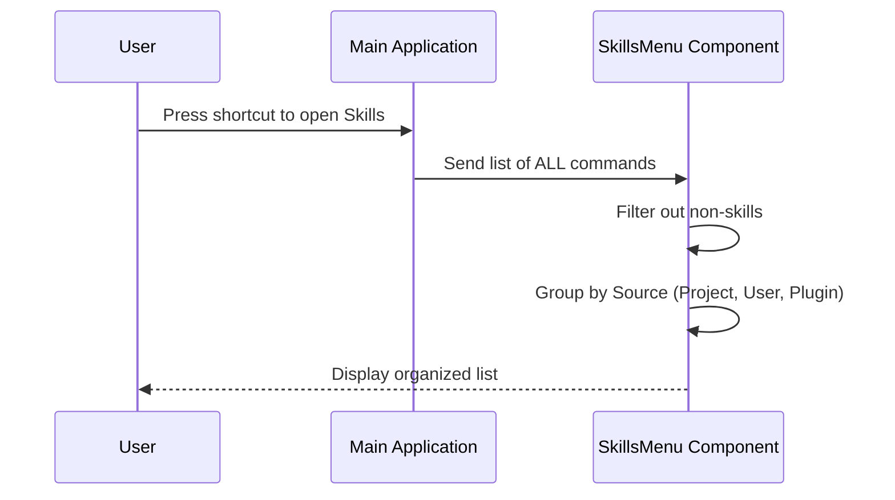

# Chapter 1: Skills Menu Interface

Welcome to the `skills` project! 🚀

In this first chapter, we are going to explore the **Skills Menu Interface**. If you think of your AI tools as a toolbox, this interface is the drawer system that keeps everything organized so you can find exactly what you need, right when you need it.

## 1. The Motivation: Why do we need a Menu?

Imagine you have written 50 different prompts for your AI. Some rewrite code, some write emails, and others summarize PDFs.
*   **The Problem:** If all these commands are just a giant, unorganized list, you’ll spend more time searching for the command than actually using it.
*   **The Solution:** The `SkillsMenu` component.

It acts like a **Software Launcher** or a **Catalog**. It takes a messy pile of commands, filters out the ones that aren't "skills" (prompt-based capabilities), and organizes the rest into neat categories based on where they came from.

## 2. Key Concepts

Before looking at the code, let's understand the three jobs this component does:

1.  **Filtering:** It looks at *everything* the app can do and says, "Show me only the AI skills."
2.  **Grouping:** It sorts skills into buckets like "Project Settings" (specific to your current work) or "User Settings" (your global favorites).
3.  **Displaying:** It renders a visual list in your terminal, showing the skill name and helpful details like how much "brain power" (tokens) it uses.

## 3. Visualizing the Process

Here is what happens under the hood when you open the Skills Menu:



## 4. Internal Implementation

Let's look at how this is built using React. This component uses a library called `Ink` to render React components inside a command-line terminal.

### Step 1: Receiving and Filtering Commands

The component receives a prop called `commands`. This is the raw list. We first need to filter this list to find only the skills.

> **Note:** A "Skill" in this context is a command with `type: 'prompt'`. To learn exactly what makes up a skill, check out [Chapter 2: Skill Command Structure](02_skill_command_structure.md).

```tsx
// SkillsMenu.tsx (Simplified Logic)

// We only want commands that are 'prompts'
// and come from valid sources like 'skills' or 'plugins'
const skills = useMemo(() => {
  return commands.filter(cmd => 
    cmd.type === 'prompt' && 
    (cmd.loadedFrom === 'skills' || cmd.loadedFrom === 'plugin' || cmd.loadedFrom === 'mcp')
  );
}, [commands]);
```

**Explanation:**
The code above acts like a bouncer at a club. It checks every command. If the command isn't a 'prompt' type, or if it doesn't come from a recognized source (like a plugin or an MCP server), it gets rejected.

### Step 2: Grouping by Source

Once we have our clean list of skills, we need to organize them. We create "buckets" for each source.

> **Note:** To understand where these skills come from, refer to [Chapter 3: Skill Sources & Scoping](03_skill_sources___scoping.md).

```tsx
// Creating buckets for our skills
const groups = {
  projectSettings: [], // Skills specific to this folder
  userSettings: [],    // Your global skills
  plugin: [],          // Skills from installed plugins
  mcp: []              // Skills from AI servers
};

// Sorting skills into buckets
for (const skill of skills) {
  if (skill.source in groups) {
    groups[skill.source].push(skill);
  }
}
```

**Explanation:**
We initialize an empty object with keys for each category. We then loop through our filtered skills and drop them into the matching bucket based on their `source` property.

### Step 3: Rendering the List

Finally, we display the groups. If a group is empty (e.g., you have no plugins installed), we simply don't render that section.

```tsx
const renderSkillGroup = (source) => {
  const groupSkills = skillsBySource[source];
  
  // If the bucket is empty, don't show anything
  if (groupSkills.length === 0) return null;

  return (
    <Box flexDirection="column" key={source}>
      <Text bold dimColor>{getSourceTitle(source)}</Text>
      {groupSkills.map(skill => renderSkill(skill))}
    </Box>
  );
};
```

**Explanation:**
This function takes a source name (like 'plugin'). It grabs the skills for that source. It prints a nice bold header (e.g., "**Plugin skills**"), and then loops through the skills to print each one individually.

### Step 4: Displaying Individual Skills

For each skill, we want to show its name and some metadata.

> **Note:** We calculate "tokens" to help the user know how expensive a prompt is. We cover this in [Chapter 5: Token Estimation & Metadata](05_token_estimation___metadata.md).

```tsx
const renderSkill = (skill) => {
  // We calculate tokens here (simplified)
  const tokenDisplay = `~${formatTokens(skill.estimatedTokens)}`;

  return (
    <Box key={skill.name}>
      <Text>{skill.name}</Text>
      <Text dimColor> · {tokenDisplay} tokens</Text>
    </Box>
  );
}
```

**Explanation:**
This renders a single line in the terminal. It shows the command name on the left, and on the right (in a dimmer color), it shows the token estimation. This helps the user make informed choices.

## 5. Integrating External Tools (MCP)

You might have noticed `mcp` in the grouping logic. This stands for **Model Context Protocol**.

The `SkillsMenu` treats MCP skills just like any other skill, but groups them separately so you know they are coming from an external AI server.

> **Deep Dive:** We will explain how the menu communicates with these servers in [Chapter 4: MCP (Model Context Protocol) Integration](04_mcp__model_context_protocol__integration.md).

## Summary

In this chapter, we learned:
1.  The **Skills Menu** is the central dashboard for the user.
2.  It **Filters** raw commands to isolate AI skills.
3.  It **Groups** them by source (User vs. Project vs. Plugin).
4.  It **Renders** them nicely using `Ink` components.

Now that we have a menu to display them, let's look at what actually makes up a "Skill" in the code.

[Next Chapter: Skill Command Structure](02_skill_command_structure.md)

---

Generated by [Code IQ](https://github.com/adityasoni99/Code-IQ)