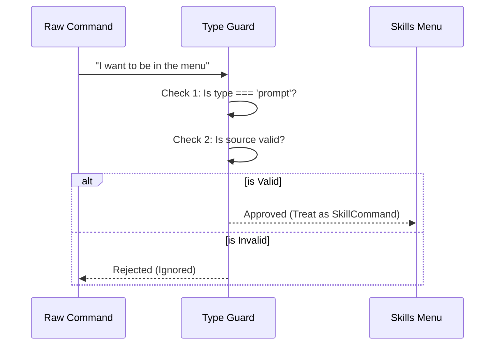

# Chapter 2: Skill Command Structure

Welcome back! 👋

In the previous chapter, [Chapter 1: Skills Menu Interface](01_skills_menu_interface.md), we looked at the visual menu that users interact with. But for that menu to work, it needs to know exactly what a "skill" is.

In this chapter, we are going to look at the **Skill Command Structure**.

## 1. The Motivation: The "ID Card" Problem

Imagine you are running a high-security facility (your AI Application). People are trying to enter—some are **Skills** (helpful prompts), others are just generic system commands or configuration scripts.

*   **The Problem:** Without a standardized ID card, the application doesn't know who is who. It doesn't know which name to display, or whether the command is safe to run as a prompt.
*   **The Solution:** The `SkillCommand` structure.

Think of `SkillCommand` as a **Standardized ID Card**. It forces every AI tool to follow a strict contract: "You must have a Name, a Description, and a specific Type."

## 2. Key Concepts

To understand the code, we need to understand the hierarchy. In this project, a Skill isn't just a random object; it builds upon existing foundations.

1.  **Command:** The generic parent. Anything the app can run (like "Save File" or "Quit").
2.  **PromptCommand:** A specific type of command intended to be sent to an AI model.
3.  **SkillCommand:** The final product. It is a `PromptCommand` that lives in a specific place (Source) and has metadata attached to it.

### The "Contract"

For the code to accept an object as a Skill, it must satisfy two main rules:
1.  **Type:** It must explicitly say `type: 'prompt'`.
2.  **Source:** It must come from a valid location (like your user settings or a plugin).

## 3. The Data Structure

Let's look at what this "ID Card" looks like in data. This is the blueprint that the [Skills Menu Interface](01_skills_menu_interface.md) reads to display the list.

### A Simple Skill Example

If you created a skill called "Fix Code," the application converts it into an object looking something like this:

```javascript
const fixCodeSkill = {
  name: "fix-code",       // The ID on the card
  type: "prompt",         // CRITICAL: Tells the app this is an AI skill
  description: "Finds bugs in selected code",
  source: "userSettings", // Where this skill lives
  estimatedTokens: 150    // How "heavy" this skill is
};
```

If `type` were missing, or set to `'system'`, the Menu would ignore it completely.

## 4. Visualizing the Validation

How does the application decide if a command is worthy of being called a `SkillCommand`?



## 5. Internal Implementation

Let's look at the actual TypeScript code that enforces this structure.

### Defining the Type

In the code, we define a `SkillCommand` by combining two existing definitions.

```typescript
// SkillsMenu.tsx

import { type CommandBase, type PromptCommand } from '../../commands.js';

// A Skill is a PromptCommand that also has basic Command properties
type SkillCommand = CommandBase & PromptCommand;
```

**Explanation:**
This is an "Intersection Type". We are saying a Skill must have everything a base command has (like an ID) **AND** everything a prompt command has (like prompt text).

### The "Bouncer" Function

In Chapter 1, we saw a filter function. Now lets understand exactly what checks it performs.

```typescript
// SkillsMenu.tsx

function isSkill(cmd) {
  // 1. Must be a prompt
  const isPrompt = cmd.type === 'prompt';
  
  // 2. Must come from a valid home
  const isValidSource = 
    cmd.loadedFrom === 'skills' || 
    cmd.loadedFrom === 'plugin' || 
    cmd.loadedFrom === 'mcp';

  return isPrompt && isValidSource;
}
```

**Explanation:**
This logic ensures that internal system commands (which might have `type: 'system'`) never accidentally show up in your list of AI tools.

> **Note:** The property `loadedFrom` tells us the origin of the skill. We will explore exactly what 'skills', 'plugin', and 'mcp' mean in [Chapter 3: Skill Sources & Scoping](03_skill_sources___scoping.md).

### Using the Structure for Display

Once the application knows it has a valid `SkillCommand`, it can safely access properties like `pluginInfo`.

```typescript
// SkillsMenu.tsx

const renderSkill = (skill: SkillCommand) => {
  // Because we know it's a SkillCommand, we can check for plugins
  const pluginName = skill.source === 'plugin' 
    ? skill.pluginInfo?.pluginManifest.name 
    : undefined;

  // ... render logic
}
```

**Explanation:**
Because we strictly defined the structure, TypeScript allows us to safely ask, "Does this skill have plugin info?" without crashing the application if the skill is a simple text file.

## Summary

In this chapter, we learned:
1.  **SkillCommand** is the "ID Card" for AI tools.
2.  It creates a strict **Contract**: a skill must be a `prompt` and have a valid `source`.
3.  This structure allows the **Menu** to safely read details like descriptions and plugin names.

But where do these skills actually live on your computer? And how does the app know which ones belong to a specific project?

[Next Chapter: Skill Sources & Scoping](03_skill_sources___scoping.md)

---

Generated by [Code IQ](https://github.com/adityasoni99/Code-IQ)