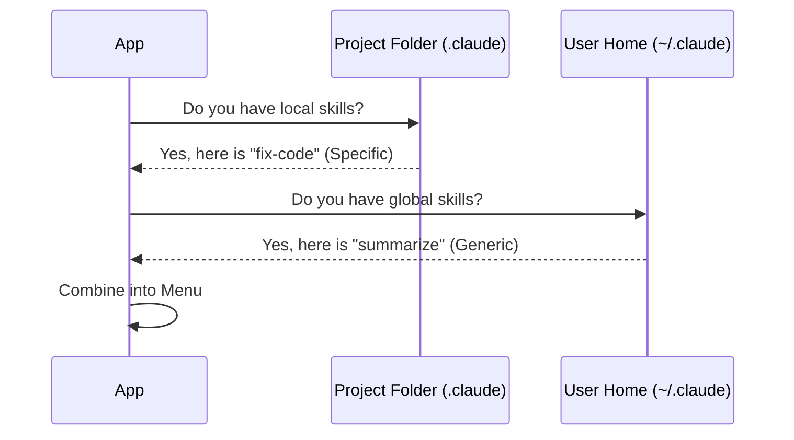

# Chapter 3: Skill Sources & Scoping

Welcome back! 👋

In [Chapter 2: Skill Command Structure](02_skill_command_structure.md), we defined the "ID Card" that every skill must have. We know *what* a skill is. Now, we need to answer: **Where do they live?**

In this chapter, we will explore **Skill Sources & Scoping**.

## 1. The Motivation: Backpack vs. Desk Drawer

Imagine you are a software engineer working on two different projects: a website for a Bank and a game for a Startup.

*   **The Problem:** You have a skill called "Check Code Style."
    *   For the **Bank**, the style must be strict and formal.
    *   For the **Startup**, the style should be loose and fast.
    *   You also have a skill called "Summarize Email" that you want to use *everywhere*, regardless of which project you are working on.

*   **The Solution:** Scoping.

Just like variable scope in programming (Global vs. Local variables), we categorize skills based on where they are stored:
1.  **User Settings (Global):** Like a backpack. You carry these skills with you to every project (e.g., "Summarize Email").
2.  **Project Settings (Local):** Like a desk drawer. These skills only exist when you are inside that specific project folder (e.g., "Bank Code Style").

## 2. Key Concepts

The system uses a concept called `SkillSource` to define these locations. Here are the three main sources you will see in the code:

1.  **`userSettings`**:
    *   **Location:** `~/.claude/skills` (your home directory).
    *   **Scope:** Available globally in any terminal window.
2.  **`projectSettings`**:
    *   **Location:** `.claude/skills` (inside your current working folder).
    *   **Scope:** Available only when you open the CLI in that folder.
3.  **`policySettings`**:
    *   **Location:** Managed by system administrators.
    *   **Scope:** Enforced rules that you cannot easily change.

## 3. Visualizing the Hierarchy

When the application starts, it looks at the file system layers to build your toolbox.



## 4. Internal Implementation

Let's look at how the code handles these different locations.

### Step 1: Defining the Sources

In the code, we don't just use random strings. We define a specific type to ensure we only look in valid places.

```typescript
// utils/settings/constants.ts (Simplified)

export type SettingSource = 
  | 'projectSettings'  // Local folder
  | 'userSettings'     // Global home dir
  | 'policySettings';  // Corporate rules
```

**Explanation:**
This TypeScript definition restricts the application. It prevents us from accidentally trying to load skills from a temporary folder or an invalid location.

### Step 2: Finding the Path

How does the code know where `.claude/skills` is? We use a helper function to calculate the file path based on the source.

```typescript
// skills/loadSkillsDir.ts

export function getSkillsPath(source, type) {
  // If local, look in the current working directory
  if (source === 'projectSettings') {
    return path.join(process.cwd(), '.claude', type);
  }
  
  // If global, look in the user's home directory
  return path.join(os.homedir(), '.claude', type);
}
```

**Explanation:**
*   `process.cwd()`: Gets the folder you are currently typing in (Current Working Directory).
*   `os.homedir()`: Gets your main user folder (e.g., `C:\Users\Name` or `/Users/Name`).
This ensures that `projectSettings` change as you move folders, but `userSettings` stay constant.

### Step 3: Grouping for the Menu

In [Chapter 1: Skills Menu Interface](01_skills_menu_interface.md), we saw the menu rendering code. Now we can fully understand how it groups these items using the source we identified.

```typescript
// SkillsMenu.tsx

// 1. Create buckets for each source
const groups = {
  projectSettings: [], 
  userSettings: [],
  policySettings: [] 
};

// 2. Sort skills into buckets
for (const skill of skills) {
  // skill.source was determined when the file was loaded
  if (skill.source in groups) {
    groups[skill.source].push(skill);
  }
}
```

**Explanation:**
The `SkillsMenu` doesn't need to know file paths. It simply trusts the `skill.source` property. This separation of concerns is excellent design: the *Loader* figures out paths, and the *Menu* just displays the category.

### Step 4: Displaying the Origin

The menu helps the user distinguish between these sources visually.

```typescript
// SkillsMenu.tsx

function getSourceTitle(source) {
  // Converts 'projectSettings' -> 'Project skills'
  return `${capitalize(getSettingSourceName(source))} skills`;
}
```

**Explanation:**
This small utility function transforms the internal variable name (`projectSettings`) into a friendly title for the user interface ("Project skills"), making the list easy to read.

## 5. Why this matters for the User

Understanding scoping solves the "Collision" problem.

If you have a skill named `test` in your User settings, and a skill named `test` in your Project settings, the application needs to know they are different (or which one takes priority).

By explicitly tracking the `source`, the UI can:
1.  Show you both skills in different sections.
2.  Allow you to override a global behavior with a local project specific behavior.

## Summary

In this chapter, we learned:
1.  **Scope** determines where a skill lives and when it is active.
2.  **User Settings** are global (Backpack), **Project Settings** are local (Desk Drawer).
3.  The code calculates file paths dynamically using `process.cwd()` and `os.homedir()`.

Now we have skills loaded from files on your computer. But what if a skill doesn't come from a file at all? What if it comes from a live AI server running somewhere else?

[Next Chapter: MCP (Model Context Protocol) Integration](04_mcp__model_context_protocol__integration.md)

---

Generated by [Code IQ](https://github.com/adityasoni99/Code-IQ)