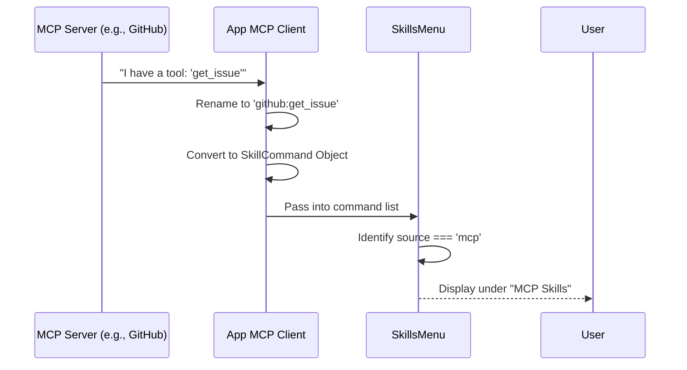

# Chapter 4: MCP (Model Context Protocol) Integration

Welcome back! 👋

In [Chapter 3: Skill Sources & Scoping](03_skill_sources___scoping.md), we learned how the application loads skills from files in your user or project folders.

But what if a skill is too complex to be a simple text file? What if a skill needs to query a database, execute Python code, or search the internet? These capabilities usually live on external "servers."

In this chapter, we explore **MCP (Model Context Protocol) Integration**.

## 1. The Motivation: The Universal Translator

Imagine you want your AI to have tools from many different sources:
1.  A **GitHub** tool to read issues.
2.  A **PostgreSQL** tool to query data.
3.  A **Google Drive** tool to read documents.

**The Problem:** Writing custom code to connect to every single one of these services inside your app is messy and hard to maintain.

**The Solution:** The **Model Context Protocol (MCP)**.
Think of MCP as a "Universal Translator" or a USB port for AI tools. The application doesn't need to know *how* Google Drive works. It just connects to an "MCP Server," and that server hands over a list of tools.

Our job in the `skills` project is to take those external tools and make them look and feel exactly like the local skills we studied in previous chapters.

## 2. Key Concepts

To integrate these external tools into our menu, we need to understand three things:

1.  **The Source:** These skills are identified by `source: 'mcp'` (instead of `userSettings` or `projectSettings`).
2.  **The Naming Convention:** Because these tools come from specific servers, their names usually follow a pattern: `server-name:tool-name`.
3.  **The Visual Grouping:** We don't want to mix remote database tools with your local text snippets. We want to group them together.

## 3. Visualizing the Integration

Here is how an external tool travels from a remote server to your terminal menu.



## 4. Internal Implementation

Let's look at how the `SkillsMenu` component handles these special skills.

### Step 1: Identifying MCP Skills

Just like we filtered for local files in previous chapters, we explicitly look for the string `'mcp'`.

```typescript
// SkillsMenu.tsx

// Filter commands to find skills
const isMcpSkill = (cmd) => {
  return cmd.type === 'prompt' && cmd.loadedFrom === 'mcp';
};
```

**Explanation:**
This ensures that tools coming from the Model Context Protocol are recognized as valid skills, satisfying the "ID Card" contract we discussed in [Chapter 2: Skill Command Structure](02_skill_command_structure.md).

### Step 2: Extracting Server Names

When listing MCP skills, it is helpful to tell the user *which* servers are currently connected. We do this by looking at the skill names.

If you have skills named `github:read` and `postgres:query`, we want to show a subtitle like: *(github, postgres)*.

```typescript
// SkillsMenu.tsx

function getSourceSubtitle(source, skills) {
  if (source === 'mcp') {
    // 1. Extract names before the colon (e.g., "github" from "github:read")
    const serverNames = skills.map(s => {
      const idx = s.name.indexOf(':');
      return idx > 0 ? s.name.slice(0, idx) : null;
    });

    // 2. Remove duplicates and join them
    const uniqueServers = [...new Set(serverNames)];
    return uniqueServers.join(', ');
  }
}
```

**Explanation:**
1.  We loop through all MCP skills.
2.  We split the name at the colon (`:`).
3.  We use a `Set` to remove duplicates (so we don't list "github" 50 times).
4.  We return a clean comma-separated list.

### Step 3: Rendering the Group

Finally, we display these skills in their own dedicated section in the menu.

```typescript
// SkillsMenu.tsx

const renderMcpGroup = () => {
  // We utilize the helper we wrote above
  const subtitle = getSourceSubtitle('mcp', mcpSkills);
  
  return (
    <Box flexDirection="column">
      <Text bold dimColor>MCP skills</Text>
      {/* Show the connected servers in parentheses */}
      {subtitle && <Text dimColor> ({subtitle})</Text>}
      
      {/* List the actual skills */}
      {mcpSkills.map(skill => renderSkill(skill))}
    </Box>
  );
}
```

**Explanation:**
This creates a distinct visual block. The user sees **MCP skills** in bold, followed by the list of servers like `(github, filesystem, postgres)`, and then the individual tools below.

## 5. Why this matters

Without this integration:
1.  **Clutter:** Remote tools would be mixed in with your personal prompts.
2.  **Confusion:** You might see a tool called `read_file` and not know if it reads from your local computer or a remote Google Drive.

By utilizing the `mcp` source and the `server:tool` naming convention, the menu provides clarity and safety.

## Summary

In this chapter, we learned:
1.  **MCP** allows the app to connect to external servers (like Databases or APIs).
2.  The menu identifies these by checking for `loadedFrom === 'mcp'`.
3.  We parse the skill names to extract **Server Names** for a helpful UI subtitle.
4.  This creates a unified interface where local text prompts and powerful remote tools live side-by-side.

Now that we have all our skills loaded—from files, projects, and remote servers—we need to present one last crucial piece of information to the user: **Cost**. How "heavy" is a skill?

[Next Chapter: Token Estimation & Metadata](05_token_estimation___metadata.md)

---

Generated by [Code IQ](https://github.com/adityasoni99/Code-IQ)