# Chapter 5: Token Estimation & Metadata

Welcome to the final chapter! 🎉

In [Chapter 4: MCP (Model Context Protocol) Integration](04_mcp__model_context_protocol__integration.md), we learned how to pull in powerful tools from external servers. Now our menu is full of skills from local files, projects, plugins, and MCP servers.

But before you select a skill, there is one critical question: **"How 'expensive' is this?"**

In this chapter, we explore **Token Estimation & Metadata**.

## 1. The Motivation: The Price Tag

Imagine going to a restaurant where the menu lists delicious food but no prices. You might accidentally order a dish that bankrupts you!

In the world of AI, **Tokens** are the currency.
*   **The Problem:** AI models have a limited "Context Window" (short-term memory). If a skill contains a massive prompt (e.g., 50 pages of text), loading it might push out all your previous conversation history.
*   **The Solution:** Token Estimation.

We calculate the "weight" of a skill and display it right next to the name. It acts like a price tag or a file size indicator, helping you decide if you can "afford" to use that skill right now.

## 2. Key Concepts

### What is a Token?
To an AI, a "token" is a chunk of text. Roughly speaking, **100 tokens $\approx$ 75 words**.
*   A short command ("Fix this") might be 5 tokens.
*   A complex prompt ("Analyze this entire codebase...") might be 5,000 tokens.

### What is Metadata?
Metadata is "data about data." In our Skills Menu, simply knowing the name of the skill isn't enough. We also display:
1.  **Cost:** The estimated token count.
2.  **Origin:** If the skill comes from a Plugin, we show the Plugin's name.

## 3. Visualizing the Process

Here is what happens in the split second before the menu renders a skill line:

```mermaid
sequenceDiagram
    participant Menu as Skills Menu
    participant Calc as Token Estimator
    participant UI as Terminal Screen

    Menu->>Menu: Load Skill Object
    
    rect rgb(20, 20, 20)
        Note right of Menu: Calculation Phase
        Menu->>Calc: "Here is the prompt text"
        Calc->>Calc: Count words/chars
        Calc-->>Menu: "It is ~150 tokens"
    end
    
    Menu->>Menu: Check for Plugin Name
    Menu->>UI: Render "Fix Code · ~150 tokens"
```



## 4. Internal Implementation

Let's look at how `SkillsMenu.tsx` calculates and displays this information.

### Step 1: Calculating the Cost

We use a helper function called `estimateSkillFrontmatterTokens`. This function reads the text inside the skill and runs a quick math approximation.

```typescript
// SkillsMenu.tsx
import { estimateSkillFrontmatterTokens } from '../../skills/loadSkillsDir.js';
import { formatTokens } from '../../utils/format.js';

// Inside the render function for a single skill
const estimatedTokens = estimateSkillFrontmatterTokens(skill);

// Format it nicely (e.g., turns 1500 into "1.5k")
const tokenDisplay = `~${formatTokens(estimatedTokens)}`;
```

**Explanation:**
We don't need an exact count (which is slow and depends on the specific AI model). We just need an *estimate*. The `~` symbol indicates this is an approximation.

### Step 2: Identifying Plugins (Metadata)

If a skill comes from a plugin, the user needs to know *which* plugin. A generic skill named `configure` could belong to a "GitHub Plugin" or a "Jira Plugin."

```typescript
// SkillsMenu.tsx

const pluginName = 
  skill.source === 'plugin' 
    ? skill.pluginInfo?.pluginManifest.name 
    : undefined;
```

**Explanation:**
We check the `source`. If it is `'plugin'`, we dig into the `pluginInfo` object to find the human-readable name of the plugin manifest.

### Step 3: Rendering the Metadata Line

Finally, we combine the Name, the Plugin Origin, and the Token Cost into one visual line.

```tsx
// SkillsMenu.tsx

return (
  <Box key={skill.name}>
    {/* 1. The Skill Name */}
    <Text>{skill.name}</Text>
    
    {/* 2. The Metadata (Dimmed Color) */}
    <Text dimColor>
      {pluginName ? ` · ${pluginName}` : ""} 
      · {tokenDisplay} tokens
    </Text>
  </Box>
);
```

**Explanation:**
*   We use `<Text dimColor>` so the metadata doesn't distract from the main skill name.
*   We use conditional logic: if `pluginName` exists, we add a bullet point (`·`) and the name. If not, we skip it.
*   We always show the `{tokenDisplay}`.

## 5. The Result

When you run the application, this code results in a clean list:

*   **fix-code** <span style="color:gray">· ~120 tokens</span>
*   **ticket-create** <span style="color:gray">· Jira Plugin · ~350 tokens</span>
*   **summarize** <span style="color:gray">· ~2.1k tokens</span>

This empowers the user to manage their Context Window effectively.

## Summary of the Tutorial

Congratulations! 🚀 You have completed the **Skills** project tutorial.

Let's recap what we've built:
1.  **[Skills Menu Interface](01_skills_menu_interface.md):** The drawer system that organizes our tools.
2.  **[Skill Command Structure](02_skill_command_structure.md):** The "ID Card" that defines what a skill looks like.
3.  **[Skill Sources & Scoping](03_skill_sources___scoping.md):** The logic for Global (User) vs. Local (Project) skills.
4.  **[MCP Integration](04_mcp__model_context_protocol__integration.md):** The bridge to external AI servers.
5.  **Token Estimation:** The "Price Tag" that helps us manage AI memory.

You now understand the architecture behind a robust, user-friendly AI command menu!

---

Generated by [Code IQ](https://github.com/adityasoni99/Code-IQ)