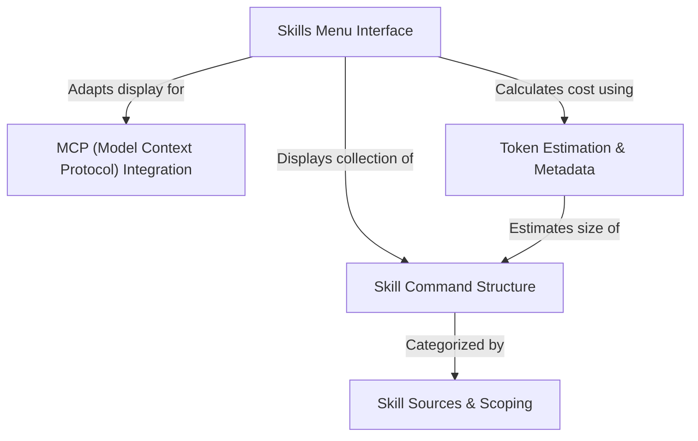

# Tutorial: skills

This project implements a **Skills Menu**, a visual dashboard that acts as a launcher for AI capabilities known as *skills*. It organizes these prompt-based tools into groups based on where they are defined (such as **User Settings** or external **MCP** servers) and displays helpful metadata like estimated **token usage** to help users manage their context window.

## Chapters

1. [Skills Menu Interface](01_skills_menu_interface.md)
2. [Skill Command Structure](02_skill_command_structure.md)
3. [Skill Sources & Scoping](03_skill_sources___scoping.md)
4. [MCP (Model Context Protocol) Integration](04_mcp__model_context_protocol__integration.md)
5. [Token Estimation & Metadata](05_token_estimation___metadata.md)

---

Generated by [Code IQ](https://github.com/adityasoni99/Code-IQ)