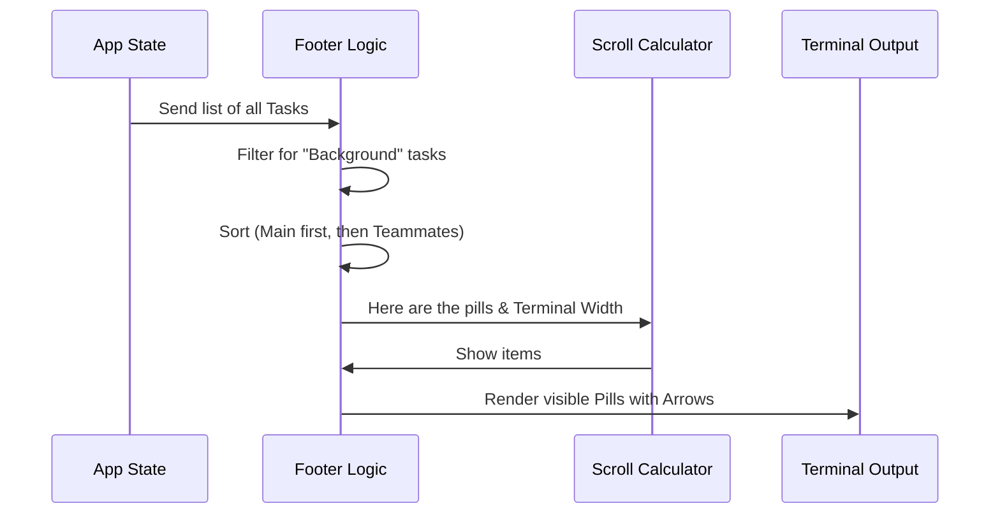

# Chapter 1: Background Task Footer

Welcome to the **Task Management System** tutorial! In this first chapter, we are going to explore how we keep track of multiple things happening at once without overwhelming the user.

## The Problem: Information Overload
Imagine you are running a complex Command Line Interface (CLI) tool. It's running a local server, checking files, and an AI agent is thinking about code changes—all at the same time.

If every single log message from every single process printed to the screen simultaneously, it would be chaos. You wouldn't know where to look!

## The Solution: The Background Task Footer
The **Background Task Footer** is our solution. Think of it like the **Taskbar** in Windows or the **Dock** in macOS. It sits quietly at the bottom of your terminal window and gives you a high-level summary of everything currently running.

### Use Case
We want to display a row of "Pills" (small UI chips) at the bottom of the screen.
1.  **Main Task:** The primary process (usually the user or the main agent).
2.  **Teammates:** Other background agents or processes.
3.  **Space Management:** If the terminal is too narrow, the list should scroll horizontally.

---

## Key Concepts

### 1. The Pill
A "Pill" is a small UI element representing a single task. It usually shows:
*   **The Name:** e.g., `@main` or `@writer`.
*   **The Color:** Distinct colors help identify different agents.
*   **The State:** Is it working? Is it idle? Is it selected?

### 2. The Carousel
Terminals have limited width. If we have 10 active tasks but only space for 5, the Footer acts like a **Carousel**. It calculates which pills fit in the window and hides the rest behind "arrow" indicators (← / →).

---

## How It Works: The Flow

Before looking at code, let's visualize how the Footer decides what to render.



---

## Using the Component

The main component is `BackgroundTaskStatus`. It doesn't need much configuration because it pulls most of its data directly from the global application state.

Here is a simplified view of how you might use it in your application layout:

```tsx
import { BackgroundTaskStatus } from './BackgroundTaskStatus';

export function AppLayout() {
  return (
    <Box flexDirection="column">
      <MainContent />
      
      {/* The Footer sits at the bottom */}
      <Box marginTop={1}>
        <BackgroundTaskStatus 
          tasksSelected={false} 
          isLeaderIdle={false} 
        />
      </Box>
    </Box>
  );
}
```

---

## Internal Implementation

Let's break down the `BackgroundTaskStatus.tsx` file into bite-sized pieces to understand how it processes data.

### Step 1: Getting the Data
First, we hook into our global state to get the list of tasks and the current terminal size.

```tsx
// Inside BackgroundTaskStatus function
const { columns } = useTerminalSize(); // How wide is the terminal?
const tasks = useAppState(s => s.tasks); // Get all tasks
const viewingAgentTaskId = useAppState(s => s.viewingAgentTaskId);
```

### Step 2: Filtering and Sorting
We don't want to show everything. We only want "Background" tasks (tasks that are running but not currently the main focus). We also explicitly separate the "Main" pill from "Teammate" pills.

```tsx
// Filter purely background tasks
const runningTasks = Object.values(tasks).filter(
  t => isBackgroundTask(t)
);

// Create the "Main" pill manually (it always exists)
const mainPill = {
  name: "main",
  isIdle: isLeaderIdle,
  taskId: undefined
};
```

### Step 3: Creating the Teammate List
We map the running tasks into a standard "Pill" format. We also apply sorting so that active agents might appear before idle ones, or simply alphabetically.

```tsx
// Map tasks to a simple data structure for rendering
const teammatePills = runningTasks.map(t => ({
  name: t.identity.agentName,
  color: getAgentThemeColor(t.identity.color),
  isIdle: t.isIdle,
  taskId: t.id
}));

const allPills = [mainPill, ...teammatePills];
```

### Step 4: The Scroll Logic
This is the "magic" part. We calculate how wide each pill is (text length) and see how many fit into the `availableWidth` of the terminal.

*Note: The actual math happens in a helper utility, keeping our component clean.*

```tsx
// Calculate which pills are visible based on terminal width
const { 
  startIndex, 
  endIndex, 
  showLeftArrow, 
  showRightArrow 
} = calculateHorizontalScrollWindow(
  pillWidths,    // Array of widths (e.g., [5, 8, 6])
  availableWidth, // e.g., 80 columns
  2,             // Width reserved for arrows
  selectedIdx    // Which pill is currently focused
);
```

### Step 5: Rendering
Finally, we render only the slice of pills that fit. We add arrows if there are more items off-screen.

```tsx
// Render the visible slice
return (
  <>
    {showLeftArrow && <Text dimColor>← </Text>}
    
    {visiblePills.map((pill) => (
      <AgentPill 
        key={pill.name}
        name={pill.name} 
        color={pill.color} 
        // ... handled events
      />
    ))}
    
    {showRightArrow && <Text dimColor> →</Text>}
  </>
);
```

---

## Rendering Individual Tasks

The Footer shows a summary (like `@writer`), but what if we want to see what that task is actually *doing*?

The file `BackgroundTask.tsx` handles the detailed rendering of a specific task's status line. It uses a `switch` statement to render differently based on the task type (e.g., is it a bash command or an AI thinking?).

### Example: Rendering a Bash Command
If the task is running a terminal command, we show the command name and a progress spinner.

```tsx
// Inside BackgroundTask function
case "local_bash": {
  // Truncate text so it fits on one line
  const description = truncate(task.command, activityLimit);
  
  return (
    <Text>
      {description} 
      <ShellProgress shell={task} />
    </Text>
  );
}
```

### Example: Rendering an AI Agent
If the task is an agent, we might want to show its name in color and its current status (e.g., "thinking").

```tsx
case "in_process_teammate": {
  const color = toInkColor(task.identity.color);
  
  return (
    <Text>
      <Text color={color}>@{task.identity.agentName}</Text>
      <Text dimColor>: {truncate(task.activity)}</Text>
    </Text>
  );
}
```

*Note: You will learn more about how we visually represent these states in [Visual Status System](03_visual_status_system.md).*

---

## Conclusion

You've just built the navigation center of the CLI! 
*   **Why:** To manage multiple concurrent processes in a limited space.
*   **How:** By calculating text widths and rendering a "sliding window" of Task Pills.

The Footer is great for a summary, but what happens when you click on one of these pills to see the full output?

[Next Chapter: Task Detail Dialogs](02_task_detail_dialogs.md)

---

Generated by [Code IQ](https://github.com/adityasoni99/Code-IQ)