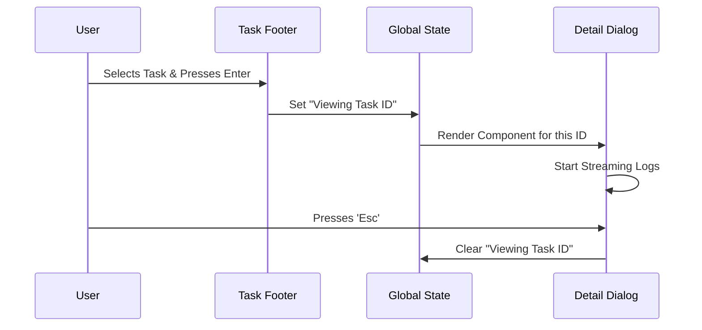

# Chapter 2: Task Detail Dialogs

Welcome back! In the previous chapter, [Background Task Footer](01_background_task_footer.md), we learned how to display a row of summary "pills" at the bottom of the screen.

Those pills are great for knowing *that* something is running, but they don't tell you *what* is actually happening.

## The Problem: The "Check Engine" Light
Imagine driving a car. A light on your dashboard turns on. It tells you something is wrong, but not *what*. To find out, you need to pull over and open the hood.

The **Background Task Footer** is the dashboard light. It tells you `@writer` is thinking or `build` is running.
The **Task Detail Dialog** is opening the hood. It lets you see the logs, the errors, and the active thought process of an AI agent.

## The Solution: Modal Interfaces
We use a **Task Detail Dialog**—a specialized window that pops up over your main content. It temporarily takes focus, allowing you to interact with that specific background process.

### Use Case
1.  **User Action:** You see the `@writer` pill spinning indefinitely.
2.  **Navigation:** You press a key to select that pill and hit Enter.
3.  **Result:** A large dialog opens showing exactly what `@writer` is trying to write.

---

## Key Concepts

### 1. The Wrapper
All detail views are wrapped in a generic `<Dialog>` component. This ensures they all look consistent (same border, same title bar, same keyboard shortcuts for closing).

### 2. Live Data Streams
Unlike a static error message, these dialogs are **alive**.
*   **Shell Tasks:** Stream text output from a log file (like running `tail -f`).
*   **AI Agents:** Stream the current "thought" or tool activity (like "Searching Google...").

### 3. Contextual Actions
Depending on what you are looking at, you might want to do different things:
*   **Running Task:** You might want to **Kill** (stop) it.
*   **Completed Task:** You might want to **Dismiss** the notification.

---

## The Flow: Opening the Hood

How does the system switch from the footer to the dialog?



---

## Implementation: The Shell Dialog

Let's look at `ShellDetailDialog.tsx`. This is the simplest type of dialog. It is used when the system runs a standard terminal command (like `npm install`) in the background.

### 1. The Container
We wrap everything in a `Dialog`. We also listen for keyboard events so the user can control the window.

```tsx
// ShellDetailDialog.tsx simplified
export function ShellDetailDialog({ shell, onDone }) {
  // Handle keys like Esc (close) or X (stop task)
  const handleKeyDown = (e) => {
    if (e.key === 'x') onKillShell();
  };

  return (
    <Box flexDirection="column" onKeyDown={handleKeyDown}>
      <Dialog 
        title="Shell details" 
        onCancel={onDone}
      >
        {/* Content goes here */}
      </Dialog>
    </Box>
  );
}
```

### 2. Displaying Status Info
Before showing the raw logs, we show a summary header. This uses standard `Text` components to show the command name and how long it has been running.

```tsx
// Inside the render function
<Box flexDirection="column">
  <Text>
    <Text bold>Status:</Text> 
    <Text color="background">{shell.status}</Text>
  </Text>
  
  <Text>
    <Text bold>Command:</Text> 
    {truncateToWidth(shell.command, 50)}
  </Text>
</Box>
```

### 3. Streaming the Output
This is the most important part. We don't want to freeze the UI by reading a massive file synchronously. We use a helper function `getTaskOutput` which reads only the end ("tail") of the output file.

```tsx
// Reads the last 8KB of the log file
async function getTaskOutput(shell) {
  const path = getTaskOutputPath(shell.id);
  const result = await tailFile(path, 8192); 
  return result; // contains { content: string }
}
```

We then use a React effect to poll this data repeatedly while the dialog is open:

```tsx
useEffect(() => {
  if (shell.status !== "running") return;

  // Update output every second
  const timer = setInterval(() => {
    updateOutput(); 
  }, 1000);

  return () => clearInterval(timer);
}, [shell.status]);
```

---

## Implementation: The AI Agent Dialog

When viewing an AI agent (like in `AsyncAgentDetailDialog.tsx` or `InProcessTeammateDetailDialog.tsx`), raw text logs aren't enough. We want to see the **Structure** of the AI's thoughts.

### 1. Visualizing "Thoughts"
Instead of a wall of text, we parse the agent's state to show what "Tool" it is currently using.

```tsx
// InProcessTeammateDetailDialog.tsx
<Box flexDirection="column">
  <Text bold dimColor>Progress</Text>
  
  {/* Loop through recent actions */}
  {teammate.progress.recentActivities.map((activity, i) => (
    <Text key={i}>
      {/* Helper to render "Reading file..." or "Running command..." */}
      {renderToolActivity(activity, tools, theme)}
    </Text>
  ))}
</Box>
```

*Note: You will learn more about how we render these specific activities in [Tool Activity Renderer](05_tool_activity_renderer.md).*

### 2. Showing the Prompt
Often, you want to know: *"What did I actually ask this agent to do?"*

```tsx
const displayPrompt = truncateToWidth(teammate.prompt, 300);

return (
  <Box flexDirection="column" marginTop={1}>
    <Text bold dimColor>Prompt</Text>
    <Text wrap="wrap">{displayPrompt}</Text>
  </Box>
);
```

---

## Handling Special Types: Remote Sessions
Sometimes a task isn't running on your computer at all—it's running in the cloud. The `RemoteSessionDetailDialog.tsx` handles this.

Instead of showing a file log, it might offer a link to open the session in a browser, or a button to "Teleport" (connect your local terminal to that remote session).

```tsx
// RemoteSessionDetailDialog.tsx
<Dialog title="Remote session">
  <Text>Status: {session.status}</Text>
  
  {/* Offer to open URL */}
  <Link url={sessionUrl}>
    <Text>{sessionUrl}</Text>
  </Link>
  
  <Text dimColor>Press 't' to teleport to this session</Text>
</Dialog>
```

---

## Conclusion

Task Detail Dialogs act as the "inspector" for your system. They take the minimal information from the **Footer** and expand it into a full, interactive view.

*   **Shell Dialogs** focus on raw text output (logs).
*   **Agent Dialogs** focus on structured activities (tools and thoughts).
*   **Remote Dialogs** focus on connectivity (URLs and teleporting).

Now that we can see the text status of our tasks, how do we make the status recognizable at a glance with colors and icons?

[Next Chapter: Visual Status System](03_visual_status_system.md)

---

Generated by [Code IQ](https://github.com/adityasoni99/Code-IQ)