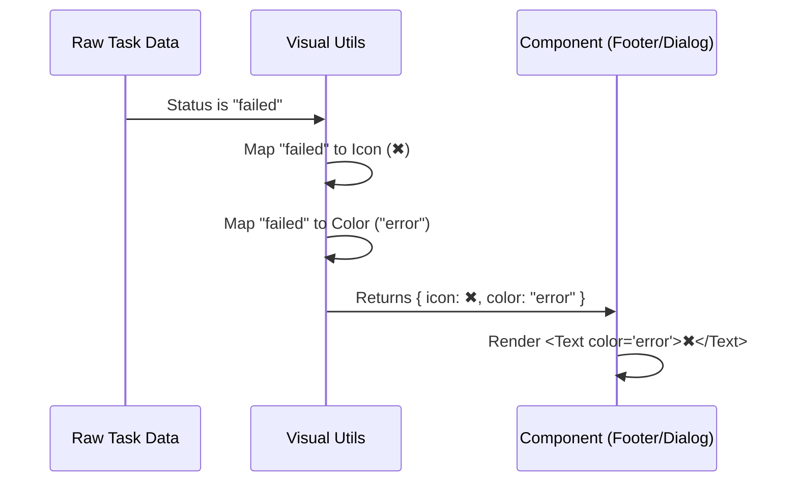

# Chapter 3: Visual Status System

Welcome back! In [Chapter 2: Task Detail Dialogs](02_task_detail_dialogs.md), we built detailed windows to inspect our tasks. Before that, in [Chapter 1: Background Task Footer](01_background_task_footer.md), we built a summary bar.

## The Problem: The "Traffic Light" Confusion

Imagine you are driving. You see a **Red** light. You stop.
Now imagine you drive to the next town, and there, **Blue** means stop. You would crash immediately!

In user interfaces, we face a similar problem.
*   If a task succeeds, it should look "Green" everywhere (Footer and Dialog).
*   If a task fails, it should look "Red" everywhere.
*   If a task is running, it should have a specific icon (like a spinner or play button).

If we hard-code `color="green"` in the Footer and `color="blue"` in the Dialog, our app becomes inconsistent and confusing.

## The Solution: A Shared Visual System

We solve this by creating a **Visual Status System**. This is a collection of helper functions that act as the "Source of Truth" for how things look.

Instead of asking: *"What color is a failed task?"*
The UI asks: *"Hey System, here is a task status. Give me the correct color and icon."*

---

## Key Concepts

### 1. Semantic Colors
We don't talk in hex codes (like `#FF0000`). We talk in **Meanings**:
*   **Success:** usually Green.
*   **Error:** usually Red.
*   **Warning:** usually Yellow.
*   **Background/Idle:** usually Dim or Grey.

### 2. Iconography
We use symbols to represent state quickly without reading text:
*   ✔ (Tick) = Done
*   ✖ (Cross) = Failed
*   ▶ (Play) = Running
*   … (Ellipsis) = Idle

### 3. The Flow

Here is how a raw text status is converted into a visual element:



---

## Internal Implementation

The heart of this system lives in `taskStatusUtils.tsx`. Let's look at how it makes decisions.

### 1. Determining the Icon
The function `getTaskStatusIcon` takes the status and returns a character string (an emoji or symbol).

```tsx
import figures from 'figures'; // A library for cross-platform symbols

export function getTaskStatusIcon(status, options) {
  if (options?.hasError) return figures.cross; // ✖
  
  if (status === 'running') {
    return figures.play; // ▶
  }
  
  if (status === 'completed') return figures.tick; // ✔
  
  return figures.bullet; // • (Default fallback)
}
```
*   **Why simple?** We handle complex logic (like "is it running but idle?") inside here, so the UI doesn't have to worry about it.

### 2. Determining the Color
Similarly, `getTaskStatusColor` returns the semantic color name recognized by our terminal rendering engine (Ink).

```tsx
export function getTaskStatusColor(status, options) {
  if (options?.hasError) return 'error'; // Red
  
  if (status === 'completed') return 'success'; // Green
  
  if (status === 'killed') return 'warning'; // Yellow
  
  return 'background'; // Default/Dim color
}
```

### 3. Describing AI Activity
AI agents are complex. They don't just "run"; they "think," "search," or "write." We use `describeTeammateActivity` to generate a one-line summary.

```tsx
export function describeTeammateActivity(task) {
  if (task.shutdownRequested) return 'stopping';
  
  // If the AI has a plan, summarize the recent activity
  // e.g., "reading file..." or "searching google..."
  const activity = task.progress?.lastActivity?.activityDescription;
  
  return activity ?? 'working';
}
```
*   **Note:** This relies on activity data that we will visualize in detail in [Chapter 5: Tool Activity Renderer](05_tool_activity_renderer.md).

---

## Usage Example: Building a Component

Now, let's look at `ShellProgress.tsx`. This component is used in both the Footer and the Dialogs. It uses our Visual System to render consistent text.

### The Component Logic
Instead of manually checking `if (status === 'failed')`, we use the utility helpers.

```tsx
import { Text } from 'src/ink.js';

// A reusable sub-component for text coloring
export function TaskStatusText({ status, label }) {
  // 1. Determine color based on status
  const color = status === 'completed' ? 'success' 
              : status === 'failed' ? 'error' 
              : undefined;

  // 2. Render text with that color
  return (
    <Text color={color} dimColor>
      ({label ?? status})
    </Text>
  );
}
```

### Handling Different States
The main `ShellProgress` component switches between states but relies on the styling logic above.

```tsx
export function ShellProgress({ shell }) {
  switch (shell.status) {
    case 'completed':
      return <TaskStatusText status="completed" label="done" />;
      
    case 'failed':
      return <TaskStatusText status="failed" label="error" />;
      
    case 'running':
      return <TaskStatusText status="running" />;
      
    default:
      return null;
  }
}
```

**What just happened?**
1.  We pass a `shell` object.
2.  If the status is `failed`, we ask for the "error" label.
3.  `TaskStatusText` sets the color to `'error'` (Red).
4.  The user sees a Red `(error)` text.

---

## Advanced Logic: Hiding the Footer
Sometimes, the Visual System decides to show **nothing**.

In `taskStatusUtils.tsx`, there is a function `shouldHideTasksFooter`.
If we are looking at a detailed "Spinner Tree" (a hierarchical view of tasks), we might not want to show the footer at all to save space.

```tsx
export function shouldHideTasksFooter(tasks, showSpinnerTree) {
  // If spinner tree is off, always show footer
  if (!showSpinnerTree) return false;

  // If we have active background tasks that aren't 
  // part of the main tree, keep the footer.
  // ... (logic to check task types) ...
  
  return true; // Hide footer
}
```
This ensures the screen doesn't get cluttered with duplicate information.

---

## Conclusion

By moving our colors and icons into a centralized system (`taskStatusUtils`), we achieved:
1.  **Consistency:** "Success" always looks the same.
2.  **Simplicity:** UI components don't need complex `if/else` chains.
3.  **Maintainability:** If we want to change the "Success" icon from `✔` to `★`, we change it in one place.

Now that our local tasks look great, what happens when we connect to a server somewhere else?

[Next Chapter: Remote Session Visualization](04_remote_session_visualization.md)

---

Generated by [Code IQ](https://github.com/adityasoni99/Code-IQ)