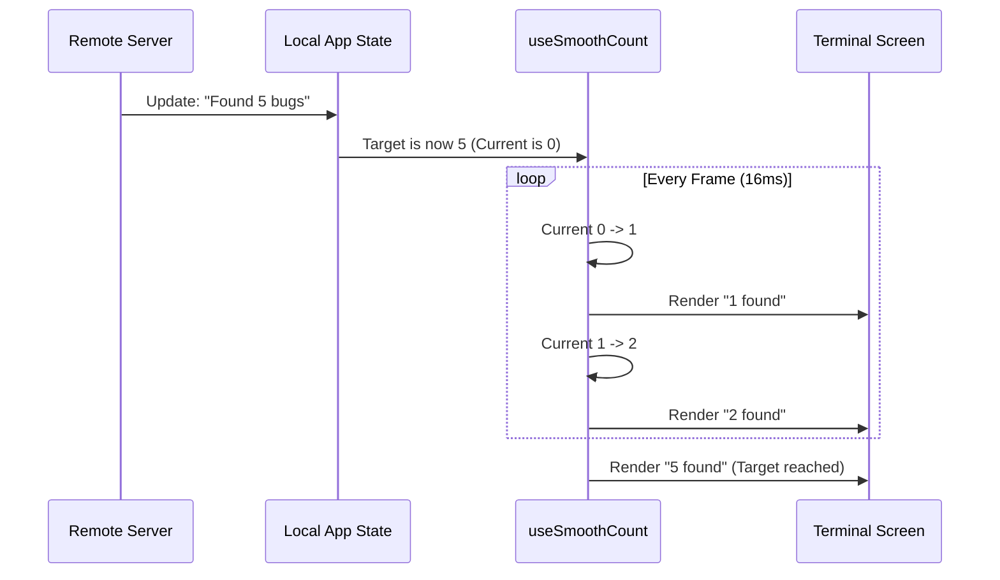

# Chapter 4: Remote Session Visualization

Welcome back! In [Chapter 3: Visual Status System](03_visual_status_system.md), we created a consistent set of icons and colors (Red/Green, Tick/Cross) for standard tasks.

But sometimes, a task is too special for a simple Green "Success" or Red "Error."

## The Problem: The "Black Box"
Imagine you have hired a remote super-agent to find bugs in your code. You are paying for this service, and it takes a few minutes.
*   **Bad UI:** A spinner that says "Processing..." for 3 minutes.
*   **The User's Reaction:** "Is it stuck? Did it crash? What is it finding?"

We need a way to visualize a **Complex Narrative**. The agent isn't just "working"; it is **Finding**, then **Verifying**, and finally **Deduping** bugs.

## The Solution: Remote Session Visualization
We built a specialized component called `RemoteSessionProgress`. It replaces the standard progress bar with a **Storytelling Display**.

### Use Case
When the "Ultrareview" agent is running:
1.  **Visual Delight:** The text "ultrareview" should animate with a **Rainbow** effect to show it's a premium, active process.
2.  **Live Counters:** If the agent finds 5 bugs, the number shouldn't snap from 0 to 5. It should tick up (1, 2, 3, 4, 5) to make the system feel alive.
3.  **Detailed Stages:** The user should know exactly which phase the agent is in.

---

## Key Concepts

### 1. The Rainbow Animation
To distinguish this special remote task from a standard local command (like `npm install`), we use a cycling rainbow gradient. This isn't just for looks; it signals "AI Intelligence is active."

### 2. Smooth Ticking (The "Odometer" Effect)
Data from the server comes in snapshots. One second we have 0 bugs, the next second we have 10. If we just render the number 10, it feels jerky. We use a **Smooth Count** hook to animate the numbers incrementally.

### 3. Review Stages
The agent goes through three distinct phases:
1.  **Finding:** Scanning files.
2.  **Verifying:** Checking if the bugs are real.
3.  **Synthesizing:** Removing duplicates (Deduping).

---

## How It Works: The Flow

Here is how a raw update from the server is transformed into a smooth animation on your screen.



---

## Internal Implementation

The magic happens in `RemoteSessionProgress.tsx`. Let's break down the three main pieces.

### Part 1: The Rainbow Text
We want the letters of "ultrareview" to change colors in a wave. We use a helper `getRainbowColor` and an animation `phase`.

```tsx
// Inside RainbowText function
// 'phase' is a number that changes every frame (0, 1, 2...)
return (
  <>
    {text.split('').map((char, i) => (
      // Shift the color based on character position (i) and time (phase)
      <Text key={i} color={getRainbowColor(i + phase)}>
        {char}
      </Text>
    ))}
  </>
);
```
*   **Result:** The colors appear to "crawl" across the text.

### Part 2: The Smooth Counter
We create a custom hook called `useSmoothCount`. It keeps track of the number currently displayed vs. the actual number from the server.

```tsx
function useSmoothCount(target, time, snap) {
  const displayed = useRef(target); // What we show on screen
  
  // If we need to catch up
  if (target > displayed.current) {
    displayed.current += 1; // Tick up by 1
  }
  
  return displayed.current;
}
```
*   **Why `useRef`?** We need to remember the `displayed` number between renders so it doesn't reset.

### Part 3: Formatted Stage Output
We need to combine the numbers into a readable string based on the current stage.

```tsx
export function formatReviewStageCounts(stage, found, verified, refuted) {
  if (stage === 'synthesizing') {
    // Stage 3: We have verified bugs and are deduping
    return `${verified} verified · deduping`;
  }
  
  if (stage === 'verifying') {
    // Stage 2: We found stuff, now checking it
    return `${found} found · ${verified} verified`;
  }
  
  // Stage 1: Just looking
  return `${found} found`;
}
```

---

## Putting It All Together

The main component `RemoteSessionProgress` acts as a traffic controller. It decides whether to show the rainbow (if running) or a static status (if done/failed).

### The Main Component Logic

```tsx
export function RemoteSessionProgress({ session }) {
  // 1. If it's the special "Remote Review" type
  if (session.isRemoteReview) {
    return <ReviewRainbowLine session={session} />;
  }

  // 2. If it's just a normal remote task that finished
  if (session.status === 'completed') {
    return <Text color="success">done</Text>;
  }

  // 3. Fallback for standard progress
  return <Text>Working...</Text>;
}
```

### The Rainbow Line Component
The `ReviewRainbowLine` component brings the animations and logic together.

```tsx
function ReviewRainbowLine({ session }) {
  // Get the animation clock (ticks every 80ms)
  const [, time] = useAnimationFrame(TICK_MS);
  
  // Calculate the smooth numbers
  const found = useSmoothCount(session.bugsFound, time);
  
  // Generate the text string (e.g., "5 found · 2 verified")
  const statusText = formatReviewStageCounts(
    session.stage, found, session.verified, 0
  );

  return (
    <Text>
      <RainbowText text="ultrareview" phase={time} />
      <Text dimColor> · {statusText}</Text>
    </Text>
  );
}
```

---

## Conclusion

By creating a specialized visualization for Remote Sessions, we turned a boring wait time into an engaging experience.

*   **Rainbows** tell the user "Something special is happening."
*   **Smooth Counts** tell the user "The system is active and finding things."
*   **Stage Labels** tell the user "Here is exactly where we are in the process."

Now that we can visualize high-level session progress, let's zoom in even further. How do we show the specific "Thought Process" of an agent?

[Next Chapter: Tool Activity Renderer](05_tool_activity_renderer.md)

---

Generated by [Code IQ](https://github.com/adityasoni99/Code-IQ)