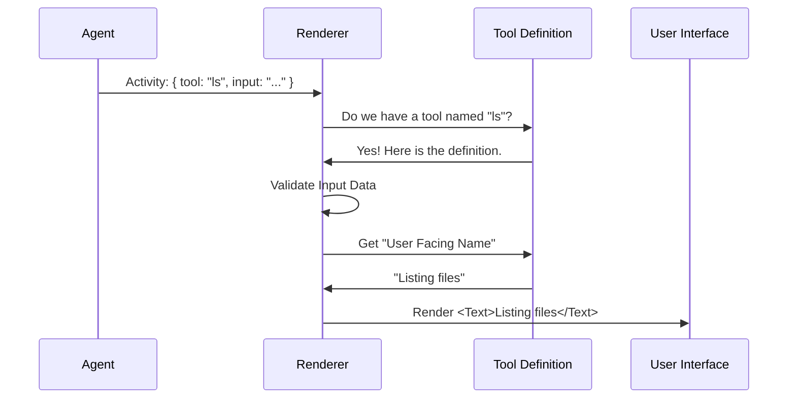

# Chapter 5: Tool Activity Renderer

Welcome to the final chapter of our tutorial series!

In the previous chapter, [Remote Session Visualization](04_remote_session_visualization.md), we learned how to show high-level animations for complex remote sessions. We made the system feel "alive" with rainbows and smooth counters.

But when an AI Agent is running locally on your machine, it isn't just a vague "processing" state. It is performing specific actions: reading files, running commands, or searching documentation.

## The Problem: "Robot Speak" vs. Human Language

AI Agents communicate with the system using **Structured Data** (usually JSON).

When an agent wants to read a file, it generates a "Tool Call" that looks like this:

```json
{
  "toolName": "readFile",
  "input": {
    "path": "/src/components/Button.tsx"
  }
}
```

If we showed this raw JSON in our [Task Detail Dialogs](02_task_detail_dialogs.md), the user would be overwhelmed. It looks like debug code, not a user interface.

## The Solution: The Tool Activity Renderer

The **Tool Activity Renderer** acts as a **Translator**. It takes that raw, technical JSON and converts it into a friendly, human-readable sentence.

*   **Raw:** `{ "toolName": "readFile", "input": "..." }`
*   **Rendered:** `Reading file (src/components/Button.tsx)`

### Use Case
You are watching an agent fix a bug.
1.  **Without Renderer:** You see a stream of `{ "tool": "grep", ... }`, `{ "tool": "cat", ... }`.
2.  **With Renderer:** You see a story: "Searching for 'error'...", then "Reading config.json...".

---

## Key Concepts

### 1. The Activity Object
This is the raw data coming from the agent. It contains two main things:
*   **The Tool Name:** The internal ID of the function (e.g., `run_terminal_cmd`).
*   **The Input:** The arguments passed to that function (e.g., `{ command: "ls -la" }`).

### 2. The Tool Definition
Every tool in our system has a blueprint. This blueprint doesn't just contain code; it contains **Metadata** about how it should be displayed. It knows its own `userFacingName` (e.g., "Running command").

### 3. Safety Parsing
Before we display input data, we must ensure it is valid. We use schemas (like Zod) to check that the data is structured correctly before we try to print it.

---

## How It Works: The Flow

Let's visualize how a raw event becomes a UI element.



---

## Internal Implementation

The magic happens in a function called `renderToolActivity`. Let's walk through it step-by-step.

### Step 1: Finding the Tool
The function receives the activity data. First, it looks through our list of available tools to see if it recognizes the `toolName`.

```tsx
// renderToolActivity.tsx

export function renderToolActivity(activity, tools, theme) {
  // 1. Find the tool definition by name
  const tool = findToolByName(tools, activity.toolName);
  
  // If we don't know this tool, just show the raw name
  if (!tool) {
    return activity.toolName;
  }
  
  // ... continue logic
}
```

### Step 2: Validating the Input
We use the tool's strict `inputSchema` to parse the incoming data. This ensures we don't crash the UI if the agent sends garbage data.

```tsx
  try {
    // 2. Safely parse the input data
    const parsed = tool.inputSchema.safeParse(activity.input);
    
    // If parsing fails, default to empty object
    const parsedInput = parsed.success ? parsed.data : {};
    
    // ... continue logic
```

### Step 3: Getting the Human Name
Now we ask the tool: *"How do you want to be introduced?"*
This calls a function defined on the tool itself, passing in the input data so the name can be dynamic.

```tsx
    // 3. Get the friendly name (e.g., "Reading file")
    const userFacingName = tool.userFacingName(parsedInput);
    
    // Fallback if no name is defined
    if (!userFacingName) {
      return activity.toolName;
    }
```

### Step 4: Formatting the Details
Finally, we want to show the *details* (arguments). For example, if the action is "Reading file", the detail is the *filename*.

```tsx
    // 4. Format the arguments (e.g., "index.ts")
    const toolArgs = tool.renderToolUseMessage(parsedInput, {
      theme,
      verbose: false
    });

    // 5. Combine them: Name + (Args)
    if (toolArgs) {
      return (
        <Text>
          {userFacingName}({toolArgs})
        </Text>
      );
    }
```

### Step 5: Handling Errors
If anything goes wrong during this process (e.g., the schema validation crashes), we have a safety net. We simply return the raw tool name so the user sees *something*.

```tsx
    return userFacingName;
  } catch {
    // If anything explodes, fallback to the ID
    return activity.toolName;
  }
}
```

---

## Usage Example

Let's say we have a tool defined for editing files.

**Input Data (Raw Activity):**
```js
const activity = {
  toolName: "edit_file",
  input: { 
    path: "server.js", 
    changes: "..." 
  }
};
```

**Tool Definition Logic (Internal):**
*   `userFacingName`: Returns "Editing file"
*   `renderToolUseMessage`: Returns the `path` variable ("server.js")

**Resulting UI Output:**
The `renderToolActivity` function combines these to render:

```text
Editing file(server.js)
```

This text is then displayed in the **Task Detail Dialog** we built in [Chapter 2](02_task_detail_dialogs.md), usually inside the scrolling list of "Thoughts" or "Activity."

---

## Conclusion

The **Tool Activity Renderer** is the final piece of the puzzle.

1.  We managed space with the **Footer** ([Chapter 1](01_background_task_footer.md)).
2.  We created interactive inspectors with **Dialogs** ([Chapter 2](02_task_detail_dialogs.md)).
3.  We standardized our look with the **Visual Status System** ([Chapter 3](03_visual_status_system.md)).
4.  We visualized complex remote jobs with **Remote Sessions** ([Chapter 4](04_remote_session_visualization.md)).
5.  And finally, we translated raw machine actions into human stories with the **Tool Activity Renderer**.

By combining these five concepts, you have built a robust, user-friendly Command Line Interface that can handle complex AI agents and background processes without confusing the user.

**Congratulations! You have completed the Task Management System tutorial.**

---

Generated by [Code IQ](https://github.com/adityasoni99/Code-IQ)