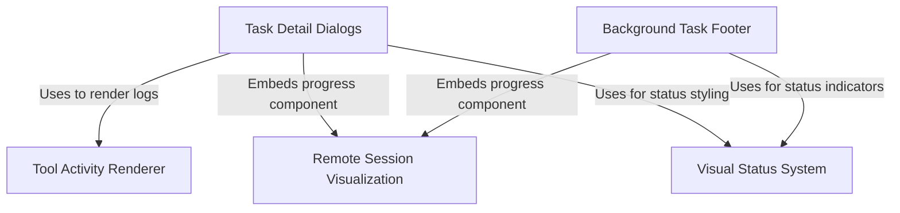

# Tutorial: tasks

This project provides a terminal-based UI for managing concurrent operations, featuring a persistent **Background Task Footer** that summarizes running activities and allows users to inspect them via specialized **Task Detail Dialogs**. It employs a shared **Visual Status System** to ensure consistent state representation (icons, colors) across views, while utilizing specific renderers like the **Tool Activity Renderer** and **Remote Session Visualization** to translate complex internal logs and session states into human-readable formats.

## Chapters

1. [Background Task Footer](01_background_task_footer.md)
2. [Task Detail Dialogs](02_task_detail_dialogs.md)
3. [Visual Status System](03_visual_status_system.md)
4. [Remote Session Visualization](04_remote_session_visualization.md)
5. [Tool Activity Renderer](05_tool_activity_renderer.md)

---

Generated by [Code IQ](https://github.com/adityasoni99/Code-IQ)