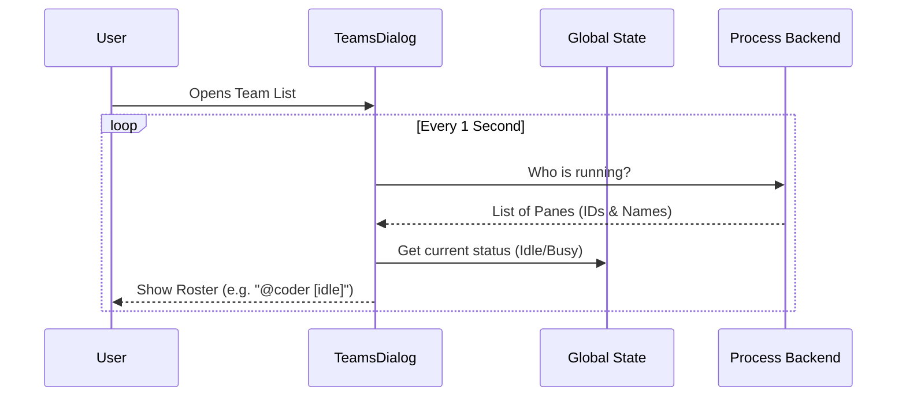

# Chapter 1: Teammate Entity & Discovery

Welcome to the first chapter of the **Teams** project tutorial! 

In this series, we will build a system where AI agents work together like a real software development team. Before we can assign tasks or let agents talk to each other, we need to answer a fundamental question: **Who is on the team?**

## The Motivation: The "Office Roster" Analogy

Imagine walking into a physical office. To know who is working today, you might look at the desks.
- You see **Alice** sitting at Desk 1.
- You see **Bob** sitting at Desk 2.
- You notice **Charlie** is missing (maybe his desk is empty).

In our software, an "AI Agent" isn't a physical person. It is a computer process running in the background (specifically, inside a tool called **tmux**). 

**The Problem:** How do we bridge the gap between a raw computer process (Process ID: 12345) and a helpful teammate named "Alice"?

**The Solution:** The **Teammate Entity & Discovery** system. It acts as a dynamic roster that constantly checks "who is at their desk" and reports their status to the UI.

### Use Case: The Team Dialog
Throughout this chapter, we will look at how the **Team Dialog** works. This is the menu you see when you want to list all your active AI teammates.

## Key Concepts

To understand this chapter, we need to define three simple concepts:

1.  **The Teammate Entity**: This is the data object representing an agent. It holds their **Name** (e.g., "coder"), their **Status** (Idle vs. Busy), and their **Location** (which `tmux` pane they live in).
2.  **Discovery**: The system doesn't just memorize a static list. It actively "discovers" processes. If you manually kill a process, the discovery system notices the teammate is gone.
3.  **The Backend**: This is the actual terminal window where the agent lives. We will explore this deeply in [Process Backend Interface](05_process_backend_interface.md).

## How to Use: The User Interface

In our application, we don't usually call "Discovery" functions manually. Instead, the User Interface (UI) components automatically ask for this data.

### 1. The Team Status Indicator
At the bottom of the screen, there is a small indicator showing how many teammates are online.

**Input:** The application state (which contains the list of discovered agents).
**Output:** A text string like `"3 teammates"`.

Here is how the code calculates that number:

```tsx
// Inside TeamStatus.tsx
// We get the teamContext from the global application state
const teamContext = useAppState(s => s.teamContext);

// We count the teammates, excluding the 'team-lead' (which is the user)
const totalTeammates = teamContext
    ? Object.values(teamContext.teammates)
      .filter(t => t.name !== 'team-lead')
      .length 
    : 0;
```

**Explanation:**
1.  `useAppState`: Hooks into the global memory of the app.
2.  `Object.values`: Converts the roster into a list.
3.  `filter`: We remove the "team-lead" because that is *you* (the human), not an AI agent.

### 2. The Teammate List
When you press `Enter` on the status, a dialog opens listing everyone. This dialog needs to stay fresh. If an agent crashes or finishes a task, the UI must update.

```tsx
// Inside TeamsDialog.tsx
// This hook runs the code inside it every 1000 milliseconds (1 second)
useInterval(() => {
    // Incrementing this key forces the list to re-read data
    setRefreshKey(k => k + 1);
}, 1000);
```

**Explanation:**
1.  `useInterval`: A timer that ticks every second.
2.  `setRefreshKey`: By changing a piece of state, we force the "Discovery" logic to run again, ensuring our list is never stale.

## Internal Implementation

How does the system actually manage these entities? It's a loop of checking reality vs. data.

### Step-by-Step Discovery

1.  **The Scan:** The system looks at the backend (tmux) to see which panes act like agents.
2.  **The Match:** It matches those panes to names (e.g., Pane `%4` is "Agent Smith").
3.  **The State:** It checks if they are currently working on a task (Active) or waiting (Idle).
4.  **The Render:** The UI draws the list.

### Sequence Diagram

Here is what happens when you open the Team Dialog:



### Code Deep Dive: Managing the Lifecycle

Sometimes, a teammate isn't needed anymore. You might want to "fire" (kill) a teammate process. This involves cleaning up three layers: the Process, the Config, and the State.

Here is the logic for removing a teammate:

```typescript
// Inside TeamsDialog.tsx
async function killTeammate(
  paneId: string, 
  backendType: PaneBackendType | undefined, 
  // ... other params
) {
  if (backendType) {
    // 1. Kill the actual OS process (The Pane)
    await getBackendByType(backendType).killPane(paneId, !isInsideTmuxSync());
  }
```

**Explanation:**
*   This interacts with the [Process Backend Interface](05_process_backend_interface.md) to actually stop the computer program running the agent.

Once the process is dead, we need to tell the rest of the app:

```typescript
  // 2. Remove them from the permanent team configuration
  removeMemberFromTeam(teamName, paneId);

  // 3. Unassign any work they were doing
  // (We will cover tasks in Chapter 2)
  await unassignTeammateTasks(teamName, teammateId, teammateName, 'terminated');
```

**Explanation:**
*   If we don't remove them from the config, the app might try to resurrect them or talk to a ghost.
*   If we don't unassign their tasks, the work will be stuck forever in "In Progress".

Finally, we update the UI immediately:

```typescript
  // 4. Update the AppState so the UI removes the name immediately
  setAppState(prev => {
    // ... logic to remove the specific teammate ID from the list ...
    return {
      ...prev,
      teamContext: {
        ...prev.teamContext,
        teammates: remainingTeammates // The list without the killed agent
      }
    };
  });
}
```

**Explanation:**
*   We use `setAppState` to manually remove the agent from memory. This makes the UI feel instant, even if the background cleanup takes a few milliseconds.

## Controlling Teammates

Besides killing processes, we can also change how much power a teammate has. This is called their **Permission Mode**.

```typescript
// Inside TeamsDialog.tsx
function cycleTeammateMode(teammate: TeammateStatus, /*...*/) {
  // Calculate the next mode (e.g., read-only -> full-access)
  const nextMode = getNextPermissionMode(context);
  
  // Send a message to the agent telling them their permissions changed
  sendModeChangeToTeammate(teammate.name, teamName, nextMode);
}
```

**Explanation:**
*   The "Entity" isn't just a name; it has properties like `mode`.
*   We will learn exactly how permissions work in [Permission Mode Control](03_permission_mode_control.md).
*   We communicate this change using the mailbox system, covered in [Agent Communication (Mailbox Protocol)](04_agent_communication__mailbox_protocol_.md).

## Summary

In this chapter, we learned:
1.  **Teammate Entities** are the bridge between a UI name ("@coder") and a system process (`%1`).
2.  **Discovery** acts like a heartbeat, constantly checking who is available.
3.  We manage these entities using the **TeamsDialog**, allowing us to list, kill, or modify agents.

Now that we have a team assembled and we know who is online, we need to give them something to do!

[Next Chapter: Task Assignment](02_task_assignment.md)

---

Generated by [Code IQ](https://github.com/adityasoni99/Code-IQ)