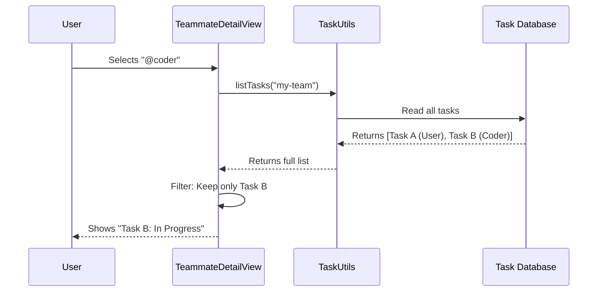

# Chapter 2: Task Assignment

Welcome back! In the previous chapter, [Teammate Entity & Discovery](01_teammate_entity___discovery.md), we learned how the system detects which AI agents are "alive" and running in our terminal.

Now that we know **who** is on the team, we need to know **what** they are doing. 

## The Motivation: The Project Manager's View

Imagine a Project Manager walking around an office with a clipboard. They stop at Alice's desk and ask, "What are you working on right now?"

Without a tracking system, the manager has to ask every single time. In our `teams` project, we want a digital "clipboard" that instantly tells us:
1.  Which tasks exist.
2.  Who is responsible for them.
3.  Whether the work is done.

**The Problem:** An agent might have 5 different instructions queued up. We need a way to visualize this workload so the human user doesn't get confused.

**The Solution:** The **Task Assignment** view. This connects the "Teammate Entity" (from Chapter 1) to specific units of work.

### Use Case: The Agent Detail View
In this chapter, we will explore what happens when you select a specific agent (e.g., `@coder`) from the roster to see their personal to-do list.

## Key Concepts

1.  **The Task Object**: A simple packet of data containing a `subject` (what to do), a `status` (completed or pending), and an `owner` (who is doing it).
2.  **Assignment**: The process of linking a Task's `owner` field to a Teammate's `name` or `agentId`.
3.  **Orphaned Tasks**: If an agent is "killed" (terminated), their tasks become orphans. We must handle this cleanup to prevent tasks from being stuck in limbo.

## How to Use: Fetching Assignments

In the UI, we don't ask the agent directly "What are you doing?" instead, we query a central task list and filter it.

### 1. Getting the List
When you open a teammate's detail view, the component immediately asks for all tasks associated with the current team.

```tsx
// Inside TeammateDetailView (TeamsDialog.tsx)
useEffect(() => {
  let cancelled = false;

  // 1. Fetch ALL tasks for this team
  listTasks(teamName).then(allTasks => {
    if (cancelled) return;
    
    // 2. Filter specifically for THIS teammate
    const myTasks = allTasks.filter(task => 
      task.owner === teammate.agentId || 
      task.owner === teammate.name
    );
    
    setTeammateTasks(myTasks);
  });
// ... cleanup code ...
}, [teamName, teammate.agentId, teammate.name]);
```

**Explanation:**
*   `listTasks(teamName)`: Retrieves the global list of to-dos for the project.
*   `.filter(...)`: We only keep tasks where the `owner` matches our current teammate.
*   **Note**: We check both `agentId` and `name` to be safe, ensuring we catch tasks assigned by either identifier.

### 2. Displaying the Status
Once we have the list, we render it. The UI gives immediate visual feedback on progress.

```tsx
// Inside TeammateDetailView rendering logic
{teammateTasks.map(task => (
  <Text 
    key={task.id} 
    color={task.status === 'completed' ? 'success' : undefined}
  >
    {/* Show a Checkmark if done, or a Square if pending */}
    {task.status === 'completed' ? figures.tick : '\u25FC'}
    {' '}
    {task.subject}
  </Text>
))}
```

**Input:** A task object `{ status: 'completed', subject: 'Fix login bug' }`.
**Output:** A green line of text: `✔ Fix login bug`.

## Internal Implementation

How does the system keep track of this? Let's look at the flow of information when you inspect an agent.

### Step-by-Step Flow

1.  **Selection:** You press `Enter` on a teammate in the main list.
2.  **Query:** The UI components mount and trigger the `useEffect` hook.
3.  **Retrieval:** The `listTasks` utility reads the project's task database (usually a JSON file or memory state).
4.  **Filtering:** The UI discards tasks belonging to other agents.
5.  **Display:** The filtered list is shown to the user.

### Sequence Diagram



## Code Deep Dive: Handling "Firing"

The most complex part of Task Assignment isn't assigning the task—it's what happens when the employee leaves. 

If you decide to "kill" an agent (as described in [Chapter 1](01_teammate_entity___discovery.md)), we cannot leave their tasks assigned to a dead process. That would be like firing an employee but expecting them to finish a report next week.

We perform a cleanup operation called **Unassignment**.

### The Cleanup Logic

When the user presses `k` (kill) in the dialog:

```typescript
// Inside killTeammate function
// 1. Remove the physical process (Chapter 1 concept)
// ...

// 2. Handle the administrative cleanup
const { notificationMessage } = await unassignTeammateTasks(
  teamName, 
  teammateId, 
  teammateName, 
  'terminated'
);
```

**Explanation:**
*   `unassignTeammateTasks`: This function goes through the task list, finds everything assigned to this agent, and sets the status to `terminated` or unassigns them.
*   This ensures the rest of the team knows that work is no longer being handled.

### Notifying the Team
After unassigning tasks, we need to tell the system (and the user) what happened.

```typescript
// Updating the Global App State
setAppState(prev => {
  return {
    ...prev,
    inbox: {
      messages: [...prev.inbox.messages, {
        from: 'system',
        // We create a system message explaining what happened
        text: jsonStringify({
          type: 'teammate_terminated',
          message: notificationMessage
        }),
        status: 'pending'
      }]
    }
  };
});
```

**Explanation:**
*   We inject a message into the `inbox`. This mimics an email sent to the project lead saying: *"Agent @coder was terminated. 3 tasks have been unassigned."*
*   We will learn more about how agents receive and process messages in [Agent Communication (Mailbox Protocol)](04_agent_communication__mailbox_protocol_.md).

## Summary

In this chapter, we explored **Task Assignment**:
1.  We learned that tasks are data objects linked to a teammate via an **Owner ID**.
2.  We saw how the **Detail View** filters the global list to show only relevant work.
3.  We implemented **Cleanup Logic** to ensure tasks aren't left stranded when an agent is terminated.

Now that we have agents (Chapter 1) and we know what tasks they have (Chapter 2), we need to control **how much power** they have to execute those tasks. Can they delete files? Can they run system commands?

Let's find out in the next chapter.

[Next Chapter: Permission Mode Control](03_permission_mode_control.md)

---

Generated by [Code IQ](https://github.com/adityasoni99/Code-IQ)