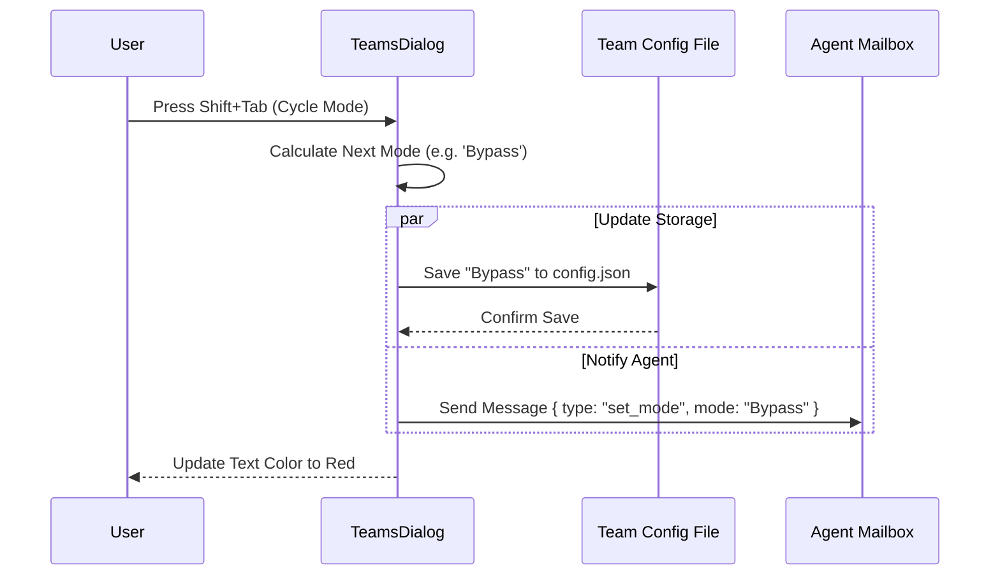

# Chapter 3: Permission Mode Control

Welcome to the third chapter of the **Teams** project tutorial!

In previous chapters, we established **who** is on the team ([Teammate Entity & Discovery](01_teammate_entity___discovery.md)) and **what** they are working on ([Task Assignment](02_task_assignment.md)).

Now we face a critical safety question: **How much power do we give them?**

## The Motivation: The "Junior Intern" Analogy

Imagine you hire a junior intern. You might trust them to **read** documents, but you probably want to double-check their work before they **delete** files or **deploy** code to production.

As the intern gains trust, you might give them more autonomy.

In our system, AI agents are like that intern. We need a way to dynamically shift their "Security Clearance" between different levels:
*   **ReadOnly / Safe:** Can only look, cannot touch.
*   **Default:** Can act, but might need confirmation for dangerous actions.
*   **Bypass:** Full autonomy to do whatever is needed (High Trust).

**The Problem:** We need a way to toggle these states instantly without restarting the agent, and we need to see at a glance what permissions an agent has.

**The Solution:** **Permission Mode Control**. A governance layer that manages the state of trust and visualizes it with colors (Red/Green) and symbols.

### Use Case: The "Shift+Tab" Toggle
In this chapter, we will build the logic that allows a user to press `Shift+Tab` in the UI to cycle an agent from "Ask Permission" mode to "Full Autonomy" mode.

## Key Concepts

1.  **Permission Mode**: A string value representing the current trust level (e.g., `'default'`, `'bypassed'`, `'read-only'`).
2.  **The Context**: A collection of settings that determine if a specific tool (like `fs.delete_file`) is allowed to run.
3.  **Mode Cycling**: The logic that calculates the *next* mode based on the *current* mode (e.g., `Default` -> `Bypass` -> `ReadOnly` -> `Default`).

## How to Use: The User Interface

To the user, this system appears as a visual badge next to the agent's name.

### 1. Visualizing the Mode
In the UI, we don't show raw text like `"mode: bypassed"`. We translate that state into a color and a symbol.

**Input:** A mode string (e.g., `'bypassed'`).
**Output:** A Red color and a specific symbol.

Here is how the UI component decides what to draw:

```tsx
// Inside TeammateListItem.tsx
// 1. Convert string to a typed mode
const mode = permissionModeFromString(teammate.mode);

// 2. Get the symbol (e.g., a shield or a lightning bolt)
const modeSymbol = permissionModeSymbol(mode);

// 3. Get the color (e.g., Red for high-risk/bypass)
const modeColor = getModeColor(mode);
```

**Explanation:**
*   `permissionModeFromString`: Sanitizes the data coming from the backend.
*   `permissionModeSymbol`: Returns a character like `⚡` (Bypass) or `🔒` (Safe).
*   `getModeColor`: Returns a UI theme color string.

### 2. Cycling the Mode
When the user wants to change permissions, they press a key. We use a "Cycler" function to determine the next state.

```typescript
// Inside TeamsDialog.tsx
function cycleTeammateMode(teammate: TeammateStatus, /*...*/) {
  const currentMode = teammate.mode ?? 'default';
  
  // Create a context to determine valid next moves
  const context = { 
    mode: currentMode,
    isBypassPermissionsModeAvailable: true 
  };
  
  // Calculate next mode (e.g. Default -> Bypass)
  const nextMode = getNextPermissionMode(context);
  
  // Apply the change
  sendModeChangeToTeammate(teammate.name, teamName, nextMode);
}
```

**Explanation:**
*   `getNextPermissionMode`: This is a state machine. It knows that after "Standard" comes "Bypass", and after "Bypass" comes "Read Only".
*   `sendModeChangeToTeammate`: This triggers the actual update logic.

## Internal Implementation

Changing a permission mode is a two-step process. We must update the **Persistent Config** (so the UI remembers it) and notify the **Live Agent** (so they stop asking for permission immediately).

### Step-by-Step Flow

1.  **User Action:** User selects "@coder" and presses `Shift+Tab`.
2.  **Calculation:** The app determines the next mode is "Bypass".
3.  **Persistence:** The app updates `config.json`. The UI reads this file to update the color immediately.
4.  **Communication:** The app sends a "Mailbox Message" to the running agent process saying "Your mode is now Bypass."

### Sequence Diagram



### Code Deep Dive: The Dual Update

Why do we update two things?
1.  **Config File:** If we restart the app, we want to remember that "@coder" is allowed to bypass permissions.
2.  **Mailbox:** The agent is a separate process. Changing a file doesn't interrupt it immediately. We must send a signal.

Here is the helper function that handles both:

```typescript
// Inside TeamsDialog.tsx
function sendModeChangeToTeammate(
  teammateName: string, 
  teamName: string, 
  targetMode: PermissionMode
): void {
  // 1. Update persistent config (UI updates immediately via React state)
  setMemberMode(teamName, teammateName, targetMode);

  // 2. Prepare the message payload
  const message = createModeSetRequestMessage({
    mode: targetMode,
    from: 'team-lead'
  });

  // 3. Send via Mailbox Protocol
  void writeToMailbox(teammateName, {
    from: 'team-lead',
    text: jsonStringify(message),
    timestamp: new Date().toISOString()
  }, teamName);
}
```

**Explanation:**
*   `setMemberMode`: Writes to the JSON database.
*   `createModeSetRequestMessage`: Formats a standardized command object.
*   `writeToMailbox`: Drops the letter in the agent's inbox.

We will explore exactly how the agent reads that letter in the next chapter, [Agent Communication (Mailbox Protocol)](04_agent_communication__mailbox_protocol_.md).

### Batch Control
Sometimes you want to unlock the whole team at once. The system supports "Batch Cycling".

```typescript
// Inside TeamsDialog.tsx
function cycleAllTeammateModes(teammates: TeammateStatus[], /*...*/) {
  // 1. Check if everyone is on the same mode
  const allSame = modes.every(m => m === modes[0]);

  // 2. If mixed, reset everyone to default. If same, move everyone forward.
  const targetMode = !allSame ? 'default' : getNextPermissionMode(/*...*/);

  // 3. Update everyone at once
  setMultipleMemberModes(teamName, modeUpdates);
  
  // 4. Loop through and notify every agent
  for (const teammate of teammates) {
     // ... send mailbox message ...
  }
}
```

## Summary

In this chapter, we learned:
1.  **Permission Modes** act as security clearances (Default, Bypass, Read-only).
2.  The **UI** visualizes these modes using colors and symbols to give immediate feedback.
3.  Changing a mode requires updating **Persistent Storage** (for the UI) and sending a **Message** (for the live agent).

Now we have a secure way to control our agents. But wait—how exactly does that "Mailbox Message" work? How do agents talk to us, and how do they talk to each other?

[Next Chapter: Agent Communication (Mailbox Protocol)](04_agent_communication__mailbox_protocol_.md)

---

Generated by [Code IQ](https://github.com/adityasoni99/Code-IQ)