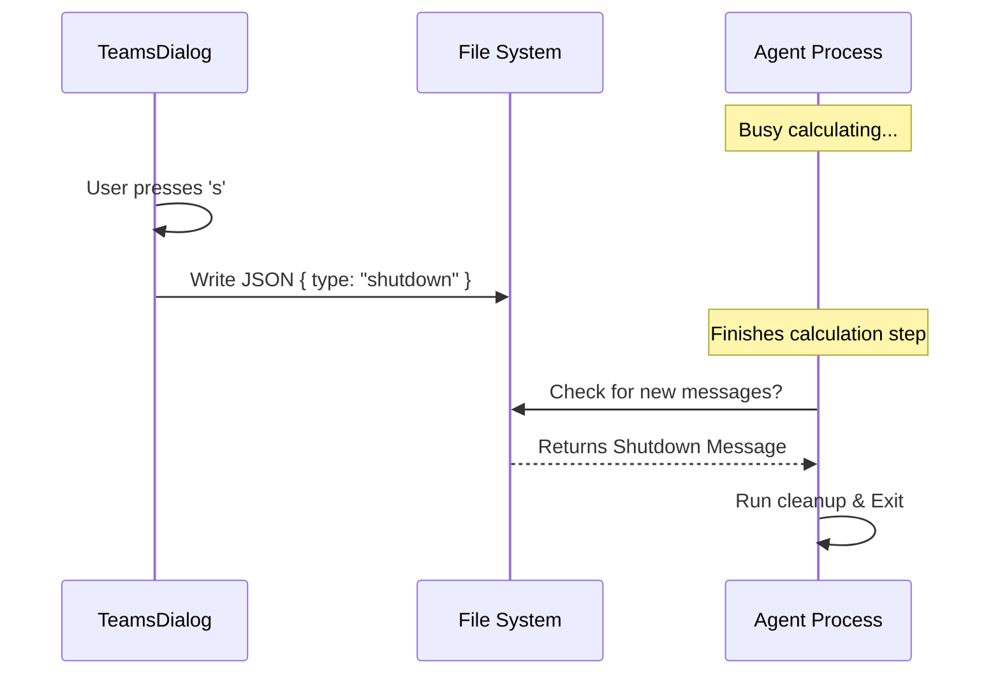

# Chapter 4: Agent Communication (Mailbox Protocol)

Welcome to Chapter 4! 

In the previous chapter, [Permission Mode Control](03_permission_mode_control.md), we learned how to toggle an agent's security clearance. We mentioned that when you change a permission, the system sends a "message" to the agent.

But how exactly does that happen? 

In this chapter, we will uncover the **Mailbox Protocol**—the communication system that allows our User Interface (UI) to give orders to independent AI processes.

## The Motivation: The "Sliding a Note Under the Door" Analogy

Imagine you are working in an office.
*   **You** are in the hallway (The UI).
*   **Alice** (The AI Agent) is locked inside her office working on a complex math problem.

You want Alice to stop working and go home.
1.  You cannot tap her on the shoulder (she is in a locked room / separate process).
2.  You cannot yell (separate memory space).

**The Solution:** You write a formal note on a piece of paper and slide it under her door.
Alice finishes her current math step, looks down, sees the note, reads it, and then packs up to leave.

This is exactly how the **Mailbox Protocol** works. We don't force the agent to stop immediately; we place a message in their "mailbox" for them to process when they are ready.

### Use Case: Graceful Shutdown
In this chapter, we will build the functionality for the **Shutdown** command. When you select an agent and press `s`, we send them a polite request to stop running.

## Key Concepts

To understand this system, we need three concepts:

1.  **The Mailbox**: A specific location (usually a file or a data pipe) dedicated to a specific agent.
2.  **The Envelope**: The standard wrapper for every message. It contains metadata like `from` (who sent it) and `timestamp` (when).
3.  **The Payload**: The actual letter inside. This is a JSON object describing the command (e.g., `type: "shutdown"`).

## How to Use: Sending a Message

In our `teams` application, we don't handle file paths manually. We use helper functions to "write" to the mailbox.

### 1. Constructing the Message
First, we need to format the data we want to send. We use JSON (JavaScript Object Notation) so both the UI and the Python/Node backend can understand it.

**Input:** A command to shutdown.
**Output:** A structured message object.

```typescript
// Example of a raw message structure
const message = {
  type: 'teammate_shutdown',
  reason: 'Graceful shutdown requested by team lead'
};
```

**Explanation:**
*   `type`: Tells the agent what kind of action to take.
*   `reason`: Optional data giving context (logging why they are being fired).

### 2. Posting the Message
We use the `writeToMailbox` function to deliver this message.

```typescript
// Inside TeamsDialog.tsx
import { writeToMailbox, jsonStringify } from '../../utils/teammateMailbox';

async function sendShutdown(teammateName: string, teamName: string) {
  const payload = { 
    type: 'shutdown', 
    message: 'User requested stop' 
  };

  await writeToMailbox(teammateName, {
    from: 'team-lead',
    text: jsonStringify(payload), // The payload goes inside 'text'
    timestamp: new Date().toISOString()
  }, teamName);
}
```

**Explanation:**
*   `from`: Identifies the sender (us, the `'team-lead'`).
*   `text`: The actual instruction, converted to a string string.
*   `writeToMailbox`: The utility that handles the "sliding under the door" part.

## Internal Implementation

What happens "under the hood" when you press that button?

### Step-by-Step Delivery

1.  **Serialize:** The UI takes your JavaScript object and converts it into a text string.
2.  **Delivery:** The system appends this text to the agent's `mailbox.json` file (or input pipe).
3.  **Polling:** The Agent (running in the background) periodically "checks its mail."
4.  **Action:** The Agent reads the `shutdown` command and initiates its cleanup sequence.

### Sequence Diagram

Here is the flow of a Shutdown Request:



### Code Deep Dive: Handling Interaction

In `TeamsDialog.tsx`, we handle user input to trigger these messages. Notice how we use a specific helper `sendShutdownRequestToMailbox` which wraps the raw `writeToMailbox` function for convenience.

```typescript
// Inside TeamsDialog.tsx handling user input
if (input === 's') {
    // 1. Identify who is selected
    const teammate = teammateStatuses[selectedIndex];
    
    // 2. Send the specific helper message
    void sendShutdownRequestToMailbox(
        teammate.name, 
        dialogLevel.teamName, 
        'Graceful shutdown requested by team lead'
    );
}
```

**Explanation:**
*   We abstract the complex JSON creation into `sendShutdownRequestToMailbox` to keep our UI code clean.
*   The `void` keyword tells TypeScript "we are sending this off and not waiting for a reply right now" (fire and forget).

### Batch Communication
In [Chapter 3](03_permission_mode_control.md), we saw "Batch Mode Cycling." The Mailbox protocol handles this by simply sending a separate letter to every single agent in a loop.

```typescript
// Inside cycleAllTeammateModes
for (const teammate of teammates) {
    // Create the message
    const message = createModeSetRequestMessage({
      mode: targetMode,
      from: 'team-lead'
    });
    
    // Send it to this specific teammate
    void writeToMailbox(teammate.name, { /* envelope data */ }, teamName);
}
```

**Explanation:**
*   Even though we want to update the *whole team*, we must communicate with each agent *individually*. There is no "loudspeaker" to shout to everyone at once; we must slide a note under everyone's door individually.

## Summary

In this chapter, we learned:
1.  **The Mailbox Protocol** is an asynchronous way to send commands to agents.
2.  Messages are structured **JSON objects** containing metadata and a payload.
3.  We use this system for critical actions like **Shutdowns** and **Permission Changes**.

We have covered the **Data** (Entity), the **Work** (Tasks), the **Rules** (Permissions), and the **Communication** (Mailbox). 

There is one final piece of the puzzle. Where do these agents actually *live*? What is this "tmux" thing we keep mentioning, and how does the application control the actual terminal windows?

[Next Chapter: Process Backend Interface](05_process_backend_interface.md)

---

Generated by [Code IQ](https://github.com/adityasoni99/Code-IQ)