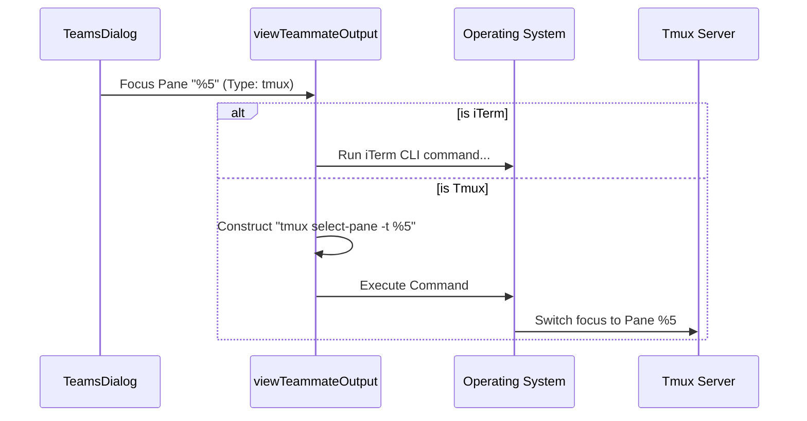

# Chapter 5: Process Backend Interface

Welcome to the final chapter of the **Teams** project tutorial!

In the previous chapter, [Agent Communication (Mailbox Protocol)](04_agent_communication__mailbox_protocol_.md), we learned how to send polite messages to our agents.

But sometimes, polite messages aren't enough. Sometimes you need to physically manage the "office space" where the agents live. You might need to:
*   **Focus** their window to see what they are typing.
*   **Hide** their window to clean up your screen.
*   **Kill** their process if they freeze completely.

## The Motivation: The "Universal Remote" Analogy

Imagine your home entertainment system. You have a TV, a Soundbar, and a Cable Box.
*   To turn off the TV, you press a button on the TV remote.
*   To turn off the Soundbar, you press a button on the Audio remote.

This is annoying. You want a **Universal Remote**. You press "Power Off," and it sends the correct signal to whichever device is currently active.

**The Problem:** Our AI agents can live in different types of terminal environments.
1.  **tmux**: A command-line tool popular with server administrators.
2.  **iTerm2**: A graphical terminal app popular on macOS.

We don't want our UI code to worry about the complex commands for every specific terminal.

**The Solution:** The **Process Backend Interface**. This is a layer of code that translates a simple command (like "Focus Window") into the specific instructions needed for the underlying technology.

### Use Case: Focusing the Agent
In this chapter, we will examine what happens when you select an agent in the list and press `Enter`. The application must bring that agent's specific terminal pane to the foreground, regardless of whether they are in tmux or iTerm.

## Key Concepts

1.  **The Backend**: The specific technology hosting the agent (e.g., `'tmux'` or `'iterm2'`).
2.  **The Pane ID**: The unique address of the agent's window (e.g., `%4` for tmux, or `session-123` for iTerm).
3.  **Abstraction**: Hiding complex details behind a simple function name.

## How to Use: The "View" Command

In our User Interface, viewing an agent's output is as simple as calling one function. We don't need to know *how* the window is focused, only *which* window to focus.

### 1. The Trigger
When the user presses `Enter` on the keyboard:

```tsx
// Inside TeamsDialog.tsx
if (key.return) {
  // We grab the ID and the Type from the teammate object
  const { tmuxPaneId, backendType } = currentTeammate;

  // We call the abstraction function
  await viewTeammateOutput(tmuxPaneId, backendType);
  
  // Close the dialog so the user can see the terminal
  onDone();
}
```

**Explanation:**
*   `tmuxPaneId`: The address of the window.
*   `backendType`: The type of "building" the window is in.
*   `viewTeammateOutput`: The function that handles the hard work.

## Internal Implementation

How does the system decide which command to run? It acts like a switchboard operator.

### Step-by-Step Execution

1.  **The Call:** The UI calls `viewTeammateOutput` with an ID (`%5`) and a type (`tmux`).
2.  **The Check:** The function checks the type.
3.  **The Translation:**
    *   If it is **iTerm**, it prepares an AppleScript command.
    *   If it is **tmux**, it prepares a CLI command (`tmux select-pane ...`).
4.  **The Execution:** It sends the command to the Operating System.

### Sequence Diagram



### Code Deep Dive: Handling Differences

Let's look at the actual implementation of `viewTeammateOutput`. Notice how it branches based on the backend type.

```typescript
// Inside TeamsDialog.tsx
async function viewTeammateOutput(paneId: string, backendType: PaneBackendType | undefined) {
  if (backendType === 'iterm2') {
    // iTerm specific command to focus a session
    await execFileNoThrow(IT2_COMMAND, ['session', 'focus', '-s', paneId]);
  } else {
    // Tmux specific command to select a pane
    // We check if we are inside tmux or need to talk to a socket
    const args = isInsideTmuxSync() 
      ? ['select-pane', '-t', paneId] 
      : ['-L', getSwarmSocketName(), 'select-pane', '-t', paneId];
      
    await execFileNoThrow(TMUX_COMMAND, args);
  }
}
```

**Explanation:**
*   `execFileNoThrow`: A helper that runs system commands safely.
*   `IT2_COMMAND`: The path to the iTerm control tool.
*   `TMUX_COMMAND`: The path to the `tmux` executable.

### Code Deep Dive: The Cleaner Abstraction

For more complex operations like **Killing** a process, we use an even cleaner pattern called the **Registry Pattern**. instead of writing `if/else` statements, we ask a registry for the correct tool.

```typescript
// Inside TeamsDialog.tsx -> killTeammate
if (backendType) {
  // 1. Get the specific tool for this job (TmuxBackend or ITermBackend)
  const backend = getBackendByType(backendType);

  // 2. Call the standard method 'killPane'
  // We don't need to know HOW it kills the pane, just that it does.
  await backend.killPane(paneId, !isInsideTmuxSync());
}
```

**Explanation:**
*   `getBackendByType`: This factory function returns an object that knows how to handle the specific technology.
*   `killPane`: Both the Tmux backend and the iTerm backend have a function with this exact name, but the code inside them is completely different. This allows our UI code to stay clean and simple.

## Advanced Feature: Capability Checks

Not all terminals are created equal. For example, `tmux` can easily "hide" a pane (make it invisible but keep it running), while other terminals might not support this.

The Backend Interface allows us to check **Capabilities**.

```tsx
// Inside TeamsDialog.tsx
// 1. Get the current backend tool
const backend = getCachedBackend();

// 2. Ask: "Do you support hiding windows?"
if (backend?.supportsHideShow) {
  // 3. If yes, show the "H" shortcut in the UI
  <Text>Press 'H' to hide/show all</Text>
}
```

**Input:** A backend object (e.g., standard terminal).
**Output:** `supportsHideShow: false` (The UI hides the button).

**Input:** A backend object (e.g., tmux).
**Output:** `supportsHideShow: true` (The UI shows the button).

## Tutorial Conclusion

Congratulations! You have completed the **Teams** project tutorial. 

We have built a complete mental model of how an AI team management system works:

1.  **[Teammate Entity & Discovery](01_teammate_entity___discovery.md)**: We learned how to find out *who* is on the team.
2.  **[Task Assignment](02_task_assignment.md)**: We tracked *what* they are working on.
3.  **[Permission Mode Control](03_permission_mode_control.md)**: We managed *how much power* they have.
4.  **[Agent Communication (Mailbox Protocol)](04_agent_communication__mailbox_protocol_.md)**: We learned how to *talk* to them politely.
5.  **Process Backend Interface**: We learned how to control the *environment* they live in.

With these five pillars, you understand how to build a robust, observable, and controllable system for multi-agent AI collaboration.

Happy Coding!

---

Generated by [Code IQ](https://github.com/adityasoni99/Code-IQ)