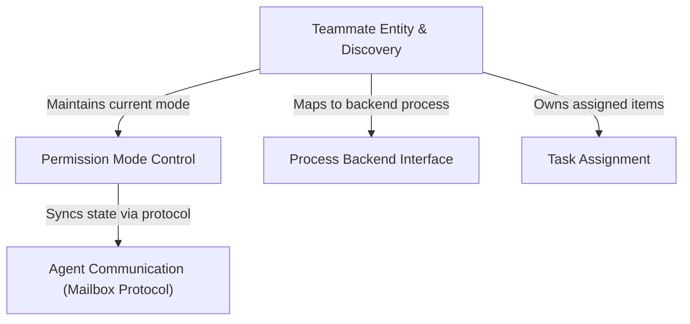

# Tutorial: teams

This project functions as a **command center** for managing a team of *AI agents* operating as independent processes. It allows a team lead to visualize the roster, monitor **assigned tasks**, cycle through *security permission levels*, and control the underlying terminal lifecycles (such as killing or focusing specific agent windows).

## Chapters

1. [Teammate Entity & Discovery](01_teammate_entity___discovery.md)
2. [Task Assignment](02_task_assignment.md)
3. [Permission Mode Control](03_permission_mode_control.md)
4. [Agent Communication (Mailbox Protocol)](04_agent_communication__mailbox_protocol_.md)
5. [Process Backend Interface](05_process_backend_interface.md)

---

Generated by [Code IQ](https://github.com/adityasoni99/Code-IQ)