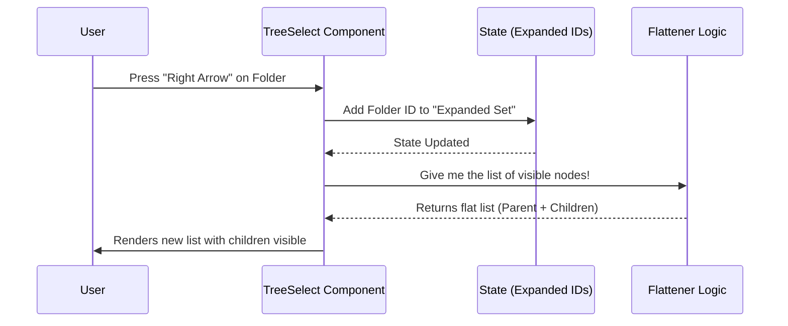

# Chapter 1: Hierarchical Tree Selector

Welcome to the first chapter of the **Hierarchical Tree Selector** tutorial!

In this project, we are building a user interface for the terminal. Terminal interfaces are usually text-based and flat (line-by-line). However, real-world data is often **nested**, like files inside folders or categories inside departments.

This chapter introduces the **Hierarchical Tree Selector**: a component that allows users to navigate deep, nested structures using a simple keyboard interface.

## The Problem: Flat Lists vs. Nested Data

Imagine you are building a tool to select a configuration file. A standard list (like a shopping list) works fine if you have 5 items.

But what if you have this?

```text
Project
├── src
│   ├── components
│   │   └── Button.tsx
│   └── utils.ts
└── package.json
```

If we flattened this into a simple list, it would be cluttered and hard to read. We need a way to **drill down** into folders (expand) and close them (collapse) to keep the view clean.

## The Solution: TreeSelect

The `TreeSelect` component wraps a standard list but adds "superpowers":
1.  **Visual Hierarchy:** It uses indentation and icons (like `▼` or `▸`) to show depth.
2.  **Interactivity:** Users can press **Right** to expand a parent and **Left** to collapse it.

## Key Concept: Recursive Data Structure

To use a tree, we first need to structure our data effectively. We use a **Recursive Type**. This means a "Node" can contain a list of other "Nodes" inside it.

Here is the simplified shape of a `TreeNode`:

```typescript
// From TreeSelect.tsx
export type TreeNode<T> = {
  id: string | number;      // Unique ID
  label: string;            // What the user sees
  value: T;                 // The actual data
  children?: TreeNode<T>[]; // A list of nodes inside this one!
};
```

> **Analogy:** Think of this like a set of Matryoshka dolls (Russian nesting dolls). A doll can contain another doll, which can contain another doll, and so on.

## Use Case: Selecting a File

Let's look at how to use this component to select a file from a project structure.

### Step 1: Define the Data
We define our nodes. Notice how `src` has a `children` array containing more nodes.

```typescript
const fileSystem = [
  {
    id: 'src',
    label: 'src',
    value: 'folder_src',
    children: [
      { id: 'app', label: 'App.tsx', value: 'file_app' }
    ]
  },
  { id: 'pkg', label: 'package.json', value: 'file_pkg' }
];
```

### Step 2: render the Component
We pass this data to `TreeSelect`.

```tsx
<TreeSelect
  nodes={fileSystem}
  onSelect={(node) => console.log('Selected:', node.label)}
  onExpand={(id) => console.log('Expanded:', id)}
/>
```

**What happens?**
The user sees a list. They can highlight `src`. If they press the **Right Arrow**, the list grows to reveal `App.tsx`. If they press **Enter** on `App.tsx`, the `onSelect` function runs.

## Internal Implementation: How it Works

Under the hood, `TreeSelect` does a magic trick. The terminal can only render a flat list of lines. It cannot render a real 3D tree.

So, the component takes your **Nested Tree** and converts it into a **Flat List** dynamically, based on what is currently open or closed.

### Visualizing the Flow

Here is what happens when a user interacts with the component:



### Code Deep Dive

Let's look at the actual code in `TreeSelect.tsx` to see how this magic happens.

#### 1. Tracking State
The component needs to remember which folders are open. It uses a `Set` (a collection of unique items) to store the IDs of expanded nodes.

```typescript
// TreeSelect.tsx
export function TreeSelect(props) {
  // ... prop destructuring

  // Stores IDs like {'src', 'components'}
  const [internalExpandedIds, setInternalExpandedIds] = React.useState(
    new Set()
  );

  // ...
}
```

#### 2. Flattening the Tree
This is the most critical part. We need a function that turns the nested boxes into a straight line. We will cover the math of this in [Recursive Tree Flattening](03_recursive_tree_flattening.md), but here is the basic idea used inside `TreeSelect`:

```typescript
// Inside TreeSelect.tsx
const flattenedNodes = React.useMemo(() => {
  const result = [];
  
  // A helper to visit every node
  function traverse(node, depth) {
    // Logic to add node to result array...
    // If node is expanded, call traverse() on children...
  }
  
  // ... logic to start traversal
  return result;
}, [nodes, isExpanded]);
```

#### 3. Handling Navigation
The component listens for keyboard events. Notice how it intercepts Left and Right arrows to control the expansion state instead of just moving selection.

```typescript
// Inside handleKeyDown in TreeSelect.tsx
if (e.key === "right" && flatNode.hasChildren) {
  e.preventDefault();
  // Open the folder
  toggleExpand(focusNodeId, true);
} 
else if (e.key === "left" && flatNode.isExpanded) {
  e.preventDefault();
  // Close the folder
  toggleExpand(focusNodeId, false);
}
```

## Summary

The **Hierarchical Tree Selector** solves the problem of displaying deep data in a flat terminal.
1.  It takes **Nested Data** (Recursive `TreeNode`).
2.  It tracks **Expansion State** (Which nodes are open).
3.  It **Flattens** the visible nodes into a list the terminal can understand.

However, deciding *what* happens when you press keys and *how* to turn that nested tree into a flat list requires specific strategies.

In the next chapter, we will look specifically at how the component decides what to expand and how it handles moving focus through this complex structure.

[Next Chapter: Tree Navigation & Expansion Strategy](02_tree_navigation___expansion_strategy.md)

---

Generated by [Code IQ](https://github.com/adityasoni99/Code-IQ)