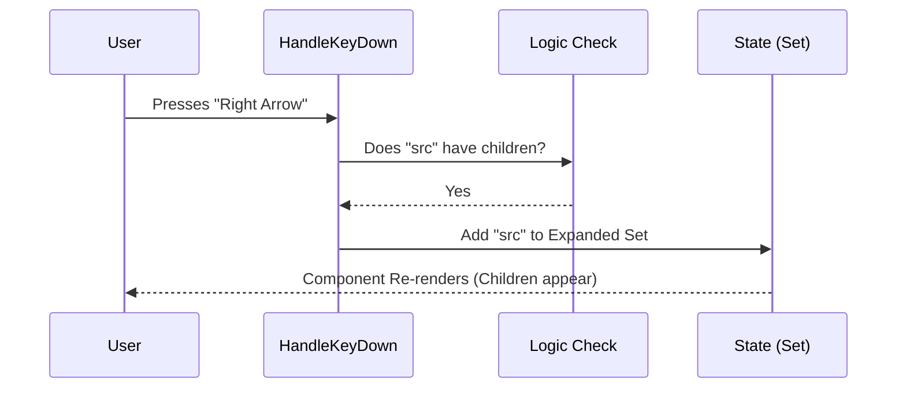

# Chapter 2: Tree Navigation & Expansion Strategy

Welcome to the second chapter of the **Hierarchical Tree Selector** tutorial!

In the previous chapter, [Hierarchical Tree Selector](01_hierarchical_tree_selector.md), we learned how to structure nested data and render a basic component. However, a tree is useless if you can't open or close folders!

This chapter focuses on the **Brain** of the component: how it interprets keyboard inputs to navigate deep hierarchies without using a mouse.

## The Problem: Two Dimensions in a One-Dimensional World

Terminal lists are traditionally **1D** (One-Dimensional). You press **Up** to go to the previous item, and **Down** to go to the next.

But a Tree is **2D**:
1.  **Vertical:** Moving between items (siblings).
2.  **Horizontal:** Moving into depth (parent to child).

If we only used Up and Down, navigating a huge folder structure would be a nightmare. We need a strategy to handle that "Horizontal" movement.

## The Strategy: Arrow Key Logic

We will implement a standard interaction model used in file explorers (like VS Code or Finder):

*   **Right Arrow (→):**
    *   If the node is closed: **Expand it** (Show children).
    *   If the node is already open: **Do nothing** (or optionally move focus to the first child).
*   **Left Arrow (←):**
    *   If the node is open: **Collapse it** (Hide children).
    *   If the node is closed (or has no children): **Jump to Parent** (Move focus "out").

## Key Concept 1: The "Open" State

Before we can expand anything, we need to remember what is currently open. We don't change the original data; instead, we keep a separate "list of open IDs."

We use a JavaScript `Set` for this. Think of it as a **VIP Guest List**. If a folder's ID is on the list, it's allowed to show its children.

```typescript
// Inside TreeSelect.tsx component
// A Set acts like a unique checklist of IDs: {'src', 'components'}
const [internalExpandedIds, setInternalExpandedIds] = React.useState(
  new Set()
);
```

To check if a folder is open, we just ask the set:

```typescript
// Returns true if 'src' is in the Set
const isFolderOpen = internalExpandedIds.has('src');
```

## Key Concept 2: Toggling Logic

We need a helper function to add or remove IDs from this list. This function effectively "opens" or "closes" a folder.

```typescript
const toggleExpand = (nodeId, shouldExpand) => {
  setInternalExpandedIds(prev => {
    const newSet = new Set(prev); // Copy the old list
    if (shouldExpand) {
      newSet.add(nodeId);    // Add ID to open it
    } else {
      newSet.delete(nodeId); // Remove ID to close it
    }
    return newSet;
  });
};
```

> **Why copy the Set?** In React, we must create a *new* object/set to trigger a re-render. We can't just modify the old one.

## Key Concept 3: Intercepting Keyboard Input

This is where the magic happens. We listen for key presses on the focused item.

Normally, pressing **Right** in a text box moves the cursor. In our list, we want to prevent that default behavior and run our logic instead.

### Visualizing the Flow

Let's see what happens when a user presses the **Right Arrow** on a folder named `src`:



## Implementation: The `handleKeyDown` Function

Let's break down the actual code inside `TreeSelect.tsx`. We look at the event `e.key`.

### Scenario A: Expanding (Right Arrow)

If the user presses Right, and the item has stuff inside it, we open it.

```typescript
// Inside handleKeyDown
if (e.key === "right" && flatNode.hasChildren) {
  // Stop the terminal from doing weird scrolling stuff
  e.preventDefault(); 
  
  // Call our toggle helper to ADD to the set
  toggleExpand(focusNodeId, true);
}
```

### Scenario B: Collapsing (Left Arrow)

If the user presses Left, and the folder is currently open, we close it.

```typescript
// Inside handleKeyDown
else if (e.key === "left") {
  // Check if it's a folder AND it's currently open
  if (flatNode.hasChildren && flatNode.isExpanded) {
    e.preventDefault();
    
    // Call our toggle helper to REMOVE from the set
    toggleExpand(focusNodeId, false);
  }
  // ... (See Scenario C below)
}
```

### Scenario C: Jumping to Parent (Left Arrow)

This is a subtle but powerful feature.
*   **Context:** You are highlighting `Button.tsx` (a child).
*   **Action:** You press **Left**.
*   **Result:** You don't want to close `Button.tsx` (it's a file, it can't close). You want to jump focus back to the folder that contains it (`components`).

```typescript
// Inside the same 'left' block as above
else {
  // If we are a child (we have a parentId)
  if (flatNode.parentId !== undefined) {
    e.preventDefault();
    
    // 1. Close the parent folder (optional, but clean)
    toggleExpand(flatNode.parentId, false);
    
    // 2. Move focus "Up" to the parent
    if (onFocus) {
       // logic to find parent node and call onFocus(parentNode)
    }
  }
}
```

## Putting It Together

When we combine these strategies, we get a fluid navigation experience:

1.  User starts at `Project`.
2.  Presses **Right** $\rightarrow$ `Project` opens.
3.  Presses **Down** $\rightarrow$ Selects `src`.
4.  Presses **Right** $\rightarrow$ `src` opens.
5.  Presses **Down** $\rightarrow$ Selects `utils.ts`.
6.  Presses **Left** $\rightarrow$ Focus jumps back to `src`.
7.  Presses **Left** $\rightarrow$ `src` closes.

## Summary

In this chapter, we learned how to turn a static list into an interactive tree:

1.  We used a **Set** to track which IDs are "Expanded".
2.  We used **Key Interception** to override standard arrow keys.
3.  We implemented **Logic Branches** to handle Expanding, Collapsing, and Jumping to Parents.

**But wait!** Simply having a list of "Open IDs" (`{'src', 'components'}`) doesn't actually show the files on the screen. We need a way to read that list and generate the correct visual lines to print to the terminal.

How do we turn the *Data Tree* + *Expanded State* into a *Flat List* of items? We will explore that math in the next chapter.

[Next Chapter: Recursive Tree Flattening](03_recursive_tree_flattening.md)

---

Generated by [Code IQ](https://github.com/adityasoni99/Code-IQ)