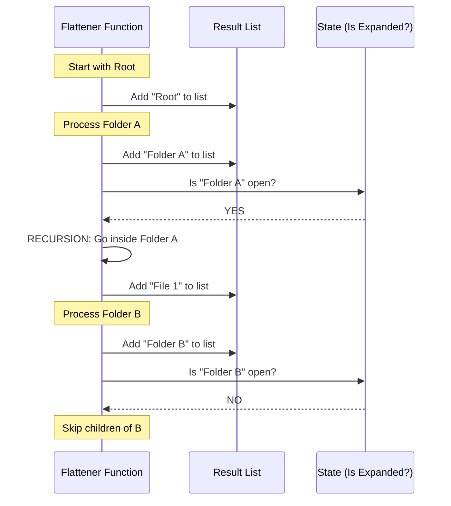

# Chapter 3: Recursive Tree Flattening

Welcome to the third chapter of the **Hierarchical Tree Selector** tutorial!

In the previous chapter, [Tree Navigation & Expansion Strategy](02_tree_navigation___expansion_strategy.md), we built the "brain" of our component. We know which folders the user wants to open and we store their IDs in a `Set`.

However, knowing that "Folder A is open" isn't enough. We need to display the contents of Folder A on the screen.

This chapter explains **Recursive Tree Flattening**: the engine that transforms your nested data into a linear list that the terminal can actually draw.

## The Problem: Trees vs. Arrays

Terminal interfaces (and most rendering engines) are simple. They like **Flat Lists** (Arrays). They want to print Line 1, then Line 2, then Line 3.

But our data is a **Tree**:

```text
Root
  ├── Folder A
  │     └── File 1
  └── Folder B
```

If we just printed the top-level items, we would only see `Root`. We wouldn't see `File 1`.

We need a process that "walks" through the tree and decides which items to put into a final, flat list based on whether their parents are open or closed.

## Key Concept: Recursion

To solve this, we use **Recursion**.

> **Definition:** Recursion is when a function calls itself to solve a smaller version of the same problem.

Imagine you are looking for a specific paper in a stack of boxes.
1.  You open the big box.
2.  You look at the first item. Is it a paper? Keep it.
3.  Is it a smaller box? **Repeat step 1** for that smaller box.

This is exactly how we flatten our tree.

## Internal Implementation: The `traverse` Function

The heart of `TreeSelect.tsx` is a function called `traverse`. Its job is to visit a node, add it to our list, and then decide if it should visit the node's children.

### Visualizing the Flow

Let's see what happens when the Flattener processes a tree where "Folder A" is **Expanded** (Open) and "Folder B" is **Collapsed** (Closed).



### Code Deep Dive

Let's look at the code in `TreeSelect.tsx`. We wrap this logic in `React.useMemo` so it only runs when data changes or folders are opened/closed.

#### 1. The Setup
We start with an empty array. This will hold our final flat list.

```typescript
// Inside TreeSelect.tsx
const flattenedNodes = React.useMemo(() => {
  // This array will hold the final linear list
  const result = [];
  
  // ... traverse function goes here ...

  return result;
}, [nodes, isExpanded]);
```

#### 2. The Recursive Helper
We define a helper function called `traverse`. It takes a `node` and a `depth` (how deep we are in the tree).

```typescript
function traverse(node, depth, parentId) {
  // Check if this node is currently open in our State
  const nodeIsExpanded = isExpanded(node.id);
  
  // Check if it actually has stuff inside
  const hasChildren = node.children && node.children.length > 0;

  // ... add to result ...
}
```

#### 3. Adding to the List
Regardless of whether it is open or closed, we *always* add the current node to the list because it is visible.

```typescript
// Inside traverse()
result.push({
  node: node,           // The original data
  depth: depth,         // 0 for root, 1 for child, etc.
  isExpanded: nodeIsExpanded,
  hasChildren: hasChildren
});
```

> **Why track depth?** We need to know the depth so we can indent the text later (e.g., adding spaces or `|--` prefixes).

#### 4. The Recursive Step
Here is the magic. If the node is **Expanded** AND has **Children**, we loop through them and call `traverse` again.

```typescript
// Inside traverse()
if (hasChildren && nodeIsExpanded) {
  for (const child of node.children) {
    // RECURSION: Call self, but increase depth by 1
    traverse(child, depth + 1, node.id);
  }
}
```

#### 5. Kicking it Off
Finally, we start the process by looping over the top-level nodes (the roots).

```typescript
// Inside the useMemo, after defining traverse()
for (const node of nodes) {
  traverse(node, 0); // Start at depth 0
}
```

## Use Case Example

Let's trace this with real data to see the transformation.

### Input Data (The Tree)
```javascript
const nodes = [
  { 
    id: 'src', 
    children: [ { id: 'app.tsx' } ] 
  },
  { 
    id: 'readme.md' 
  }
];
```

### Scenario 1: 'src' is Closed
*   `isExpanded('src')` is `false`.
*   **Result:**
    1.  Add `src` (Depth 0).
    2.  `src` is closed. Skip children.
    3.  Add `readme.md` (Depth 0).
*   **Flat List:** `['src', 'readme.md']`

### Scenario 2: 'src' is Open
*   `isExpanded('src')` is `true`.
*   **Result:**
    1.  Add `src` (Depth 0).
    2.  `src` is open. **Dive in!**
    3.  Call traverse on `app.tsx` (Depth 1).
    4.  Add `app.tsx` (Depth 1).
    5.  `app.tsx` has no children. Return.
    6.  Add `readme.md` (Depth 0).
*   **Flat List:** `['src', 'app.tsx', 'readme.md']`

## Why This Matters

This "Flat List" is powerful.
1.  **Rendering:** We can now simply map over this list to render lines of text.
2.  **Navigation:** When you press "Down", you just go to the next item in this array. You don't need to calculate tree logic every time you move the cursor.

The component treats the visible tree as just a simple list of options, where some options happen to be indented more than others.

## Summary

In this chapter, we solved the problem of displaying 3D data on a 2D screen.
1.  We used **Recursion** to visit nodes.
2.  We checked the **Expansion State** to decide whether to dig deeper.
3.  We calculated **Depth** to help with visual indentation later.
4.  We produced a **Flat Array** that represents exactly what the user should see right now.

Now that we have a flat list of items, we need to present them beautifully. We need to handle scrolling if the list is too long, and we want to add line numbers.

[Next Chapter: Auto-Numbering List Container](04_auto_numbering_list_container.md)

---

Generated by [Code IQ](https://github.com/adityasoni99/Code-IQ)