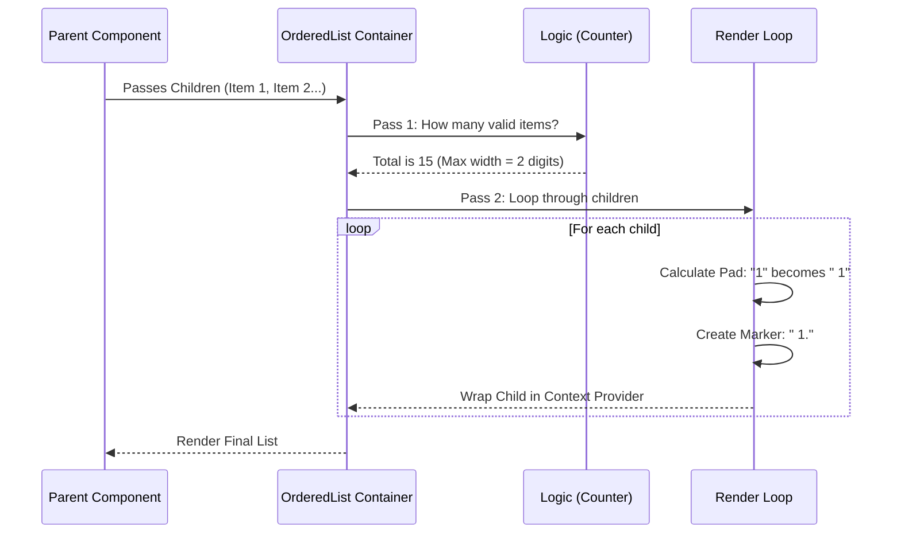

# Chapter 4: Auto-Numbering List Container

Welcome to Chapter 4 of the **Hierarchical Tree Selector** tutorial!

In the previous chapter, [Recursive Tree Flattening](03_recursive_tree_flattening.md), we successfully took a complex, nested tree of data and turned it into a flat list of visible items.

Now, we need to display this list to the user. But we don't just want a boring text dump. We want an **Ordered List** (1, 2, 3...) that looks professional.

This chapter introduces the **Auto-Numbering List Container**: a smart wrapper that handles counting, formatting, and alignment automatically.

## The Problem: The "Wobbly List"

Creating a numbered list seems easy. You just loop through items and print `index + 1`, right?

**Attempt 1:**
```text
8. Item H
9. Item I
10. Item J
```
Notice the problem? When we hit double digits (10), the text "Item J" gets pushed to the right. The dots don't align vertically. This looks messy in a terminal UI.

**Goal (Aligned):**
```text
 8. Item H
 9. Item I
10. Item J
```
To achieve this, we need to know **how many items there are in total** *before* we start printing the first one, so we can calculate how much padding (space) to add.

## The Solution: `OrderedList` Container

We will build a component called `OrderedList`. It acts like a manager for its children.

It performs three main jobs:
1.  **Filters:** It ignores random elements (like generic `<div>`s) and only counts valid List Items.
2.  **Calculates:** It determines the total count to figure out alignment (e.g., if there are 100 items, we need space for 3 digits).
3.  **Broadcasts:** It calculates the specific number (marker) for each child and passes it down.

## Key Concept 1: Two-Pass Rendering

To solve the alignment problem, we can't just print items as we see them. We need to look at the children **twice**.

1.  **Pass 1 (Counting):** Look at all children. Count how many valid list items exist.
2.  **Pass 2 (Rendering):** Loop through them again. Assign the correct number string (e.g., `" 1."`) based on the total count found in Pass 1.

## Key Concept 2: React Context (The Broadcaster)

We don't want to manually pass props like `number="1"` to every single item in our code. That is tedious.

Instead, we use **React Context**.
*   The **Container** (Parent) calculates the marker.
*   It puts that marker into a "Context Provider" (like a loudspeaker).
*   The **Item** (Child) simply listens to the context to see what its number is.

## Use Case: A Simple List

Before we apply this to our complex File Tree, let's understand it with a simple list of fruits.

**Input Code:**
```tsx
<OrderedList>
  <OrderedList.Item>Apple</OrderedList.Item>
  <OrderedList.Item>Banana</OrderedList.Item>
  {/* ... imagine 8 more items ... */}
  <OrderedList.Item>Kiwi</OrderedList.Item>
</OrderedList>
```

**Output (What the user sees):**
The container sees there are 11 items total. It knows it needs 2 digits of space.
```text
 1. Apple
 2. Banana
...
11. Kiwi
```

## Internal Implementation: How it Works

Let's visualize the flow inside the `OrderedList` component when it receives children.



### Code Deep Dive

Let's look at `OrderedList.tsx`.

#### 1. Defining the Context
First, we create the "Loudspeaker". This is how the parent talks to the child.

```typescript
// OrderedList.tsx
import React, { createContext } from 'react';

// The message we will send is just a string, e.g., " 1."
export const OrderedListContext = createContext({
  marker: ''
});
```

#### 2. Pass 1: Counting Items
Inside the component, we first count. We use `React.Children.toArray` to handle the children safely.

```typescript
// Inside OrderedListComponent function
let numberOfItems = 0;

// Loop through all children provided to this component
for (const child of React.Children.toArray(children)) {
  // Only count it if it is a valid React element
  if (isValidElement(child) && child.type === OrderedListItem) {
    numberOfItems++;
  }
}
```

#### 3. Calculating Width
Now that we know we have `numberOfItems`, we calculate how wide our numbers need to be.

```typescript
// If we have 5 items, length is 1.
// If we have 15 items, length is 2.
const maxMarkerWidth = String(numberOfItems).length;
```

#### 4. Pass 2: Rendering with Alignment
Finally, we map over the children to render them. We use the JavaScript function `padStart` to add the spaces.

```typescript
// Mapping over children to wrap them
return React.Children.map(children, (child, index) => {
  // Logic to calculate the string
  // Index 0 becomes "1". Pad it to match max width.
  const padded = String(index + 1).padStart(maxMarkerWidth);
  
  const finalMarker = `${padded}.`; // Result: " 1." or "10."

  // Wrap the child in the Provider
  return (
    <OrderedListContext.Provider value={{ marker: finalMarker }}>
      {child}
    </OrderedListContext.Provider>
  );
});
```

> **Note on Recursion:** The code also supports nested lists (lists inside lists) by combining the `parentMarker` with the current one, but for a beginner, focusing on the simple padding logic is most important!

## Why This Matters for Our Project

In [Hierarchical Tree Selector](01_hierarchical_tree_selector.md), we learned that our File Tree is just a list of nodes.

When we flatten the tree in [Recursive Tree Flattening](03_recursive_tree_flattening.md), we get an array of files. We wrap that entire array in this `OrderedList`.

This ensures that even if you have 100 files open in your tree, the numbering stays perfectly aligned on the left side of the terminal, keeping the UI clean and readable.

## Summary

In this chapter, we built a "Smart Container" that:
1.  **Pre-calculates** the necessary spacing for numbers.
2.  **Aligns** "1." and "10." perfectly using `padStart`.
3.  **Provides** the formatted number to its children using Context.

However, the container only *sends* the signal. We still need a component to *receive* that signal and actually print the text to the screen.

In the next chapter, we will build the List Item component that listens to this context and displays the content.

[Next Chapter: Context-Aware List Item](05_context_aware_list_item.md)

---

Generated by [Code IQ](https://github.com/adityasoni99/Code-IQ)