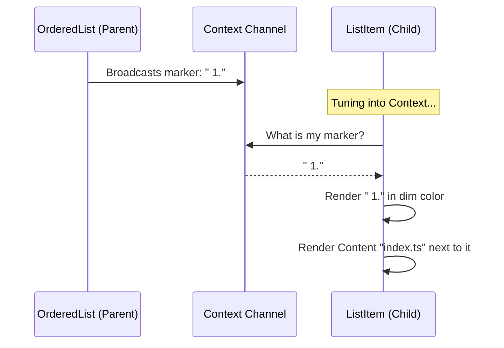

# Chapter 5: Context-Aware List Item

Welcome to the final chapter of the **Hierarchical Tree Selector** tutorial!

In the previous chapter, [Auto-Numbering List Container](04_auto_numbering_list_container.md), we built a smart parent component that knows how to count its children and calculate the correct numbers (like " 1." or "10.").

However, a parent component cannot display itself. It needs a child component to actually render the text.

This chapter introduces the **Context-Aware List Item**: a component that listens to the parent to find out its number and then displays your content.

## The Problem: Manual Numbering is Tedious

Imagine you are writing a list of files in your code:

```tsx
// The "Hard Way"
<Item label="1. index.ts" />
<Item label="2. utils.ts" />
<Item label="3. styles.css" />
```

If you delete `utils.ts`, you have to manually rename `styles.css` to be number "2.". If you have a list of 50 items, this is a nightmare.

We want to write code where the item **doesn't know its own number**. It should just ask: *"Hey Parent, what number am I?"*

## The Solution: The "Dumb" Receiver

We will build a component called `OrderedListItem`. It is "dumb" in a good way:
1.  It does not count.
2.  It does not calculate padding.
3.  It simply **tunes in** to the signal broadcast by the parent and prints what it hears.

## Key Concept: The Context Consumer

In React, if a Parent uses `Context.Provider` (the Broadcaster), the Child uses `useContext` (the Receiver).

> **Analogy:** Think of the Parent Component as a Radio Station broadcasting a song. The Child Component is the Radio. The Radio doesn't create the music; it just plays whatever is on the frequency.

## Use Case: Displaying a File

Let's see how simple our final code looks when using this component.

**Input:**
```tsx
<OrderedList>
  {/* We don't pass any numbers here! */}
  <OrderedList.Item>index.ts</OrderedList.Item>
  <OrderedList.Item>package.json</OrderedList.Item>
</OrderedList>
```

**Output:**
The item automatically receives the formatted string from the parent.
```text
 1. index.ts
 2. package.json
```

## Internal Implementation: How it Works

Let's visualize the communication flow. The `OrderedListItem` is completely passive until it receives data.



### Code Deep Dive

Let's look at the code for `OrderedListItem.tsx`. It is surprisingly simple because all the hard math was done in the previous chapter.

#### 1. Importing the Frequency
First, we need to access the same Context that the parent defined.

```typescript
// OrderedListItem.tsx
import React, { useContext } from 'react';
import { Box, Text } from '../../ink.js';

// We create/export this so the Parent knows where to broadcast
export const OrderedListItemContext = React.createContext({ 
  marker: '' 
});
```

#### 2. Tuning In
Inside the component, we use the `useContext` hook. This grabs the data sent by the nearest parent provider.

```typescript
export function OrderedListItem({ children }) {
  // Receive the "marker" (e.g., " 1.") from the parent
  const { marker } = useContext(OrderedListItemContext);

  // ... rendering logic
}
```

#### 3. Displaying the Result
Now we just arrange the marker and the children side-by-side using a `Box`.

```typescript
// Inside OrderedListItem function returns:
return (
  <Box gap={1}>
    {/* Display the number in a dim color so it's subtle */}
    <Text dimColor>{marker}</Text>
    
    {/* Display the actual content (the file name) */}
    <Box flexDirection="column">
      {children}
    </Box>
  </Box>
);
```

> **Why `dimColor`?** In terminal UIs, it is good practice to make metadata (like line numbers) less bright than the actual content. This helps the user focus on the file names.

## Putting It All Together: The Complete Architecture

Congratulations! You have built all the pieces of the **Hierarchical Tree Selector**.

Let's recap how the data flows through the entire system we built over these 5 chapters:

1.  **Input Data:** You provide a nested Tree object (`TreeNode`).
    *   *Reference: [Hierarchical Tree Selector](01_hierarchical_tree_selector.md)*
2.  **Navigation:** The component tracks which folders are "Expanded" using a `Set`.
    *   *Reference: [Tree Navigation & Expansion Strategy](02_tree_navigation___expansion_strategy.md)*
3.  **Flattening:** A recursive function turns the visible tree into a flat array.
    *   *Reference: [Recursive Tree Flattening](03_recursive_tree_flattening.md)*
4.  **Numbering:** The `OrderedList` container calculates the line numbers for that flat array.
    *   *Reference: [Auto-Numbering List Container](04_auto_numbering_list_container.md)*
5.  **Rendering:** The `OrderedListItem` (this chapter) displays the final line.

### Final Result

When you combine these 5 concepts, you get a professional, interactive CLI component:

```text
 1. Project
 2. ▾ src
 3. |  components
 4. |  ▾ Button
 5. |  |  index.ts
 6. package.json
```

## Conclusion

You have successfully built a complex UI abstraction from scratch!

We started with a difficult problem (displaying nested data in a flat terminal) and solved it by breaking it down into small, manageable responsibilities:
*   **State Management** handles the logic.
*   **Recursion** handles the data structure.
*   **Context** handles the communication between components.

These patterns—Flattening, Context Providers, and Decoupled Items—are used everywhere in professional UI development, from web apps to terminal tools.

Thank you for following the **Hierarchical Tree Selector** tutorial series. Happy coding!

---

Generated by [Code IQ](https://github.com/adityasoni99/Code-IQ)