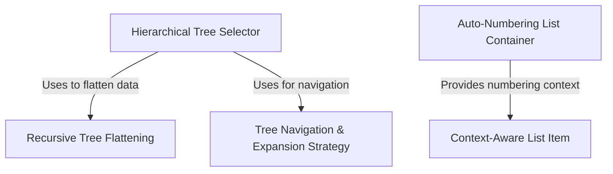

# Tutorial: ui

This project builds specialized **interactive UI components** for terminal applications, enabling rich data visualization in a command-line interface. It features a **hierarchical tree explorer** that allows users to navigate and expand nested structures (like folders), as well as a *smart ordered list* system that automatically handles numbering and alignment for its items.

## Chapters

1. [Hierarchical Tree Selector](01_hierarchical_tree_selector.md)
2. [Tree Navigation & Expansion Strategy](02_tree_navigation___expansion_strategy.md)
3. [Recursive Tree Flattening](03_recursive_tree_flattening.md)
4. [Auto-Numbering List Container](04_auto_numbering_list_container.md)
5. [Context-Aware List Item](05_context_aware_list_item.md)

---

Generated by [Code IQ](https://github.com/adityasoni99/Code-IQ)