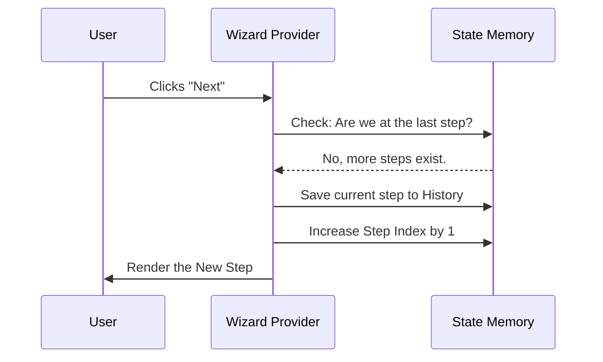

# Chapter 1: Wizard State Management

Welcome to the first chapter of the **Wizard** tutorial!

Imagine you are playing a video game. For the game to make sense, the console needs to remember two very important things:
1.  **Which level** you are currently playing.
2.  **What items** you have collected in your inventory.

If the console forgot these things every time you walked into a new room, the game would be impossible to play!

In our project, the **Wizard State Management** is that game console. It is the "brain" that keeps track of where the user is (the step) and what they have typed so far (the data).

## The Core Concept: The `WizardProvider`

The heart of this system is a component called `WizardProvider`. You can think of it as a container or a wrapper that surrounds your entire multi-step form.

It manages three specific pieces of "memory" (state):

1.  **Current Step Index**: A number (0, 1, 2...) representing the current screen.
2.  **Wizard Data**: An object `{}` acting as a "backpack" holding all user inputs.
3.  **Navigation History**: A list of breadcrumbs to remember exactly which steps the user visited, so the "Back" button works correctly.

## How It Works: A High-Level Example

Let's look at how we set this up. We don't need to write complex logic for every form; we just hand the `WizardProvider` a map of our levels (steps).

### 1. Defining the Steps
First, we need a list of components that act as our "levels".

```tsx
// These are just standard React components
import StepOne from './StepOne';
import StepTwo from './StepTwo';

// We put them in an array
const mySteps = [StepOne, StepTwo];
```

### 2. Wrapping the App
Now, we use the `WizardProvider` to manage the show.

```tsx
import { WizardProvider } from './WizardProvider';

function App() {
  return (
    <WizardProvider steps={mySteps}>
      {/* The provider will render the correct step here */}
    </WizardProvider>
  );
}
```

By doing this, the provider automatically starts at `StepOne` (Index 0). When the state changes, it swaps `StepOne` for `StepTwo`.

## Under the Hood: What happens inside?

When a user interacts with the wizard, the `WizardProvider` handles the logic so individual steps don't have to.

Let's visualize the flow when a user clicks "Next":



### deep Dive: The Internal Code

Let's look at the actual code inside `WizardProvider.tsx` to see how it manages this memory. We will break it down into small, easy-to-understand chunks.

#### 1. Setting up the Memory
At the start of the component, we create the state variables. This is the "Game Console" initializing.

```tsx
// Inside WizardProvider.tsx

// 1. Where are we? (Starts at 0)
const [currentStepIndex, setCurrentStepIndex] = useState(0);

// 2. What have we collected? (Starts empty or with initialData)
const [wizardData, setWizardData] = useState(initialData);

// 3. Where have we been? (Starts as an empty list)
const [navigationHistory, setNavigationHistory] = useState([]);
```
*Note: We use standard React `useState` hooks here. This ensures that whenever these change, the Wizard re-renders to show the correct information.*

#### 2. Moving Forward (`goNext`)
This function allows the wizard to proceed. It's smart—it checks if there is a next step before moving.

```tsx
const goNext = useCallback(() => {
  // Check if we are NOT at the last step
  if (currentStepIndex < steps.length - 1) {
    
    // Save where we came from (for the Back button)
    setNavigationHistory(prev => [...prev, currentStepIndex]);
    
    // Move to the next step
    setCurrentStepIndex(prev => prev + 1);
  } else {
    // If we are at the end, mark as completed!
    setIsCompleted(true);
  }
}, [currentStepIndex, steps.length]);
```

#### 3. Moving Backward (`goBack`)
The "Back" button is trickier than just doing `index - 1`. If you jumped from Step 1 to Step 5, hitting "Back" should take you to 1, not 4. The `navigationHistory` solves this.

```tsx
const goBack = useCallback(() => {
  // Do we have history?
  if (navigationHistory.length > 0) {
    // Find the very last step we visited
    const previousStep = navigationHistory[navigationHistory.length - 1];
    
    // Remove it from history (pop)
    setNavigationHistory(prev => prev.slice(0, -1));
    
    // Go there
    setCurrentStepIndex(previousStep);
  } 
  // ... (fallback logic handled here)
}, [navigationHistory, currentStepIndex]);
```

#### 4. Sharing the Brain (`WizardContext`)
Finally, the Provider packages all these functions and data into a bundle called `contextValue` and shares it with the children.

```tsx
// Bundling everything together
const contextValue = {
  currentStepIndex,
  wizardData,
  goNext, // The function to move forward
  goBack, // The function to move back
  // ... other helpers
};

// Providing it to the app
return (
  <WizardContext.Provider value={contextValue}>
    {children || <CurrentStepComponent />}
  </WizardContext.Provider>
);
```

## Summary

In this chapter, we learned:
1.  **Wizard State Management** acts like a game console, remembering your level (Step Index) and inventory (Data).
2.  The **`WizardProvider`** is the main component that holds this logic.
3.  It uses **History** to ensure the "Back" button works logically, even if you skip steps.

Now that we have a "Brain" managing our state, how do individual steps actually talk to it? How does `StepOne` tell the brain to "Go Next"?

We will learn exactly how to connect to this brain in the next chapter.

[Next Chapter: Context Access Hook](02_context_access_hook.md)

---

Generated by [Code IQ](https://github.com/adityasoni99/Code-IQ)