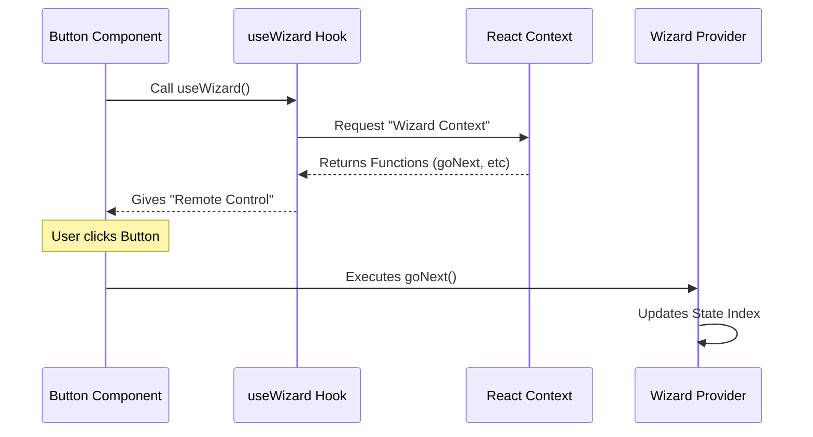

# Chapter 2: Context Access Hook

Welcome back! In the previous chapter, [Wizard State Management](01_wizard_state_management.md), we built the "Brain" of our application. We learned how the `WizardProvider` acts like a game console, remembering which level (step) you are on.

But having a Brain is only half the battle. A Brain is useless if the arms and legs (your components) can't talk to it!

**The Challenge:**
Imagine you are building a "Next Step" button. This button is deep inside your application code. How does this button tell the `WizardProvider` (which is way up at the top of your app) to flip the page?

We *could* pass a function down from parent to child, to grandchild, to great-grandchild... like a bucket brigade. But that is messy and tiring.

**The Solution:**
We use the **Context Access Hook**: `useWizard`.

Think of `useWizard` as a **Universal Remote Control**. It doesn't matter which room of the house (component) you are standing in. If you have this remote, you can change the channel on the main TV directly.

## The Core Concept: The Hook

In React, a "Hook" is just a special function that lets you "hook into" features like state or context.

Our `useWizard` hook is the bridge. It connects any component, no matter where it is, directly to the central `WizardProvider`.

### Use Case: The "Next" Button

Let's solve a specific problem. We want to create a button that, when clicked, moves the Wizard to the next step.

Here is how we do it using our remote control.

### Step 1: Import and Connect
First, inside your component, you call the hook. This is like reaching into your pocket and pulling out the remote.

```tsx
import { useWizard } from './useWizard';

const MyNextButton = () => {
  // Grab the "goNext" button from the remote
  const { goNext } = useWizard(); 

  // ... rest of component
};
```

### Step 2: Trigger the Action
Now that you have the `goNext` function, you can attach it to a button click.

```tsx
return (
  <button onClick={goNext}>
    Go to Next Step
  </button>
);
```

**What happens here?**
1.  **Input:** The user clicks the button.
2.  **Action:** The `goNext()` function fires.
3.  **Result:** The signal travels up to the `WizardProvider`. The Provider updates the state index (e.g., from 0 to 1). The entire Wizard re-renders to show the new step!

## Under the Hood: How does it work?

It seems like magic that a button deep down knows about a Provider way up high. Let's peel back the curtain.

When you call `useWizard()`, React looks *upwards* through the component tree (like looking up at the ceiling) until it finds the nearest `WizardProvider`.

Here is the flow of communication:



### Deep Dive: The Internal Code

Let's look at `useWizard.ts` to see how we built this remote control. It is actually very short!

#### 1. Importing Tools
We need two things from React: `useContext` (the tool to find the Provider) and the `WizardContext` object itself (the specific frequency we are listening to).

```tsx
// Inside useWizard.ts
import { useContext } from 'react'
import { WizardContext } from './WizardProvider.js'
// We also import types to make TypeScript happy
import type { WizardContextValue } from './types.js'
```

#### 2. The Hook Function
Here is the function we export. It tries to grab the context.

```tsx
export function useWizard() {
  // Ask React: "Give me the data from the nearest WizardProvider"
  const context = useContext(WizardContext);
  
  // ... safety check comes next
```

#### 3. The Safety Net (Crucial!)
This is the most important part of the hook.

What happens if you try to use the TV remote when you are miles away in a forest? It won't work because there is no TV nearby.

Similarly, if you use `useWizard` inside a component that is **NOT** wrapped by a `WizardProvider`, `context` will be null. If we let that slide, your app would crash silently later. instead, we shout an error immediately.

```tsx
  // Did we find a Provider?
  if (!context) {
    // If not, stop everything and warn the developer!
    throw new Error('useWizard must be used within a WizardProvider');
  }

  // If we found it, hand it over to the component
  return context;
}
```

## Why do we do this?
Why not just export `useContext(WizardContext)` directly in our components?

1.  **Convenience:** We don't want to import `useContext` AND `WizardContext` every single time we make a button. `useWizard` bundles them into one import.
2.  **Safety:** The error message ("must be used within a WizardProvider") saves you hours of debugging. If you see a white screen, checking the console will tell you exactly what you forgot.

## Summary

In this chapter, we learned:
1.  The **`useWizard` hook** is like a Universal Remote Control.
2.  It allows any component to trigger actions (like `goNext`) or read data without passing props manually.
3.  It includes a **Safety Net** to ensure your component is correctly placed inside the Wizard.

Now we have a Brain (Provider) and a Remote Control (Hook). But what should our Wizard actually look like? How do we make sure every step looks consistent?

In the next chapter, we will build the visual shell of our wizard.

[Next Chapter: Standardized Dialog Layout](03_standardized_dialog_layout.md)

---

Generated by [Code IQ](https://github.com/adityasoni99/Code-IQ)