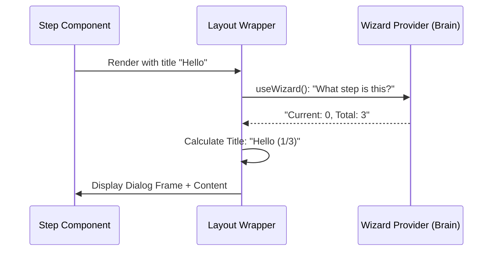

# Chapter 3: Standardized Dialog Layout

Welcome to the third chapter of our **Wizard** tutorial!

In the previous chapter, [Context Access Hook](02_context_access_hook.md), we built a "Universal Remote Control" (`useWizard`) that lets any component talk to our central brain.

Now we have a Brain (Provider) and a Remote (Hook). But if we start building our steps now, we run into a visual problem.

**The Problem:**
Imagine you are building a 5-step wizard.
-   On Step 1, you manually add a title "Personal Info" and a "Back" button.
-   On Step 2, you accidentally make the title font slightly smaller.
-   On Step 3, you forget to add the "Back" button entirely.

This leads to a messy user experience. We don't want to copy-paste the title logic and navigation buttons into every single step file.

**The Solution:**
We use the **Standardized Dialog Layout**.

Think of this like a **Pre-Printed Form**. The company logo, the page number box, and the signature line at the bottom are pre-printed and identical on every page. You only need to fill in the blank space in the middle.

## The Core Concept: `WizardDialogLayout`

The `WizardDialogLayout` is a wrapper component. It surrounds the specific content of your step with a standard "shell."

It automatically handles:
1.  **The Title**: It displays the title and automatically calculates "Step X of Y".
2.  **The Back Button**: It wires up the "Cancel/Back" button automatically.
3.  **The Footer**: It provides a dedicated space for instructions or navigation hints.

### Use Case: Wrapping a Step

Let's say we have a component for our first step called `StepNameInput`. Here is how we make it look professional using the layout.

```tsx
import { WizardDialogLayout } from './WizardDialogLayout';

export function StepNameInput() {
  return (
    <WizardDialogLayout 
      title="Who are you?" 
      footerText="Press Enter to continue"
    >
      {/* This is the unique content in the middle */}
      <input placeholder="Type your name..." />
      
    </WizardDialogLayout>
  );
}
```

**What happens visually?**
Even though we just passed a title and an input, the user sees:
1.  A dialog window.
2.  A header saying **"Who are you? (1/3)"** (The layout added the numbers!).
3.  An "X" or "Back" button in the corner that actually works.
4.  Your input box in the center.
5.  A footer at the bottom saying "Press Enter to continue".

## Under the Hood: How does it work?

The `WizardDialogLayout` is smart because it uses the tools we built in previous chapters. It doesn't just display text; it talks to the `WizardProvider` to figure out where we are.

Let's visualize the flow when a step renders:



### Deep Dive: The Internal Code

Let's look inside `WizardDialogLayout.tsx`. We will break the code down into simple parts.

#### 1. Gathering Data
First, the layout needs to know the context. It uses the hook we learned about in [Context Access Hook](02_context_access_hook.md).

```tsx
// Inside WizardDialogLayout.tsx
import { useWizard } from './useWizard';

export function WizardDialogLayout(props) {
  // Use our "Remote Control" to get state
  const { 
    currentStepIndex, 
    totalSteps, 
    goBack // We get the back function directly!
  } = useWizard();
  
  // ...
```

#### 2. Calculating the Title
We want to show the user their progress automatically. We combine the title provided by the step with the math from the Provider.

```tsx
  // Did the step provide a title? If not, use default "Wizard"
  const baseTitle = props.title || "Wizard";

  // Create the "(1/3)" suffix
  // Note: We add +1 because computers start counting at 0!
  const stepSuffix = ` (${currentStepIndex + 1}/${totalSteps})`;

  // Combine them: "Who are you? (1/3)"
  const finalTitle = `${baseTitle}${stepSuffix}`;
```

#### 3. Rendering the Dialog Shell
Now we render the visual components. We use a generic `Dialog` component (from our design system) and pass it our calculated data.

*Note: `children` is a special React prop that represents the content inside the wrapper (your input fields).*

```tsx
  return (
    <>
      <Dialog 
        title={finalTitle} 
        onCancel={goBack} // Clicking 'X' triggers goBack automatically
        color={props.color}
      >
        {props.children} 
      </Dialog>
      
      {/* The footer sits below the main dialog */}
      <WizardNavigationFooter instructions={props.footerText} />
    </>
  );
}
```

### Why is this powerful?

1.  **Zero Logic Duplication**: You never have to write `onClick={goBack}` in your steps. The layout does it for you.
2.  **Automatic Counting**: You never have to manually type "Step 1" or "Step 2". If you re-order your steps in the Provider, the numbers update automatically!
3.  **Consistent Styling**: If you want to change the color of the header, you change it in *one* file (`WizardDialogLayout`), and every step in your wizard updates instantly.

## Summary

In this chapter, we learned:
1.  **Standardized Dialog Layout** acts as a visual "Pre-printed Form" for our wizard steps.
2.  It uses **`useWizard`** to auto-calculate page numbers (e.g., "1/3") and handle the "Back" button.
3.  It wraps the unique content of each step via the `children` prop.

We now have the Brain (State), the Arms (Hook), and the Skin (Layout). But sometimes, a user needs help knowing *how* to move to the next step (e.g., "Press Enter" vs "Click Next").

In the next chapter, we will look at how to guide the user through the navigation flow.

[Next Chapter: Navigation Guidance System](04_navigation_guidance_system.md)

---

Generated by [Code IQ](https://github.com/adityasoni99/Code-IQ)