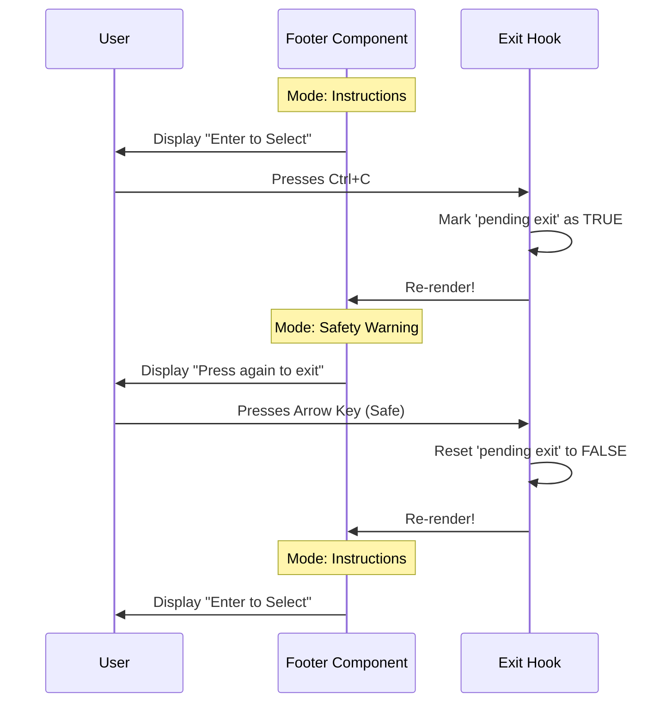

# Chapter 4: Navigation Guidance System

Welcome to the fourth chapter of our **Wizard** tutorial!

In the previous chapter, [Standardized Dialog Layout](03_standardized_dialog_layout.md), we created a consistent visual shell (the title, borders, and page numbers) for our wizard steps.

However, a pretty interface isn't enough. Imagine handing someone a complex map but removing the legend. They can see the terrain, but they don't know what the symbols mean or which path to take.

**The Problem:**
A user looks at your fancy "Select an Option" screen.
-   Do they press `Enter` to select?
-   Do they press `Space`?
-   Do they use `j` and `k` to move up and down?
-   What happens if they panic and hit `Ctrl+C`?

**The Solution:**
We use the **Navigation Guidance System** (`WizardNavigationFooter`).

This component acts as the **Map Legend** at the bottom of the screen. It tells the user exactly which keys are active. It also acts as a **Safety Guard**, catching accidental exit attempts so the user doesn't lose their progress.

## The Core Concept: `WizardNavigationFooter`

The footer sits at the very bottom of the dialog. It has two modes of operation:

1.  **Instruction Mode (Default):** It displays the "legend." For example: `↑↓ navigate • Enter select • Esc back`.
2.  **Safety Mode (Emergency):** If the user tries to quit (Presses `Ctrl+C`), the footer changes instantly to warn them: `Press Ctrl+C again to exit`.

### Use Case: The "Select Color" Step

Imagine a step where the user picks a color.

1.  **Normal State:** The footer says: "Use Arrow Keys to Choose".
2.  **User Action:** The user accidentally hits `Ctrl+C` instead of `Ctrl+V`.
3.  **System Reaction:** Instead of killing the app immediately, the footer turns red and says "Press Ctrl+C again to exit".
4.  **Result:** The user realizes their mistake, presses nothing, and the warning fades (or they continue safely).

## How to Use It

In most cases, you don't need to touch this directly! The [Standardized Dialog Layout](03_standardized_dialog_layout.md) we built in Chapter 3 already includes this footer automatically.

However, you can customize the instructions if your step is special.

### Example: Custom Instructions

If you are building a text input where `Enter` adds a new line instead of submitting, you should tell the user.

```tsx
// Inside a Step Component
import { WizardNavigationFooter } from './WizardNavigationFooter';

export function MyTextStep() {
  return (
    <>
      {/* Your content here */}
      
      {/* Customizing the legend */}
      <WizardNavigationFooter 
        instructions="Ctrl+S to Save • Esc to Cancel" 
      />
    </>
  );
}
```

## Under the Hood: How does it work?

The footer is smart. It listens for global keyboard events to handle the "Safety Mode" automatically.

Let's visualize the flow when a user interacts with the app:



### Deep Dive: The Internal Code

Let's look inside `WizardNavigationFooter.tsx`. We use a specialized hook to handle the complex "double-tap to exit" logic.

#### 1. The Exit Hook
We import a hook that listens for `Ctrl+C` (or `Ctrl+D`).

```tsx
// Inside WizardNavigationFooter.tsx
import { useExitOnCtrlCDWithKeybindings } from '../../hooks/useExitOnCtrlCDWithKeybindings.js';

export function WizardNavigationFooter({ instructions }) {
  // This hook tells us if the user is trying to quit
  const exitState = useExitOnCtrlCDWithKeybindings();
  
  // exitState looks like: { pending: true, keyName: "Ctrl+C" }
```

#### 2. The Default Instructions
If the developer didn't pass custom instructions, we provide a sensible default. We use helper components (`Byline`, `KeyboardShortcutHint`) to style keys nicely (e.g., making "Enter" look like a button).

```tsx
  // Default instructions if none provided
  const defaultContent = (
    <Byline>
      <KeyboardShortcutHint shortcut="↑↓" action="navigate" />
      <KeyboardShortcutHint shortcut="Enter" action="select" />
      {/* ... more hints */}
    </Byline>
  );

  const finalInstructions = instructions || defaultContent;
```
*Note: The `Byline` component simply arranges these hints in a neat row.*

#### 3. The Rendering Logic (The Switch)
Finally, we decide what text to show based on the `exitState`. This is a simple conditional render.

```tsx
  return (
    <Box marginLeft={3} marginTop={1}>
      <Text dimColor>
        {/* The Magic Switch */}
        {exitState.pending 
          ? `Press ${exitState.keyName} again to exit` 
          : finalInstructions
        }
      </Text>
    </Box>
  );
}
```

### Why is this important?

1.  **User Confidence:** Users never have to guess what keys work.
2.  **Safety:** Accidental keystrokes are common in terminal apps. This prevents frustration by asking for confirmation before quitting.
3.  **Consistency:** Every screen in your wizard behaves the same way regarding exit logic.

## Summary

In this chapter, we learned:
1.  The **Navigation Guidance System** acts as a map legend, explaining available shortcuts.
2.  It has a built-in **Safety Mechanism** that intercepts `Ctrl+C` to prevent accidental exits.
3.  It switches dynamically between "Instructions" and "Warning" modes.

We have now built the entire internal machinery of our Wizard:
1.  **State** (Brain)
2.  **Context Hook** (Remote Control)
3.  **Layout** (Visual Shell)
4.  **Navigation Footer** (Legend & Safety)

But how do we package all of this so other developers can import it cleanly, without seeing all the messy internal files?

In the final chapter, we will organize our code into a clean Public API.

[Next Chapter: Public Module Interface](05_public_module_interface.md)

---

Generated by [Code IQ](https://github.com/adityasoni99/Code-IQ)