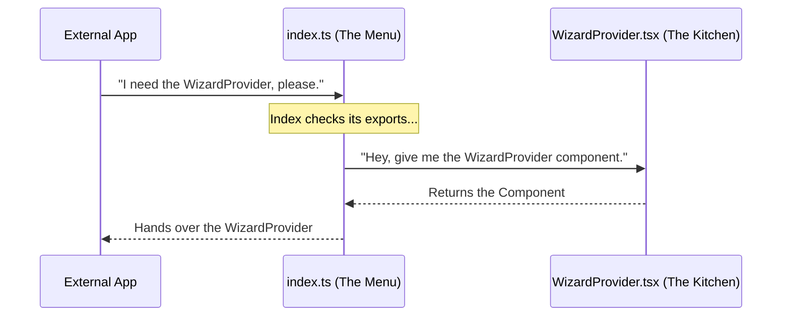

# Chapter 5: Public Module Interface

Welcome to the final chapter of the **Wizard** tutorial!

In the previous chapter, [Navigation Guidance System](04_navigation_guidance_system.md), we added the final piece of functionality to our wizard: a smart footer that guides users and prevents accidental exits.

We have built a lot of cool things:
1.  A **Brain** ([Wizard State Management](01_wizard_state_management.md)).
2.  A **Remote Control** ([Context Access Hook](02_context_access_hook.md)).
3.  A **Visual Shell** ([Standardized Dialog Layout](03_standardized_dialog_layout.md)).
4.  A **Safety System** ([Navigation Guidance System](04_navigation_guidance_system.md)).

Currently, all these pieces live in separate files scattered inside our folder. If another developer wants to use our wizard, their code might look like a messy shopping list.

**The Problem:**
To use our wizard, a developer currently has to write imports like this:

```tsx
// ❌ The Messy Way
import { WizardProvider } from './wizard/WizardProvider';
import { useWizard } from './wizard/useWizard';
import { WizardDialogLayout } from './wizard/WizardDialogLayout';
// ... and so on
```

If we ever decide to move `useWizard.ts` into a subfolder called `/hooks/`, everyone using our code will have to fix their imports. That is a maintenance nightmare!

**The Solution:**
We create a **Public Module Interface** using an `index.ts` file.

Think of this like a **Restaurant Menu**. When you go to a restaurant, you look at a single menu to see what is available. You don't walk into the kitchen, open the fridge, and ask the chef where he keeps the carrots.

The `index.ts` is our menu. It lists exactly what is available for the "customers" (other parts of the app) to order, while keeping the "kitchen" (file structure) hidden.

## The Core Concept: The "Barrel" File

In TypeScript and Node.js, a file named `index.ts` is special. If you try to import a **folder**, the computer automatically looks for an `index.ts` file inside it.

We call this a **Barrel File** because it rolls all our separate exports into one big container.

### Use Case: The Clean Import

We want to transform the messy imports above into a single, clean line.

**Goal:**
```tsx
// ✅ The Clean Way
import { 
  WizardProvider, 
  useWizard, 
  WizardDialogLayout 
} from './wizard'; // We just import the folder!
```

This is much easier to read, and it decouples the *usage* of the code from the *location* of the files.

## Under the Hood: How does it work?

It seems simple, but there is a specific flow of information happening here. The `index.ts` acts as a middleman.

Let's visualize the flow when an external app tries to import `WizardProvider`:



The App never talks to `WizardProvider.tsx` directly. It only talks to `index.ts`.

## Implementation: Building the Interface

Let's look at the code inside `index.ts`. It doesn't contain any logic! Its only job is to **Re-Export** things.

We will break this down into three simple categories.

### 1. Exporting Types
First, we export the TypeScript definitions. These are the "instruction manuals" for our components.

```tsx
// inside index.ts

// We use 'export type' to be specific
export type {
  WizardContextValue,
  WizardProviderProps,
  WizardStepComponent,
} from './types.js';
```

*Explanation:* We import the types from `./types.js` and immediately export them to the world. Now, a user can import `WizardStepComponent` directly from the main package to know how to build a step.

### 2. Exporting the Hook
Next, we export our "Remote Control" that we built in Chapter 2.

```tsx
// Re-exporting functionality
export { useWizard } from './useWizard.js';
```

*Explanation:* This makes `useWizard` available. Notice we don't export internal helper functions that might exist inside that file. We only expose what the user *needs*.

### 3. Exporting Components
Finally, we export the visual components (The Brain, The Layout, and The Footer).

```tsx
// Re-exporting the UI components
export { WizardDialogLayout } from './WizardDialogLayout.js';
export { WizardNavigationFooter } from './WizardNavigationFooter.js';
export { WizardProvider } from './WizardProvider.js';
```

*Explanation:* This completes the menu. The user can now access the Layout, the Footer, and the Provider.

## Why is this abstraction powerful?

### 1. Encapsulation (Hiding the Kitchen)
Imagine we realize `WizardProvider.tsx` is getting too big, and we split it into `WizardLogic.tsx` and `WizardRender.tsx`.

Because users import from `index.ts`, we simply update `index.ts` to point to the new files. The users **never have to change their import statements**. We can rearrange the kitchen without rewriting the menu!

### 2. Controlled Access
If we have a file called `internalHelpers.ts` that calculates math for the progress bar, we simply **don't** add it to `index.ts`.

This prevents other developers from using internal code that wasn't meant for them. It keeps the public API surface small and clean.

## Summary

In this final chapter, we learned:
1.  **Public Module Interface** acts like a Restaurant Menu (`index.ts`).
2.  It aggregates exports from many files into one single entry point.
3.  It allows other developers to import from the **folder** (`import ... from './wizard'`) instead of specific files.
4.  It allows us to refactor our internal file structure without breaking the rest of the application.

### Tutorial Complete! 🎉

Congratulations! You have built a fully functional, professional-grade Wizard module.

You have mastered:
*   [x] Managing complex state across steps.
*   [x] Creating custom hooks for easy access.
*   [x] Building consistent layouts.
*   [x] Handling keyboard navigation safely.
*   [x] Packaging it all up into a clean, reusable module.

You are now ready to build multi-step interfaces that are robust, user-friendly, and easy to maintain. Happy coding!

---

Generated by [Code IQ](https://github.com/adityasoni99/Code-IQ)