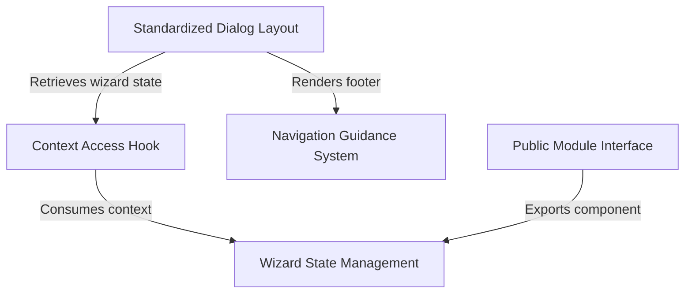

# Tutorial: wizard

This project implements a **multi-step wizard framework** designed for CLI applications. It features a centralized **State Management** system (`WizardProvider`) to track progress and collect data, which is accessible throughout the application via a custom *hook*. Additionally, it provides standardized **layout components** and navigation guidance to ensure a consistent user interface and seamless keyboard interaction.

## Chapters

1. [Wizard State Management](01_wizard_state_management.md)
2. [Context Access Hook](02_context_access_hook.md)
3. [Standardized Dialog Layout](03_standardized_dialog_layout.md)
4. [Navigation Guidance System](04_navigation_guidance_system.md)
5. [Public Module Interface](05_public_module_interface.md)

---

Generated by [Code IQ](https://github.com/adityasoni99/Code-IQ)