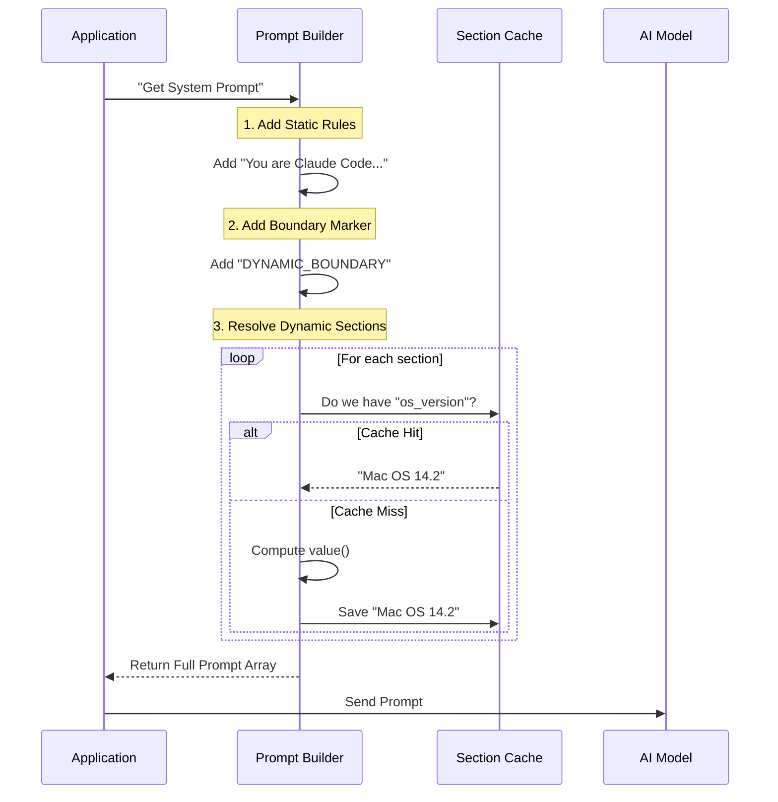

# Chapter 1: Dynamic System Prompt Construction

Welcome to the internal workings of the AI's "brain." This is the foundational layer where we define who the agent is, what it knows, and how it behaves.

## The Mission Briefing Analogy

Imagine you are a secret agent receiving a mission briefing folder before an assignment.

1.  **The Standard Operating Procedures (SOP):** These pages are printed once and used for every agent. They contain rules like "Don't break the law" and "Be polite." These never change.
2.  **The Mission Details:** These pages are printed fresh this morning. They contain "Today's Date," "Current Location," and "Current Threat Level."

If the agency reprinted the entire 100-page SOP manual every time the weather changed, it would be a huge waste of paper and time.

**Dynamic System Prompt Construction** is the digital version of this folder. It separates the **Static** (SOP) from the **Dynamic** (Mission Details) to make the AI smart, context-aware, and extremely fast.

## Why Do We Need This?

A static text file (`"You are a helpful assistant"`) is not enough for a complex coding agent. The agent needs to know:
*   What time is it?
*   What directory am I in? (`/home/user/project`)
*   What tools do I have right now?
*   What did I learn in the previous turn?

However, calculating all this information every single time the AI speaks is expensive. We need a system that caches the heavy lifting and only updates what is necessary.

## Key Concepts

### 1. The Static Section
This is the immutable personality and core instruction set. Because this text never changes, the LLM provider (like Anthropic) can cache it on their servers. This saves money and reduces latency.

### 2. The Dynamic Boundary
This is a special invisible line drawn in the prompt. It tells the system: **"Everything above this line is safe to cache forever. Everything below this line might change."**

### 3. Modular Sections
Instead of one giant string, the prompt is built from small, independent blocks.
*   **Memoized Sections:** Computed once and remembered (cached) until the user clears the context.
*   **Volatile Sections:** Re-calculated every single time (e.g., "Current Token Budget").

---

## How to Build a Section

Let's look at how we define these modular pieces using `systemPromptSections.ts`.

### Creating a Memoized Section
This is for information that is dynamic to the *session* but stable across *turns* (like the OS version).

```typescript
import { systemPromptSection } from './systemPromptSections.js'

// This will be computed once and reused
const osSection = systemPromptSection(
  'os_version', 
  () => `OS Version: ${getUnameSR()}`
)
```
*Explanation: We give the section a unique name (`'os_version'`). The function inside only runs the first time it is needed. Afterwards, the result is saved.*

### Creating a "Dangerous" Volatile Section
Sometimes, data changes every second (like a token budget or connection status). We use a special function for this to explicitly warn developers that this breaks the cache.

```typescript
import { DANGEROUS_uncachedSystemPromptSection } from './systemPromptSections.js'

// This re-runs every single turn
const budgetSection = DANGEROUS_uncachedSystemPromptSection(
  'token_budget',
  () => `Tokens remaining: ${getCurrentBudget()}`,
  'Budget changes every turn' // We must provide a reason!
)
```
*Explanation: The `DANGEROUS` prefix reminds us that using this too much will slow down the system because it forces the AI to re-read the prompt.*

---

## The Assembly Line: How It Works

When the AI prepares to speak, the system stitches these parts together. Here is the flow:



## Internal Implementation Deep Dive

Let's look under the hood at how the code handles this assembly.

### The Resolver
Located in `systemPromptSections.ts`, this function does the heavy lifting of deciding whether to run the computation or fetch from memory.

```typescript
export async function resolveSystemPromptSections(
  sections: SystemPromptSection[],
): Promise<(string | null)[]> {
  const cache = getSystemPromptSectionCache()

  return Promise.all(
    sections.map(async s => {
      // If allowed to cache AND we have it, return it.
      if (!s.cacheBreak && cache.has(s.name)) {
        return cache.get(s.name) ?? null
      }
      
      // Otherwise, do the work.
      const value = await s.compute()
      setSystemPromptSectionCacheEntry(s.name, value)
      return value
    }),
  )
}
```
*Explanation: We map over every section. If `cacheBreak` is false and the value exists in `cache`, we skip the work. Otherwise, we `await s.compute()` and save the result for next time.*

### The Master Assembly
In `prompts.ts`, we see the final structure being put together. Note the critical placement of the Boundary Marker.

```typescript
export async function getSystemPrompt(...): Promise<string[]> {
  // 1. Define the dynamic parts
  const dynamicSections = [
    systemPromptSection('env_info', () => computeEnvInfo(...)),
    systemPromptSection('memory', () => loadMemoryPrompt()),
    // ... other sections
  ]

  // 2. Resolve them (check cache vs compute)
  const resolvedDynamic = await resolveSystemPromptSections(dynamicSections)

  // 3. Assemble the final array
  return [
    getSimpleIntroSection(),    // Static
    getSimpleSystemSection(),   // Static
    SYSTEM_PROMPT_DYNAMIC_BOUNDARY, // <--- THE CACHE LINE
    ...resolvedDynamic          // Dynamic
  ].filter(s => s !== null)
}
```
*Explanation: This array defines the AI's reality. The API provider (Anthropic) sees the `SYSTEM_PROMPT_DYNAMIC_BOUNDARY` string and knows to keep a "hot copy" of everything before it. This makes the AI respond much faster.*

## Summary

In this chapter, we learned:
1.  **Static vs. Dynamic:** We separate unchanging rules from changing context.
2.  **Memoization:** We wrap dynamic functions so they only compute when necessary.
3.  **The Boundary:** We use a specific marker to optimize API caching.
4.  **Modular Design:** The "Brain" is just a list of small, manageable sections.

This system ensures that even as we add complex features like **Feature Flagging** (see [Feature Flagging and Betas](06_feature_flagging_and_betas.md)) or **Output Styling** (see [Output Styling and Persona](02_output_styling_and_persona.md)), the core performance remains fast.

## What's Next?

Now that the AI has a "brain" and knows its environment, we need to decide **how** it speaks to the user. Should it be formal? Should it use emojis?

[Next Chapter: Output Styling and Persona](02_output_styling_and_persona.md)

---

Generated by [Code IQ](https://github.com/adityasoni99/Code-IQ)