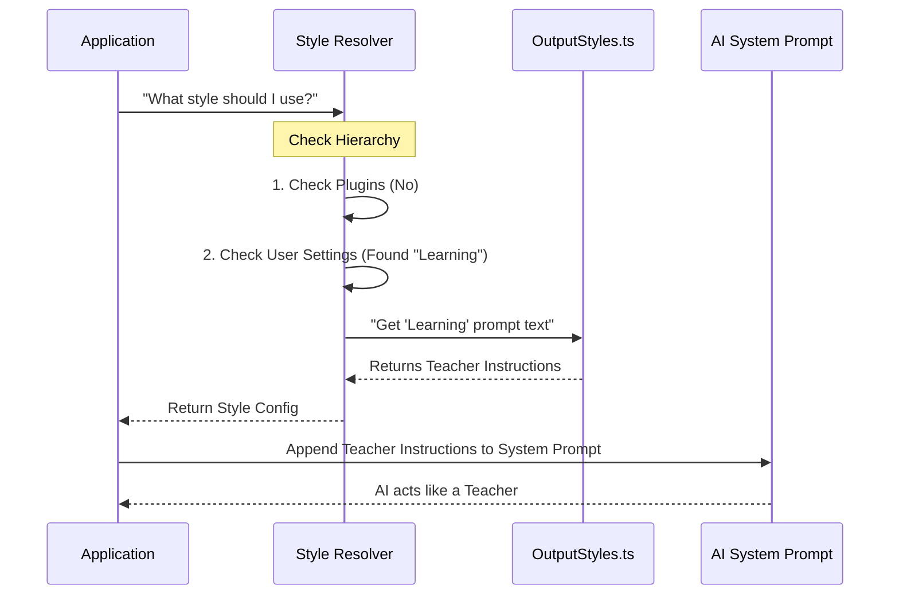

# Chapter 2: Output Styling and Persona

In the previous chapter, [Dynamic System Prompt Construction](01_dynamic_system_prompt_construction.md), we built the AI's "brain"—the logic and context it needs to function.

Now that the AI knows *what* to say, we need to decide *how* it says it.

## The Wardrobe Department

Imagine the AI is an actor. In Chapter 1, we gave the actor their memory and facts. In this chapter, we send them to the **Wardrobe and Script Department**.

Depending on the user's needs, the AI might need to put on different costumes:
*   **The Engineer (Default):** Concise, professional, minimal talk, maximum code.
*   **The Tutor (Learning Mode):** Patient, explanatory, asks the user to try writing code themselves.
*   **The Explainer (Explanatory Mode):** Verbose, detailed, focuses on the "why" behind the code.

**Output Styling** is the abstraction that manages these costumes. It controls the text tone, the visual icons (glyphs), and even the words displayed while the AI is "thinking" (spinners).

## Key Concepts

There are three main components to a Persona:

1.  **The Prompt Overlay:** A specific text block injected into the system prompt that overrides the default behavior.
2.  **Visual Glyphs:** Icons (like arrows, checkmarks, or sparkles) that make the output readable.
3.  **Motion (Spinners):** The animation text shown while the AI is working (e.g., "Thinking..." vs "Cooking...").

---

## 1. Defining a Persona (Output Style)

Styles are defined in `outputStyles.ts`. A style is essentially a configuration object containing a name, a description, and the specific instructions (prompt) for the AI.

Let's look at how the "Learning" style is defined. This style turns the AI into a teacher.

```typescript
// From outputStyles.ts
export const OUTPUT_STYLE_CONFIG = {
  Learning: {
    name: 'Learning',
    description: 'Claude pauses and asks you to write code',
    // The instructions that change the behavior:
    prompt: `You are a collaborative CLI tool. 
             Balance task completion with learning.
             Ask the human to contribute code pieces.`
  },
  // ... other styles
}
```
*Explanation: We define a simple object. The `prompt` text is the most important part—it tells the LLM to stop doing everything itself and start teaching.*

### Use Case: The "Learning" Prompt
When the **Learning** style is active, the system injects specific rules about how to ask the user questions.

```typescript
// A simplified view of the Learning Prompt
const learningPrompt = `
# Learning Style Active
In order to encourage learning, ask the human to contribute 
2-10 line code pieces when generating code.

Format your request like this:
**Context:** [Why this decision matters]
**Your Task:** [Specific function to write]
`
```
*Explanation: By adding this text to the "Brain" we built in Chapter 1, the AI changes its behavior immediately. It stops being a code-generator and starts being a tutor.*

---

## 2. Visual Language (Figures)

A personality isn't just text; it's also visual. However, not all computer terminals support the same emojis or icons. Windows Command Prompt is notoriously different from macOS Terminal.

We use `figures.ts` to handle this. It acts as a translator for visual icons.

```typescript
// From figures.ts
import { env } from '../utils/env.js'

// On Mac use '⏺', on Windows use '●'
export const BLACK_CIRCLE = env.platform === 'darwin' ? '⏺' : '●'

// Other personality-filled icons
export const LIGHTNING_BOLT = '↯' 
export const DIAMOND_OPEN = '◇'
export const SPARKLE = '✻'
```
*Explanation: Instead of hardcoding emojis in our code, we use constants. The code checks the operating system (`env.platform`) and picks the safe icon to display. This ensures the CLI looks professional on every machine.*

---

## 3. Motion and Personality (Spinners)

When the AI is thinking or generating files, the user sees a loading animation. To make the AI feel "alive," we randomize the verbs used in this animation based on the current persona or settings.

```typescript
// From spinnerVerbs.ts
export const SPINNER_VERBS = [
  'Architecting', // Professional
  'Cooking',      // Casual
  'Brewing',      // Fun
  'Thinking',     // Standard
  'Quantumizing'  // Sci-Fi
]
```
*Explanation: Instead of always saying "Loading...", the CLI picks a verb from this list. It’s a small detail, but it makes the tool feel like a creative partner rather than a cold robot.*

---

## Internal Implementation: How It Comes Together

How does the application know which costume to wear? It follows a strict hierarchy.

### The Hierarchy of Styles

1.  **Plugin Forced:** If a plugin (like a specialized security tool) is running, it might force a specific style.
2.  **Project Settings:** A `.clauderc` file in your specific project folder.
3.  **User Settings:** Your global preferences.
4.  **Default:** If nothing else is set, use the Standard persona.

### The Flow

Here is what happens when you launch the CLI:



### Deep Dive: The Resolver Code

The magic happens in `getOutputStyleConfig` inside `outputStyles.ts`. It determines the winner of the hierarchy.

```typescript
export async function getOutputStyleConfig() {
  // 1. Load all available styles
  const allStyles = await getAllOutputStyles(getCwd())

  // 2. Check if a Plugin forces a style (Highest Priority)
  const forced = Object.values(allStyles).find(s => s?.forceForPlugin)
  if (forced) return forced

  // 3. Check User Settings
  const settings = getSettings_DEPRECATED()
  const styleName = settings?.outputStyle || 'default'

  // 4. Return the matching style
  return allStyles[styleName] ?? null
}
```
*Explanation: This function is the "Manager" of the wardrobe department. It looks at the rules (Plugins, Settings) and hands the correct script (Prompt) to the actor.*

---

## Summary

In this chapter, we learned that **Persona** is more than just a "System Prompt." It is a combination of:
1.  **Output Styles:** Text instructions that change the AI's goal (e.g., from "Coding" to "Teaching").
2.  **Figures:** Smart icons that adapt to the user's operating system.
3.  **Spinner Verbs:** Dynamic words that make the waiting time feel active and human.

This system allows the AI to be a flexible tool—strict when you need to ship code fast, and helpful when you want to learn.

## What's Next?

Now that the AI has a Brain (Chapter 1) and a Voice (Chapter 2), we need to give it **Hands** to modify files and run commands. But hands can be dangerous! We need rules to ensure the AI doesn't accidentally delete your entire project.

[Next Chapter: Tool Governance and Limits](03_tool_governance_and_limits.md)

---

Generated by [Code IQ](https://github.com/adityasoni99/Code-IQ)