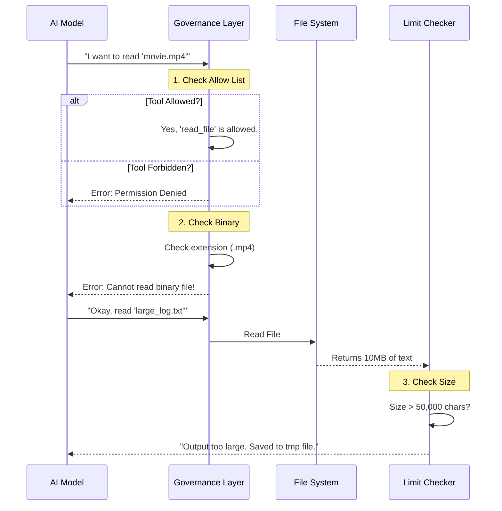

# Chapter 3: Tool Governance and Limits

In the previous chapter, [Output Styling and Persona](02_output_styling_and_persona.md), we gave the AI a voice and a personality. We decided whether it should act like a strict engineer or a patient teacher.

Now that the AI has a **Brain** (Chapter 1) and a **Voice** (Chapter 2), we need to give it **Hands**.

However, giving an AI "hands" (the ability to run shell commands, edit files, or search the web) is risky. What if it tries to read a 10GB movie file as text? What if it tries to spawn a copy of itself infinitely until your computer crashes?

This chapter introduces **Tool Governance**—the safety protocols, weight limits, and security badges that keep the AI helpful but harmless.

## The High-Security Workshop Analogy

Imagine the AI is a worker in a digital workshop.

1.  **The Toolbox (Governance):** Not every worker gets every tool. The "Manager" (Coordinator) gets a megaphone. The "Intern" (Sub-agent) gets a screwdriver, but is strictly forbidden from using the "Hire New Intern" phone to prevent overcrowding.
2.  **Safety Goggles (Binary Detection):** The worker needs to know that a text file is for reading, but a `.png` image is not. Trying to "read" an image as text results in gibberish.
3.  **Weight Limits (Data Caps):** The worker can only carry so much information at once. If they try to pick up a file with 1 million lines of code, they will drop it (or the system will crash).

## Key Concepts

### 1. Allow and Deny Lists (Who gets what?)
We don't give the AI access to every tool all the time. We use `Sets` (lists of unique items) to define boundaries.

In `tools.ts`, we explicitly define what is allowed for different modes.

#### Example: Blocking Recursion
If an AI agent creates another agent, and that agent creates *another* agent, we get an infinite loop. We prevent this using a "Denylist."

```typescript
// From tools.ts
import { AGENT_TOOL_NAME } from '../tools/AgentTool/constants.js'

// A list of tools that are FORBIDDEN for sub-agents
export const ALL_AGENT_DISALLOWED_TOOLS = new Set([
  // Don't let an agent hire another agent!
  AGENT_TOOL_NAME, 
  // Don't let a sub-agent stop the main task!
  'task_stop_tool' 
])
```
*Explanation: If a sub-agent tries to use the `agent_tool`, the system checks this list, sees it is forbidden, and blocks the request.*

### 2. The Weight Limit (Context Window Protection)
Large Language Models (LLMs) have a "Context Window"—a limit on how much text they can remember. If a tool returns 500 pages of text, the AI forgets the original instruction.

We define these limits in `toolLimits.ts`.

```typescript
// From toolLimits.ts

// Max characters allowed before we cut the output off
export const DEFAULT_MAX_RESULT_SIZE_CHARS = 50_000

// Max tokens (approx 4 bytes each) allowed
export const MAX_TOOL_RESULT_TOKENS = 100_000
```
*Explanation: If the AI runs a command that outputs 1,000,000 characters, the system intercepts it, saves it to a file, and only shows the AI a preview. This protects the AI's "Brain."*

### 3. Binary Safety (The "Don't Read Images" Rule)
The AI works with text. If it tries to read a binary file (like an image or executable), the output looks like `Q`. This confuses the AI.

We use `files.ts` to detect these files before reading them.

```typescript
// From files.ts
export const BINARY_EXTENSIONS = new Set([
  '.png', '.jpg', '.gif', // Images
  '.exe', '.bin',         // Executables
  '.zip', '.pdf'          // Archives
])

export function hasBinaryExtension(filePath: string): boolean {
  const ext = filePath.slice(filePath.lastIndexOf('.')).toLowerCase()
  return BINARY_EXTENSIONS.has(ext)
}
```
*Explanation: Before the `fs.readFile` tool runs, we check the extension. If it's on this list, we tell the AI: "I cannot read this file as text."*

---

## The Workflow: How the System Protects Itself

Here is what happens when the AI tries to use a tool.



---

## Internal Implementation Deep Dive

Let's look at the code that enforces these rules.

### Use Case: Defining Safe Tools for Async Agents
Async agents are background workers. We want them to code, but not manage the project lifecycle.

```typescript
// From tools.ts
export const ASYNC_AGENT_ALLOWED_TOOLS = new Set([
  'file_read_tool',   // Yes: Read code
  'file_edit_tool',   // Yes: Fix bugs
  'web_search_tool',  // Yes: Look up docs
  'grep_tool'         // Yes: Search text
])
```
*Explanation: This is an **Allowlist**. If a tool is not on this list, the background agent cannot use it. Notice that `task_stop_tool` is missing—the background worker cannot decide to quit the job.*

### Use Case: Detecting Binary Content
Sometimes a file ends in `.txt` but contains binary garbage. We inspect the actual bytes (buffer) to be sure.

```typescript
// From files.ts
export function isBinaryContent(buffer: Buffer): boolean {
  // Check the first few bytes
  const checkSize = Math.min(buffer.length, 8192)

  for (let i = 0; i < checkSize; i++) {
    const byte = buffer[i]
    // If we find a "Null Byte" (0), it's definitely binary
    if (byte === 0) return true
  }
  return false
}
```
*Explanation: Text files rarely contain a "Null Byte" (a byte with value 0). If we see one, we assume the file is binary (like an image or compiled code) and stop the read operation.*

### Use Case: Truncating Large Outputs
When a tool returns a massive result, we need to make a decision based on the constants in `toolLimits.ts`.

```typescript
// Pseudo-code implementation logic
function handleToolResult(output: string) {
  // Check against our constant
  if (output.length > DEFAULT_MAX_RESULT_SIZE_CHARS) {
    const path = saveToTempFile(output)
    return `Output too large (${output.length} chars). ` +
           `Content saved to ${path} for you to read via grep.`
  }
  return output
}
```
*Explanation: This logic ensures the `DEFAULT_MAX_RESULT_SIZE_CHARS` limit we defined earlier is actually enforced. The AI gets a pointer to the data instead of the raw data itself.*

## Summary

In this chapter, we learned:
1.  **Governance:** We use specific sets (`ALL_AGENT_DISALLOWED_TOOLS`) to prevent dangerous behaviors like recursive agent spawning.
2.  **Safety:** We use `BINARY_EXTENSIONS` and content inspection to prevent the AI from choking on non-text files.
3.  **Limits:** We use constants like `DEFAULT_MAX_RESULT_SIZE_CHARS` to prevent data floods from overwhelming the AI's context window.

This system ensures that the AI's "hands" are strong but safe.

## What's Next?

Now that the AI has a Brain, a Voice, and Safe Hands, it needs a way to communicate its thoughts and tool requests to the system. We don't just paste raw text back and forth; we use a structured protocol.

[Next Chapter: XML Messaging Protocol](04_xml_messaging_protocol.md)

---

Generated by [Code IQ](https://github.com/adityasoni99/Code-IQ)