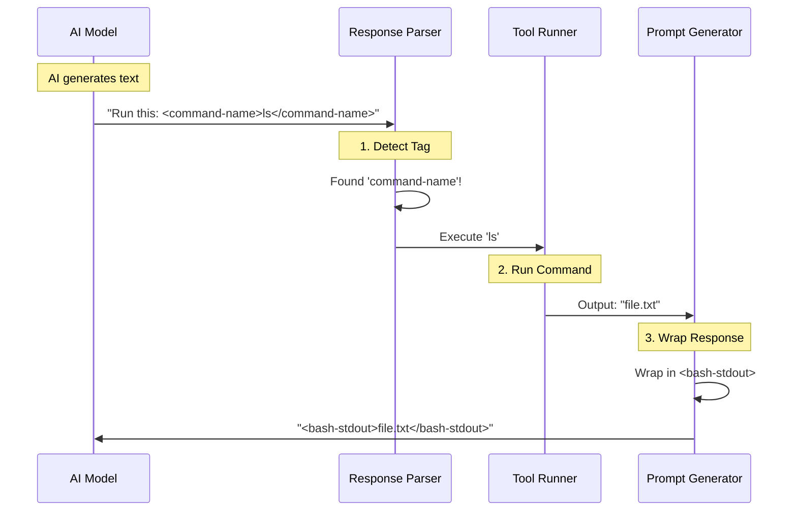

# Chapter 4: XML Messaging Protocol

In the previous chapter, [Tool Governance and Limits](03_tool_governance_and_limits.md), we gave the AI "hands" to manipulate files and run commands, along with safety gloves to prevent accidents.

Now we face a communication problem. The AI generates text. But how does the application know the difference between the AI saying, *"I am going to list your files,"* and the AI actually trying to **execute** the list command?

If we don't distinguish between **talk** and **action**, the CLI is just a chatbot.

## The Radio Protocol Analogy

Imagine a police radio channel.
1.  **Casual Talk:** "Hey Bob, lunch is at 12."
2.  **Official Codes:** "10-4," "Over," "Suspect in custody."

The code "10-4" isn't just noise; it triggers a specific procedure.

**The XML Messaging Protocol** is the "Radio Code" for our AI. It uses XML tags to wrap specific parts of the conversation so the application Runtime knows exactly what to do.

## Why Do We Need This?

Large Language Models (LLMs) output a single stream of string characters. Without a protocol, the output is unstructured.

**Unstructured (Bad):**
> "Okay, I will run the list command. ls -la. Did it work?"

*Problem:* The system doesn't know where the command starts or ends. It might try to execute "Did it work?" as a command.

**Structured with XML Protocol (Good):**
> "Okay, I will run the list command.
> `<command-name>execute</command-name>`
> `<command-args>ls -la</command-args>`"

*Solution:* The system ignores the chat text and strictly executes what is inside the tags.

## Key Concepts

We define these "Radio Codes" as constants in `xml.ts`. This ensures that the prompt generator (which talks to the AI) and the parser (which reads the AI's reply) agree on the exact spelling of the tags.

### 1. Command Tags
These are used when the AI wants to *do* something.

```typescript
// From xml.ts
export const COMMAND_NAME_TAG = 'command-name'
export const COMMAND_ARGS_TAG = 'command-args'
```
*Explanation: When the parser sees `command-name`, it knows an executable tool is being requested.*

### 2. Terminal Output Tags
These are used when the *System* replies to the *AI*. The AI needs to know if text coming back is a user message or the raw output of a terminal command.

```typescript
// From xml.ts
export const BASH_STDOUT_TAG = 'bash-stdout' // Success output
export const BASH_STDERR_TAG = 'bash-stderr' // Error output
```
*Explanation: By wrapping terminal output in `<bash-stdout>`, the AI understands: "This isn't the user talking; this is the result of my code."*

### 3. Background Task Tags
Sometimes the AI launches a background agent (a sub-task). We need tags to track the status of these invisible workers.

```typescript
// From xml.ts
export const TASK_NOTIFICATION_TAG = 'task-notification'
export const STATUS_TAG = 'status'
export const SUMMARY_TAG = 'summary'
```
*Explanation: These tags act like a status report from a remote worker, letting the main AI know if a job is "Thinking," "Running," or "Done."*

---

## How to Use the Protocol

As a developer using `constants`, you rarely write these tags manually. Instead, you use these constants to build parsers or format prompts.

### Example: Formatting a Terminal Result

Imagine the AI ran `echo "Hello"`. The terminal returned "Hello". We need to package this for the AI's memory.

```typescript
import { BASH_STDOUT_TAG } from './xml.js'

function formatOutput(rawOutput: string) {
  // Wraps the output: <bash-stdout>Hello</bash-stdout>
  return `<${BASH_STDOUT_TAG}>${rawOutput}</${BASH_STDOUT_TAG}>`
}
```
*Explanation: We use the constant `BASH_STDOUT_TAG`. If we ever decide to change the tag name from `bash-stdout` to `terminal-output` in the future, we only change it in one file (`xml.ts`), and the whole app updates.*

### Example: Identifying User Input vs. Bash Input

The system defines a specific list of tags that represent "Computer Output."

```typescript
import { TERMINAL_OUTPUT_TAGS } from './xml.js'

// TERMINAL_OUTPUT_TAGS is an array ['bash-input', 'bash-stdout', etc...]

function isSystemMessage(tagName: string) {
  // Checks if the tag belongs to the machine, not the human
  return TERMINAL_OUTPUT_TAGS.includes(tagName)
}
```
*Explanation: This array allows us to filter the chat history. We might want to hide bulky terminal logs from the user but keep them visible to the AI.*

---

## Internal Implementation Deep Dive

How does the conversation actually flow using these tags? Let's look at the lifecycle of a command.

### The Conversation Loop



### The Code: Defining the Vocabulary

The file `xml.ts` is purely a dictionary. It doesn't contain logic; it contains **definitions**. This is crucial for stability.

#### The "Bash" Family
These tags handle the simulation of a terminal session.

```typescript
// From xml.ts

// The command actually typed
export const BASH_INPUT_TAG = 'bash-input'

// The standard output (what you usually see)
export const BASH_STDOUT_TAG = 'bash-stdout'

// The standard error (when things break)
export const BASH_STDERR_TAG = 'bash-stderr'
```

#### The "Remote" Family
When using features like "Ultraplan" (remote planning) or "Teammates" (multiple AIs), we use special tags to route messages.

```typescript
// From xml.ts

// Message from another AI agent
export const TEAMMATE_MESSAGE_TAG = 'teammate-message'

// Result from a remote review session
export const REMOTE_REVIEW_TAG = 'remote-review'
```
*Explanation: If the system sees `<teammate-message>`, it knows to display the text differently, perhaps with a different avatar or color, because it came from a peer, not the user.*

#### The "Empty" Message
Sometimes a message exists but has no text (perhaps it only had an image, or it was a system ping). We use a constant for this to avoid `null` errors.

```typescript
// From messages.ts
export const NO_CONTENT_MESSAGE = '(no content)'
```
*Explanation: This isn't an XML tag, but it serves a similar purpose: a standardized signal that tells the system "There is nothing here to read."*

---

## Summary

In this chapter, we learned:
1.  **Structured vs. Unstructured:** We turn raw text into actionable data using XML tags.
2.  **Centralized Definition:** All tags are defined in `xml.ts`. We never hardcode strings like `'<bash-stdout>'` in our logic files.
3.  **Tag Families:** We have different tags for Commands, Terminal Output, and Background Tasks.

This protocol ensures that the **Brain** (Chapter 1), the **Voice** (Chapter 2), and the **Hands** (Chapter 3) all speak the same language.

## What's Next?

We have a working AI that can think, speak, act, and communicate clearly. But to be truly useful, it needs access to the outside world—API keys, GitHub tokens, and user credentials. How do we manage these secrets securely?

[Next Chapter: OAuth and Environment Configuration](05_oauth_and_environment_configuration.md)

---

Generated by [Code IQ](https://github.com/adityasoni99/Code-IQ)