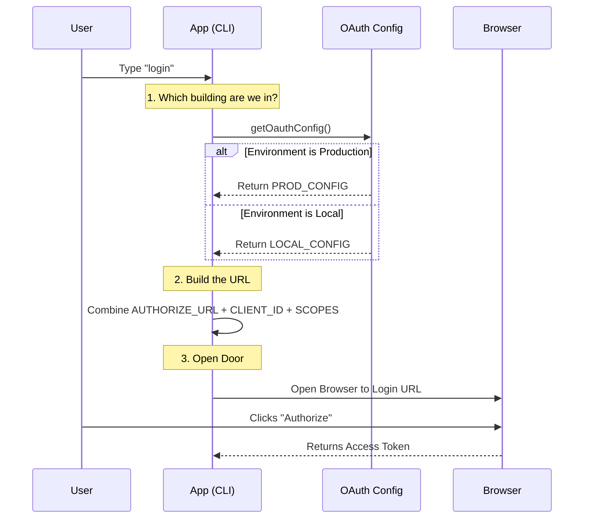

# Chapter 5: OAuth and Environment Configuration

In the previous chapter, [XML Messaging Protocol](04_xml_messaging_protocol.md), we taught the AI how to speak clearly using "Radio Codes" (XML tags). The AI can now say *"I want to run a command,"* and the system understands perfectly.

But before the AI can do anything useful on your behalf—like checking your billing, managing your account, or syncing your history—it needs to know **who** you are.

This chapter introduces the **Keycard System**. Just as you need a specific badge to enter your office building, the application needs specific keys (URLs, Client IDs, and Scopes) to connect to the right servers.

## The "Multiverse" Problem

Imagine you are a developer working on this CLI tool. You exist in three parallel universes:

1.  **The Real World (Production):** This is where real users live. The app connects to `claude.ai` and `api.anthropic.com`. Real money is spent here.
2.  **The Rehearsal Stage (Staging):** This looks like the real world, but the money is fake, and the features are experimental. The app connects to `api-staging.anthropic.com`.
3.  **The Workbench (Local):** This is your laptop. The app connects to `localhost:8000`.

If you accidentally used the **Production Keycard** while trying to enter the **Workbench**, the system would reject you. Even worse, if you used **Workbench** code to talk to **Production**, you might crash the real server.

**OAuth and Environment Configuration** is the system that automatically checks which universe you are in and hands you the correct map and keycard.

## Key Concepts

### 1. The Configuration Object (The Map)
This is a dictionary of addresses. It tells the app where the "Front Door" (Login Page) and the "Bank" (API Endpoint) are located for the current environment.

### 2. Scopes (The Access Level)
A keycard doesn't open every door. **Scopes** define exactly what the app is allowed to do.
*   Can it read your email? (No)
*   Can it read your user profile? (Yes)
*   Can it create a new API Key? (Yes)

### 3. The Switchboard (The Resolver)
This is the logic that looks at your environment variables (e.g., `process.env.USER_TYPE`) and decides which configuration object to return.

---

## 1. Defining the Environments

In `oauth.ts`, we define the addresses for our different universes. We use `const` objects to ensure these addresses never change while the app is running.

### The Production Config (Real Life)
This is the default. If you download the tool from the internet, this is what you use.

```typescript
// From oauth.ts
const PROD_OAUTH_CONFIG = {
  // Where we go to verify who you are
  CONSOLE_AUTHORIZE_URL: 'https://platform.claude.com/oauth/authorize',
  
  // Where we send API requests
  BASE_API_URL: 'https://api.anthropic.com',
  
  // The ID badge number for this specific app
  CLIENT_ID: '9d1c250a-e61b-44d9-88ed-5944d1962f5e',
}
```
*Explanation: These are hardcoded strings. `CLIENT_ID` is a public UUID that tells the server "This request is coming from the Claude CLI."*

### The Local Config (The Workbench)
When developers are fixing bugs, they run servers on their own machines.

```typescript
// From oauth.ts
function getLocalOauthConfig() {
  return {
    // Note: connecting to localhost instead of the internet!
    BASE_API_URL: 'http://localhost:8000',
    CONSOLE_AUTHORIZE_URL: 'http://localhost:3000/oauth/authorize',
    // ... other local ports
  }
}
```
*Explanation: Notice how the URLs change. If the app tries to connect to `https://api.anthropic.com` while testing a local feature, the test will fail.*

---

## 2. The Permission Slips (Scopes)

When you log in with Google or Facebook, a popup asks: *"Allow this app to view your contacts?"* That is a **Scope**.

Our CLI needs specific permissions to function. We group these in `oauth.ts`.

### Defining Permissions
We separate permissions based on which system we are talking to.

```typescript
// From oauth.ts

// Permission to see who you are
export const CLAUDE_AI_PROFILE_SCOPE = 'user:profile'

// Permission to create API keys (spending money)
const CONSOLE_SCOPE = 'org:create_api_key'
```

### creating the Master List
When the user logs in, we ask for everything at once so they only have to click "Accept" one time.

```typescript
// From oauth.ts
export const ALL_OAUTH_SCOPES = Array.from(
  new Set([
    CONSOLE_SCOPE,           // For the Console (Billing)
    CLAUDE_AI_PROFILE_SCOPE, // For the Chat Interface
    'user:file_upload'       // To upload files
  ])
)
```
*Explanation: We combine the lists into a `Set` (to remove duplicates) and then turn it back into an array. This is the list sent to the OAuth server.*

---

## 3. The Switchboard (Selecting the Config)

How does the app know which map to use? It checks the "Weather" (Environment Variables).

This logic lives in the `getOauthConfig` function.

```typescript
// From oauth.ts
export function getOauthConfig() {
  const type = getOauthConfigType() // 'prod', 'staging', or 'local'

  switch (type) {
    case 'local':
      return getLocalOauthConfig()
    case 'staging':
      return STAGING_OAUTH_CONFIG
    case 'prod':
      return PROD_OAUTH_CONFIG
  }
}
```

### Determining the Type
The helper function `getOauthConfigType` checks specific flags.

```typescript
// From oauth.ts
function getOauthConfigType() {
  // Only internal employees ('ant') can use staging/local
  if (process.env.USER_TYPE === 'ant') {
    if (process.env.USE_LOCAL_OAUTH) return 'local'
    if (process.env.USE_STAGING_OAUTH) return 'staging'
  }
  // Everyone else defaults to Production
  return 'prod'
}
```
*Explanation: This is a safety mechanism. Even if a public user tries to set `USE_STAGING_OAUTH`, the code ignores it unless they are also flagged as an internal user (`ant`). This prevents users from accidentally connecting to test servers.*

---

## Internal Implementation: The Login Flow

Let's visualize what happens when a user types `claude login`.



### Deep Dive: Custom Environments (FedStart)

Sometimes, we deploy this tool to highly secure environments (like Government Clouds) that are neither Production nor Local. We call these "Custom" environments.

The code supports an override variable: `CLAUDE_CODE_CUSTOM_OAUTH_URL`.

```typescript
// From oauth.ts

// Safety Check: We only allow specific secure URLs
const ALLOWED_OAUTH_BASE_URLS = [
  'https://claude.fedstart.com',
  // ... others
]

// Inside getOauthConfig...
const customUrl = process.env.CLAUDE_CODE_CUSTOM_OAUTH_URL

if (customUrl) {
  // 1. Verify safety
  if (!ALLOWED_OAUTH_BASE_URLS.includes(customUrl)) {
    throw new Error('Security Alert: Unapproved endpoint.')
  }

  // 2. Override the config
  config = { 
    ...config, 
    BASE_API_URL: customUrl,
    TOKEN_URL: `${customUrl}/v1/oauth/token` 
  }
}
```
*Explanation: This allows the tool to work in private clouds without changing the source code. However, the `ALLOWED_OAUTH_BASE_URLS` list ensures a hacker can't trick the tool into sending passwords to a fake server.*

---

## Managing Feature Keys (GrowthBook)

Aside from OAuth, the app also needs keys for feature flagging (which we will cover in the next chapter). These keys also change based on the environment.

We handle this in `keys.ts`.

```typescript
// From keys.ts
export function getGrowthBookClientKey(): string {
  // Internal developers get the 'Dev' key
  if (process.env.USER_TYPE === 'ant') {
    return 'sdk-yZQvlplybuXjYh6L' 
  }
  // Public users get the 'Prod' key
  return 'sdk-zAZezfDKGoZuXXKe'
}
```
*Explanation: This ensures that when we test a new feature (like a "Dark Mode") internally, regular users don't see it until we are ready.*

---

## Summary

In this chapter, we learned:
1.  **The Multiverse:** Applications run in different contexts (Prod, Staging, Local), and each needs different addresses.
2.  **Centralized Config:** We use `oauth.ts` to store all these addresses in one place, rather than scattering strings throughout the code.
3.  **Scopes:** We explicitly define permission levels (`ALL_OAUTH_SCOPES`) to ensure the app has the access it needs—and nothing more.
4.  **Security:** We use strict allow-lists to prevent the app from connecting to dangerous or unverified servers.

Now the AI knows **how** to speak (Chapter 4) and **where** to connect (Chapter 5). But how do we roll out experimental features to just *some* users without breaking the app for everyone?

[Next Chapter: Feature Flagging and Betas](06_feature_flagging_and_betas.md)

---

Generated by [Code IQ](https://github.com/adityasoni99/Code-IQ)