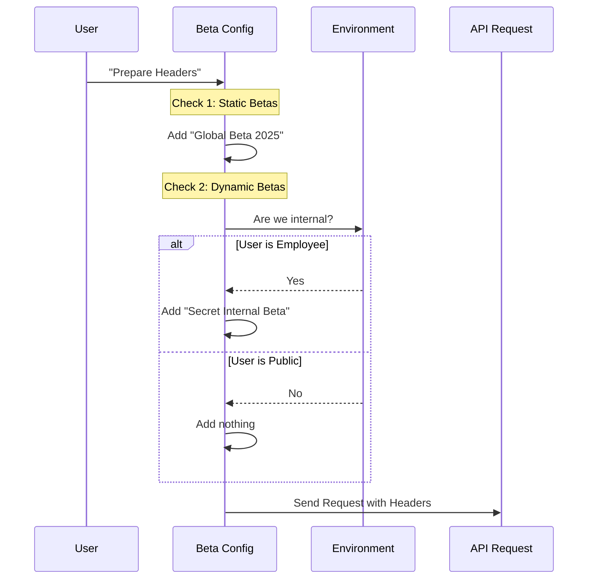

# Chapter 6: Feature Flagging and Betas

In the previous chapter, [OAuth and Environment Configuration](05_oauth_and_environment_configuration.md), we learned how the application identifies **who** you are and **where** it connects (Production vs. Local).

Now that we know who you are, we need to decide **what version of the future** you get to see.

## The "Secret Menu" Analogy

Imagine a popular fast-food restaurant.
1.  **The Standard Menu:** Burgers and fries. Available to everyone. Safe and reliable.
2.  **The Secret Menu:** "Animal Style" fries. You have to know the specific phrase to order it.
3.  **The Test Kitchen:** Experimental taco burgers. Only available to employees or specific beta testers.

**Feature Flagging and Betas** manage this "Secret Menu" for the AI.

In the world of LLMs (Large Language Models), new capabilities are invented every week (like "Computer Use" or "Fast Mode"). We can't just flip a switch for millions of users overnight—it might break everything. Instead, we use **Beta Headers** to let specific users opt-in to these experimental powers.

## Key Concepts

### 1. The Beta Header (The Secret Handshake)
To activate a new feature on the API, we don't just ask for it in plain English. We send a specific code string in the HTTP headers.

If the server sees `interleaved-thinking-2025-05-14`, it unlocks that feature. If the header is missing, you get the standard experience.

### 2. Internal vs. Public
Some features are for everyone. Some are only for internal developers (`ant` users). The code dynamically checks your status before adding the header.

### 3. Provider Nuances
Not all cloud providers are the same.
*   **Anthropic API:** Accepts almost all beta headers.
*   **AWS Bedrock:** Very strict. Accepts only a few.
*   **Google Vertex:** Accepts a different set.

We use **Sets** (lists of unique items) to define which headers are safe for which provider.

---

## How to Use Feature Flags

In this project, you don't usually write "if statements" yourself. You import the constants from `betas.ts`.

### Use Case: Enabling "Fast Mode"

Let's say we are building the request to send to the AI. We want to enable the experimental "Fast Mode" if the user has requested it.

```typescript
import { FAST_MODE_BETA_HEADER } from './betas.js'

// Imagine this is our API setup function
function getHeaders() {
  return {
    'anthropic-beta': FAST_MODE_BETA_HEADER // 'fast-mode-2026-02-01'
  }
}
```
*Explanation: We rely on the constant. If the date changes (e.g., `fast-mode-2026-03-01`), we update it in `betas.ts` once, and the whole app updates.*

### Use Case: The "Internal Only" Flag

Some features are dangerous or unfinished. We only want them enabled for internal employees.

```typescript
import { CLI_INTERNAL_BETA_HEADER } from './betas.js'

// If I am a public user, this string is empty ('')
// If I am an employee, this string is 'cli-internal-2026-02-09'
const headers = [ CLI_INTERNAL_BETA_HEADER ].filter(h => h !== '')
```
*Explanation: The logic for "Am I an employee?" is hidden inside the constant definition. The usage remains simple.*

---

## Internal Implementation Deep Dive

Let's see how the application decides which flags to send.

### The Flag Logic Flow



### The Code: Static vs. Dynamic Headers

Open `betas.ts`. You will see two types of exports.

#### 1. The Hardcoded Beta
This is a standard feature that is technically in "Beta" but available to the public.

```typescript
// From betas.ts
export const CLAUDE_CODE_20250219_BETA_HEADER = 'claude-code-20250219'
export const WEB_SEARCH_BETA_HEADER = 'web-search-2025-03-05'
```
*Explanation: These strings are fixed. Any user of the CLI gets these capabilities.*

#### 2. The Conditional Beta
This uses a ternary operator (`? :`) to decide the value at runtime.

```typescript
// From betas.ts
export const CLI_INTERNAL_BETA_HEADER =
  process.env.USER_TYPE === 'ant'     // Condition
    ? 'cli-internal-2026-02-09'       // True: Return the flag
    : ''                              // False: Return empty string
```
*Explanation: `process.env.USER_TYPE` tells us if the user is an internal "ant" (Anthropic employee). If not, the header effectively disappears.*

#### 3. Provider Specific Allow-Lists
When sending requests to AWS Bedrock or Google Vertex, sending the wrong beta header causes a crash (Error 400). We must filter them.

```typescript
// From betas.ts

// Only these specific betas are allowed on Google Vertex
export const VERTEX_COUNT_TOKENS_ALLOWED_BETAS = new Set([
  CLAUDE_CODE_20250219_BETA_HEADER,
  INTERLEAVED_THINKING_BETA_HEADER,
  'context-management-2025-06-27'
])
```
*Explanation: Before sending a request to Google, the system checks this list. If a header isn't here, it gets stripped out to prevent the request from failing.*

---

## A Note on Error Tracking (`errorIds.ts`)

When you are running experimental betas, things break. To fix bugs efficiently without leaking sensitive user data, we use **Error IDs**.

Instead of logging *"User John Doe failed to load Fast Mode because..."*, we log a number.

```typescript
// From errorIds.ts
export const E_TOOL_USE_SUMMARY_GENERATION_FAILED = 344
```

This works hand-in-hand with Betas. If we release a new Beta and suddenly see a spike in error `#344`, we know exactly where to look to fix it.

---

## Summary

In this chapter, we learned:
1.  **Beta Headers:** Simple strings act as keys to unlock experimental API features.
2.  **Conditional Exports:** We use logic inside `constants` to give internal employees different capabilities than public users.
3.  **Provider Safety:** We use Allow-Lists (Sets) to ensure we don't send incompatible headers to picky providers like AWS or Google.

## Conclusion

Congratulations! You have completed the **Constants Architecture Tutorial**.

You now understand the entire anatomy of the AI Agent:
1.  **Brain:** [Dynamic System Prompt Construction](01_dynamic_system_prompt_construction.md)
2.  **Voice:** [Output Styling and Persona](02_output_styling_and_persona.md)
3.  **Hands:** [Tool Governance and Limits](03_tool_governance_and_limits.md)
4.  **Radio:** [XML Messaging Protocol](04_xml_messaging_protocol.md)
5.  **Keycard:** [OAuth and Environment Configuration](05_oauth_and_environment_configuration.md)
6.  **Upgrades:** [Feature Flagging and Betas](06_feature_flagging_and_betas.md)

By separating these concerns into small, manageable constant files, we have created a system that is safe, fast, and easy to upgrade. Happy coding!

---

Generated by [Code IQ](https://github.com/adityasoni99/Code-IQ)