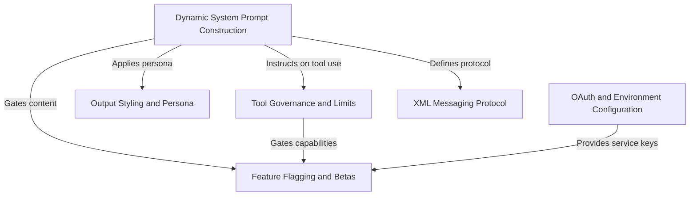

# Tutorial: constants

The project implements the core logic for **Claude Code**, an intelligent CLI tool. It centers on a **Dynamic System Prompt** (the AI's "brain") that is assembled in real-time, integrating strict **Tool Governance** (the "hands") and adaptive **Output Styling** (the "voice"). Supporting these are a structured **XML Messaging Protocol** for reliable communication, **OAuth and Environment Configuration** for identity management, and **Feature Flagging** to safely manage experimental capabilities.

## Chapters

1. [Dynamic System Prompt Construction](01_dynamic_system_prompt_construction.md)
2. [Output Styling and Persona](02_output_styling_and_persona.md)
3. [Tool Governance and Limits](03_tool_governance_and_limits.md)
4. [XML Messaging Protocol](04_xml_messaging_protocol.md)
5. [OAuth and Environment Configuration](05_oauth_and_environment_configuration.md)
6. [Feature Flagging and Betas](06_feature_flagging_and_betas.md)

---

Generated by [Code IQ](https://github.com/adityasoni99/Code-IQ)