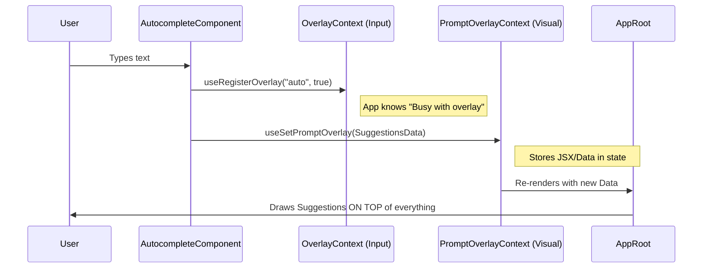

# Chapter 1: Overlay & Input Coordination

Welcome to the **context** project tutorial! This is the first chapter, so we are going to start with a fundamental challenge in building Terminal User Interfaces (TUIs): **Layers**.

## The Problem: "The Box within a Box"

Imagine you are building a text interface. You have a main scrollable area where the chat history lives. You decide to add an **Autocomplete** menu that pops up when the user starts typing.

You hit two major problems immediately:
1.  **Clipping (Visuals):** If the autocomplete menu is inside the scrollable chat box, and the menu is tall, it gets cut off by the edge of the chat box.
2.  **Confusion (Input):** If the user presses the `Escape` key, should it close the autocomplete menu, or should it cancel the whole program?

This chapter explains how **Overlay & Input Coordination** solves these problems using two specific tools: `promptOverlayContext` (Visuals) and `overlayContext` (Input).

---

## Part 1: The Visual Portal (`promptOverlayContext`)

In web development, we have `z-index` to make things float on top. In a terminal using Ink (our rendering engine), we don't have `z-index`. If an element is inside a box with `overflow: hidden`, it gets cut off.

To fix this, we use a **Portal** strategy. We "teleport" the UI element out of the scrollable box and render it near the root of the application, where nothing can clip it.

### How it Works
1.  A deeply nested component (like the Input bar) says, "I have a dialog to show."
2.  It sends that dialog up to the `PromptOverlayProvider`.
3.  The Provider renders it **outside** the main layout structure, floating it at the bottom of the screen.

### Usage Example

Let's say we want to show a "Confirmation Dialog" floating above the prompt.

```tsx
// Inside your deep component (e.g., PromptInput)
import { useSetPromptOverlayDialog } from './promptOverlayContext';

function MyInputComponent() {
  // Access the "teleporter" hook
  const setDialog = useSetPromptOverlayDialog();

  // When we mount, send our JSX to the top layer
  useEffect(() => {
     setDialog(<Text color="green">I am floating!</Text>);
     
     // Cleanup: remove dialog when we unmount
     return () => setDialog(null);
  }, [setDialog]);

  return <Text>Normal Input Here...</Text>;
}
```

**What happens?**
Even though `MyInputComponent` might be buried inside a scrollable box, the text "I am floating!" will render at the very bottom of the terminal, completely visible and unclipped.

---

## Part 2: The Input Manager (`overlayContext`)

Now that our dialog is visible, we need to manage the keyboard. Specifically, the **Escape** key.

If a dropdown is open, `Escape` should close the dropdown. If nothing is open, `Escape` might cancel the current generation or exit a mode. To do this, the app needs to know: **Is an overlay currently active?**

### How it Works
1.  When an overlay opens, it **registers** itself with a unique ID (e.g., "autocomplete").
2.  The global state adds this ID to a list of `activeOverlays`.
3.  The Input Handler checks `useIsOverlayActive()`. If true, `Escape` closes the overlay. If false, it does the default action.

### Usage Example

Here is how a component tells the system "I am open and active":

```tsx
// Inside your overlay component
import { useRegisterOverlay } from './overlayContext';

function MyDropdown() {
  // 1. Register this component as an active overlay
  // The ID is 'my-dropdown'. The second arg 'true' means it's active.
  useRegisterOverlay('my-dropdown', true);

  return <Border>Select an option...</Border>;
}
```

### Checking the State

Other parts of the app can now check if they should listen to keys:

```tsx
import { useIsOverlayActive } from './overlayContext';

function KeyHandler() {
  const isBlocked = useIsOverlayActive();

  // If an overlay is up, don't run global shortcuts!
  if (isBlocked) return null;

  return <HandleGlobalKeys />;
}
```

---

## Internal Implementation: How it all connects

Let's look under the hood. The implementation relies heavily on **React Context** to pass data up and down the tree without "prop drilling" (passing data through every single parent).

### The Flow

Here is what happens when you open an Autocomplete menu:



### Code Walkthrough: The Visual Teleporter

Open `promptOverlayContext.tsx`. The magic happens in two parts.

First, the **Provider** holds the state (`data` or `dialog`) and exposes a "Setter".

```tsx
// promptOverlayContext.tsx (Simplified)
export function PromptOverlayProvider({ children }) {
  // This state holds the floating UI node
  const [dialog, setDialog] = useState(null);

  return (
    // We provide the "setter" to children...
    <SetDialogContext.Provider value={setDialog}>
       {/* ...and we provide the "value" to the Root Layout */}
      <DialogContext.Provider value={dialog}>
        {children}
      </DialogContext.Provider>
    </SetDialogContext.Provider>
  );
}
```

Second, the **Hook** gives components a safe way to write to that state.

```tsx
// promptOverlayContext.tsx (Simplified)
export function useSetPromptOverlayDialog(node) {
  const set = useContext(SetDialogContext);
  
  // This effect runs whenever 'node' changes
  useEffect(() => {
    set(node); // "Teleport" the node up
    return () => set(null); // Clear it when unmounting
  }, [set, node]);
}
```

### Code Walkthrough: The Input Tracker

Open `overlayContext.tsx`. This file manages a `Set` of strings.

```tsx
// overlayContext.tsx (Simplified)
export function useRegisterOverlay(id, enabled = true) {
  const store = useContext(AppStoreContext);
  
  useEffect(() => {
    if (!enabled) return;
    
    // Add ID to the global Set
    store.setState(prev => ({
      ...prev,
      activeOverlays: new Set(prev.activeOverlays).add(id)
    }));

    // Remove ID on cleanup
    return () => {
      store.setState(prev => {
        const next = new Set(prev.activeOverlays);
        next.delete(id);
        return { ...prev, activeOverlays: next };
      });
    };
  }, [id, enabled]);
}
```

This logic ensures that if the component crashes or unmounts for any reason, the "Active Overlay" lock is automatically removed, preventing the app from getting stuck.

---

## Summary

In this chapter, we learned how `context` handles complex UI layering in a terminal:

1.  **Visuals:** We use `promptOverlayContext` to "teleport" UI elements out of clipped containers so they float on top.
2.  **Input:** We use `overlayContext` to register active components, ensuring keys like `Escape` interact with the popup instead of the main app.

This foundation allows us to build complex, window-like interfaces inside a simple text terminal.

In the next chapter, we will see how these overlays are used inside larger layout structures.

[Next Chapter: Modal & Portal Layouts](02_modal___portal_layouts.md)

---

Generated by [Code IQ](https://github.com/adityasoni99/Code-IQ)