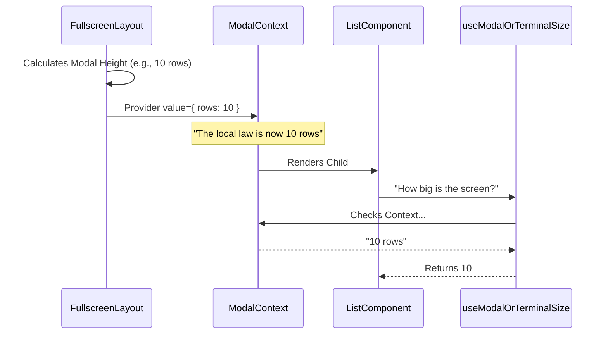

# Chapter 2: Modal & Portal Layouts

Welcome back! In the previous chapter, [Overlay & Input Coordination](01_overlay___input_coordination.md), we solved the problem of "clipping" by teleporting our UI elements to the top of the screen stack.

Now we face a new problem. Once we teleport a component into a floating box (a Modal) or a specific section of the screen (a Slot), that component loses track of reality.

## The Problem: "The Alice in Wonderland Effect"

Imagine you have a terminal that is **40 rows** tall.
You decide to open a "Slash Command" menu (like `/help`) at the bottom of the screen. This menu is only **10 rows** tall.

If the component inside that menu asks: *"How tall is the screen?"*, standard tools will answer: *"40 rows."*

**The Consequence:**
The component tries to render 40 items.
1.  **Pagination breaks:** The user sees items 1-10, but the component thinks items 1-40 are visible.
2.  **Scrolling breaks:** You press "Down", but the list doesn't scroll because it thinks it still has plenty of room.
3.  **Visual Glitches:** Content spills out or looks empty.

This chapter introduces **Modal & Portal Layouts** to give our components "Spatial Awareness."

---

## The Solution: Contextual Awareness

We need a way to tell a component: *"Ignore the actual terminal size. You are living inside a box that is 10 rows by 50 columns."*

We achieve this using `ModalContext`. It acts like a local "Governor" for a specific section of the UI, overriding the global laws of physics (screen size).

### Use Case: The Pagination Component

Let's look at how we solve this for a list of items that needs to paginate (show pages of data).

Normally, a component calculates how many items to show like this:

```tsx
// ❌ The Old Way (Naive)
const { rows } = useTerminalSize(); // Returns 40 (Full Screen)
const itemsToShow = rows - 2;       // Tries to show 38 items
```

This crashes our UI if we are inside a small popup. Here is the **Context Way**:

```tsx
// ✅ The New Way (Smart)
import { useModalOrTerminalSize } from './modalContext';

const { rows } = useModalOrTerminalSize(); // Returns 10 (Local Box)
const itemsToShow = rows - 2;              // Shows 8 items. Perfect!
```

---

## Key Concepts

### 1. The "Tape Measure" Hook (`useModalOrTerminalSize`)

This is the most important tool in this chapter. It automatically decides which measurement to use.

1.  It checks: **"Am I inside a Modal?"**
2.  **Yes:** Return the Modal's height/width.
3.  **No:** Return the real Terminal's height/width.

This allows you to write components (like a generic `<List />`) that work perfectly whether they are full-screen or trapped inside a tiny popup.

### 2. The Scroll Handle (`useModalScrollRef`)

When you have a tabbed interface inside a modal (e.g., "General" vs "Advanced" settings), switching tabs should reset the scroll position to the top.

However, because the component is detached from the main flow, normal browser/terminal scroll behavior might not trigger. `ModalContext` passes down a **Reference** to the specific scroll box, allowing us to force a reset when tabs change.

```tsx
const scrollRef = useModalScrollRef();

useEffect(() => {
  // When we mount (or switch tabs), snap to top
  if (scrollRef?.current) {
    scrollRef.current.scrollTo(0);
  }
}, [currentTab]);
```

---

## Internal Implementation: Under the Hood

How does the data get there? The parent layout (usually `FullscreenLayout`) does the math before rendering the child.

### The Data Flow



### Code Walkthrough

Let's look at `modalContext.tsx`. It is surprisingly simple because it relies on React's ability to cascade data.

#### 1. Defining the Context
First, we define what information the "Local Governor" holds.

```tsx
// modalContext.tsx
type ModalCtx = {
  rows: number;
  columns: number;
  scrollRef: RefObject<ScrollBoxHandle | null> | null;
};

export const ModalContext = createContext<ModalCtx | null>(null);
```

#### 2. The Smart Hook Logic
Here is the logic that swaps between the real terminal size and the modal size.

```tsx
// modalContext.tsx
export function useModalOrTerminalSize(fallback) {
  // 1. Try to grab the context
  const ctx = useContext(ModalContext);

  // 2. If context exists, use IT. If not, use the fallback (real terminal).
  return ctx 
    ? { rows: ctx.rows, columns: ctx.columns } 
    : fallback;
}
```

**Explanation:**
*   `useContext(ModalContext)` tries to find a provider above the component.
*   If the component is just floating in the root (not in a modal), `ctx` is `null`.
*   If `ctx` is `null`, it returns `fallback` (which the consumer usually passes in as `useTerminalSize()`).

#### 3. Checking Location
Sometimes a component just needs to know *where* it is to change its styling (e.g., hide a border if it's already inside a bordered modal).

```tsx
// modalContext.tsx
export function useIsInsideModal() {
  // Simple check: Do we have a Governor?
  return useContext(ModalContext) !== null;
}
```

---

## Putting it Together: An Example

Let's say we are building a `Selector` component (a list of options).

```tsx
import { useTerminalSize } from 'ink-use-stdout-dimensions';
import { useModalOrTerminalSize } from './modalContext';

function Selector() {
  // 1. Get the physical dimensions
  const terminal = useTerminalSize();
  
  // 2. Adjust them based on where we are
  const size = useModalOrTerminalSize(terminal);

  return (
    <Text>
      I think the screen is {size.rows} rows high.
      (Real size: {terminal.rows})
    </Text>
  );
}
```

**Scenario A: Full Screen**
*   `terminal.rows`: 40
*   `ModalContext`: null
*   **Result:** "I think the screen is 40 rows high."

**Scenario B: Inside a Slash Command Menu**
*   `terminal.rows`: 40
*   `ModalContext`: `{ rows: 10 }`
*   **Result:** "I think the screen is 10 rows high."

---

## Summary

In this chapter, we solved the "Alice in Wonderland" sizing problem:

1.  **Context Awareness:** We realized components inside portals don't know their own boundaries.
2.  **The Solution:** We used `ModalContext` to inject explicit dimensions (`rows`, `columns`).
3.  **The Abstraction:** We used `useModalOrTerminalSize` to let components automatically adapt to their environment, whether they are full-screen or in a tiny box.

Now that our layouts are stable, floating, and correctly sized, we need to handle the data that flows through them.

[Next Chapter: Message Handling & Queues](03_message_handling___queues.md)

---

Generated by [Code IQ](https://github.com/adityasoni99/Code-IQ)