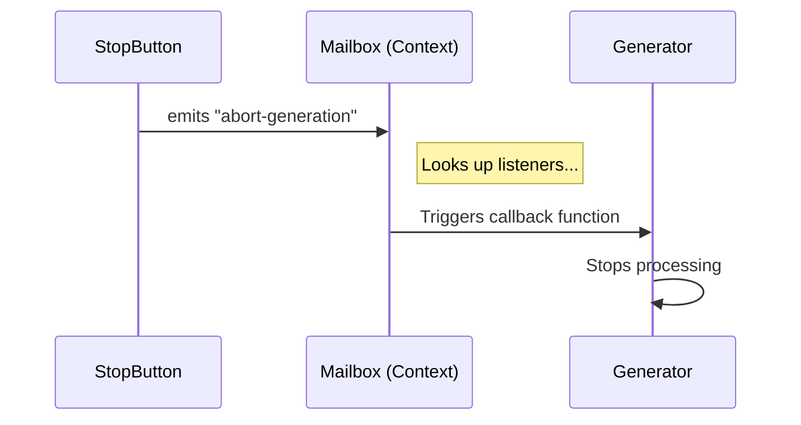

# Chapter 3: Message Handling & Queues

Welcome back! In the previous chapter, [Modal & Portal Layouts](02_modal___portal_layouts.md), we learned how to create floating windows and give them "spatial awareness." We now have a nice UI structure.

However, we have a new problem: **Communication**.

## The Problem: "The Tangled Telephone Lines"

Imagine you have a **"Stop Button"** inside a floating Modal at the bottom of the screen.
You also have an **"AI Text Generator"** running in the main window at the top.

When the user clicks "Stop," the Generator needs to halt.
In a standard React app, you might try to pass a function like `onStop` from the top component down through 10 layers of parents to reach the button. This is called "Prop Drilling," and it makes your code a nightmare to maintain.

This chapter introduces **Message Handling & Queues** to solve this:
1.  **The Mailbox:** A central radio station for disparate parts of the app to talk to each other.
2.  **QueuedMessageContext:** A visual manager that keeps streamed messages looking tidy.

---

## Part 1: The Mailbox (Asynchronous Communication)

Think of the **Mailbox** as a central hub or a "Walkie-Talkie" channel.
*   **Component A** (The Button) says: "I am broadcasting a 'cancel' signal!"
*   **Component B** (The Generator) is listening: "If I hear 'cancel', I will stop working."

Component A and Component B don't need to know each other exists. They just need access to the Mailbox.

### Key Concept: The Hub

We provide the Mailbox to the entire app using the `MailboxProvider`.

### Usage Example: Sending a Signal

Let's build that "Stop Button." It uses the `useMailbox` hook to get the walkie-talkie.

```tsx
import { useMailbox } from './mailbox';

function StopButton() {
  const mailbox = useMailbox();

  return (
    <Button onPress={() => {
      // Broadcast the signal!
      mailbox.emit('abort-generation');
    }}>
      STOP
    </Button>
  );
}
```

### Usage Example: Receiving a Signal

Now, somewhere completely different in the app, the Generator listens for that signal.

```tsx
import { useMailbox } from './mailbox';

function Generator() {
  const mailbox = useMailbox();

  useEffect(() => {
    // Define what happens when we hear the signal
    const onAbort = () => console.log("Stopping process...");
    
    // Start listening
    mailbox.on('abort-generation', onAbort);

    // Cleanup: Stop listening when we unmount
    return () => mailbox.off('abort-generation', onAbort);
  }, [mailbox]);

  return <Text>Generating...</Text>;
}
```

**Why is this better?**
You can move the `StopButton` anywhere—into a sidebar, a modal, or a popup—and it will still work without changing a single line of code in the `Generator`.

---

## Part 2: Visual Queues (`QueuedMessageContext`)

When building a TUI (Terminal User Interface) for AI, messages often stream in chunks. We need to distinguish between:
1.  **The First Chunk:** This might need a header or extra margin.
2.  **The Middle Chunks:** These should flow naturally.

If we don't manage this, the text looks like a wall of unreadable blocks. `QueuedMessageContext` helps us apply the correct "Indent" and "Padding" automatically.

### The Logic

The context calculates how much **Padding** a message box should have based on two factors:
1.  **`isFirst`**: Is this the start of a new message block?
2.  **`useBriefLayout`**: Is the user requesting a compact view?

### Usage Example: A Smart Message Container

Here is a component that wraps our text. It automatically knows if it should add padding or stay compact.

```tsx
import { QueuedMessageProvider, useQueuedMessage } from './QueuedMessageContext';

function MessageBlock({ isFirst, children }) {
  // 1. Wrap content in the Provider
  return (
    <QueuedMessageProvider isFirst={isFirst}>
      <MessageContent>{children}</MessageContent>
    </QueuedMessageProvider>
  );
}
```

### Checking the Context

Inside `MessageContent`, we can read the calculated values to style our text.

```tsx
function MessageContent({ children }) {
  // 2. Consume the calculated layout values
  const { paddingWidth, isFirst } = useQueuedMessage();

  return (
    <Box>
      {/* Show an arrow only for the first line */}
      {isFirst && <Text color="blue">➜ </Text>}
      
      {/* Indent content dynamically */}
      <Box paddingLeft={paddingWidth}>
        {children}
      </Box>
    </Box>
  );
}
```

**Result:**
*   If `useBriefLayout` is **false**: You get nice, readable indentation (`paddingWidth` = 4).
*   If `useBriefLayout` is **true**: The padding collapses to 0 for a compact view.

---

## Internal Implementation: How it all connects

Let's look under the hood to see how the signal flows through the system.

### The Mailbox Flow



### Code Walkthrough: The Mailbox Provider

Open `mailbox.tsx`. It is a wrapper around a utility class.

```tsx
// mailbox.tsx (Simplified)
export function MailboxProvider({ children }) {
  // 1. Create a stable instance of the Mailbox class
  const mailbox = useMemo(() => new Mailbox(), []);

  // 2. Pass it down to the whole app
  return (
    <MailboxContext.Provider value={mailbox}>
      {children}
    </MailboxContext.Provider>
  );
}
```

The `Mailbox` class itself (imported from utils) is simply an "Event Emitter"—a standard pattern in programming for handling lists of listeners.

### Code Walkthrough: The Queue Logic

Open `QueuedMessageContext.tsx`. This file does the math for visual styling.

```tsx
// QueuedMessageContext.tsx (Simplified)
const PADDING_X = 2; // Default indentation

export function QueuedMessageProvider({ isFirst, useBriefLayout, children }) {
  
  // 1. Calculate padding. If "Brief", use 0. Else use 2.
  const padding = useBriefLayout ? 0 : PADDING_X;

  // 2. Prepare the context value
  const value = {
    isQueued: true,
    isFirst,
    paddingWidth: padding * 2 // e.g., 4 spaces
  };

  // 3. Render the Box with the calculated padding applied immediately
  return (
    <QueuedMessageContext.Provider value={value}>
      <Box paddingX={padding}>{children}</Box>
    </QueuedMessageContext.Provider>
  );
}
```

**Key Takeaway:** By doing the math (`padding * 2`) inside the Provider, none of the child components need to know about "Brief Layouts" or math. They just ask: "How much padding should I use?" and the Context gives them the final number.

---

## Summary

In this chapter, we learned how to manage communication and flow:

1.  **Mailbox:** We decoupled our components. Buttons can send signals to invisible workers using a central "Event Emitter" instead of messy prop chains.
2.  **Queues:** We created a smart layout context that automatically handles indentation and spacing for streamed messages, keeping our UI clean whether it's in "Full" or "Brief" mode.

Now that our components can talk to each other and look good doing it, we need to manage the most complex part of our app: **Voice & Audio**.

[Next Chapter: Voice State Manager](04_voice_state_manager.md)

---

Generated by [Code IQ](https://github.com/adityasoni99/Code-IQ)