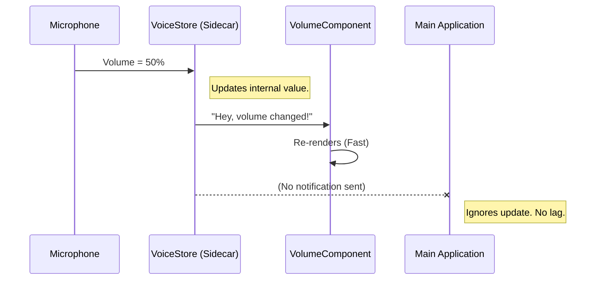

# Chapter 4: Voice State Manager

Welcome back! In the previous chapter, [Message Handling & Queues](03_message_handling___queues.md), we learned how to let different parts of our application talk to each other using a "Mailbox."

Now we face a performance challenge. We want to add **Voice Input** to our terminal. This introduces a specific problem: Audio data changes *extremely* fast.

## The Problem: "The Town Crier"

In standard React, when you update state, the component re-renders. If that component is high up in the tree (like `AppRoot`), the **entire application** re-renders.

Imagine your microphone hardware. It reports the volume level (to draw a visualizer) about **60 times per second**.

If we treat this volume level like normal state:
1.  Microphone says: "Volume is 10%."
2.  App says: "State changed! **Redraw the entire screen!**"
3.  Microphone says: "Volume is 12%."
4.  App says: "State changed! **Redraw the entire screen!**"

**The Result:** Your app freezes, the fans spin up, and the UI becomes unresponsive because it is trying to rebuild the whole world 60 times a second.

This chapter introduces the **Voice State Manager**, a specialized store designed to handle high-frequency updates without slowing down the rest of the app.

---

## The Solution: The "Sidecar" Store

We need a place to store data that lives *outside* the main React tree.

Think of the **Voice State Manager** as a "Sidecar" attached to your motorcycle (the App).
*   The Sidecar holds the noisy, fast-changing data (Volume, Status, Transcript).
*   The Motorcycle (Main App) drives smoothly, ignoring the Sidecar most of the time.
*   Only specific passengers (like a `VolumeBar` component) look at the Sidecar.

### Key Concept: Selectors

To make this work, components must be picky. They shouldn't listen to *all* voice changes. They should **Select** only what they need.

*   **Status Icon:** Only cares if `voiceState` changes (Idle -> Recording). It ignores volume changes.
*   **Volume Bar:** Only cares if `voiceAudioLevels` changes. It ignores transcript changes.

---

## Usage Example: Building a Voice UI

Let's build a simple UI that shows a status text ("Listening...") and a volume number.

### 1. Reading State with Selectors

We use the hook `useVoiceState`. Crucially, we pass it a **Selector Function**. This function tells the store exactly which piece of data we care about.

```tsx
import { useVoiceState } from './voice';

function StatusLabel() {
  // Only re-render when 'voiceState' changes
  // Ignore volume updates!
  const status = useVoiceState(s => s.voiceState);

  return <Text>Status: {status}</Text>;
}
```

**What happens?**
Even if the microphone volume changes 500 times, `StatusLabel` will **not** re-render. It stays asleep until `voiceState` flips from 'idle' to 'recording'.

### 2. Handling High Frequency Data

Now let's look at the component that *does* want the high-speed data.

```tsx
import { useVoiceState } from './voice';

function VolumeMeter() {
  // I WANT the high frequency updates!
  const levels = useVoiceState(s => s.voiceAudioLevels);
  const volume = levels[0] || 0; // Get first channel

  return <Text>Volume: {volume}</Text>;
}
```

**What happens?**
`VolumeMeter` will re-render constantly (60fps) to animate the volume. However, because it is isolated, it **only** redraws this one tiny text element. The rest of your heavy application stays completely still.

### 3. Updating the State

To change the state (e.g., when the user presses a key to start recording), we use `useSetVoiceState`.

```tsx
import { useSetVoiceState } from './voice';

function RecordButton() {
  // This hook is stable. It never causes re-renders.
  const setVoice = useSetVoiceState();

  return (
    <Button onPress={() => {
      // Direct update to the sidecar store
      setVoice({ voiceState: 'recording' });
    }}>
      Record
    </Button>
  );
}
```

---

## Internal Implementation: Under the Hood

How does this "Sidecar" actually work? It uses a pattern called **External Store Subscription**.

### The Flow



### Code Walkthrough

Let's examine `voice.tsx`. It relies on a powerful React hook called `useSyncExternalStore`.

#### 1. The Store Container
First, we create a plain JavaScript object to hold our state. This is not a React component; it's just data.

```tsx
// voice.tsx (Simplified)
const DEFAULT_STATE = {
  voiceState: 'idle',
  voiceAudioLevels: [],
  // ... other fields
};

// Create a standalone store (not inside React yet)
export const VoiceContext = createContext(null);
```

#### 2. The Provider
The Provider initializes the store once. Notice it uses `useState` with an initializer function to ensure the store is created exactly once.

```tsx
// voice.tsx
export function VoiceProvider({ children }) {
  // Create the store ONCE. 
  // This state holds the store ITSELF, not the voice data.
  const [store] = useState(() => createStore(DEFAULT_STATE));

  return (
    <VoiceContext.Provider value={store}>
      {children}
    </VoiceContext.Provider>
  );
}
```

#### 3. The Magic Hook (`useVoiceState`)
This is where the magic happens. We use `useSyncExternalStore`. This React hook is designed specifically to subscribe to data sources outside of React.

```tsx
// voice.tsx
export function useVoiceState(selector) {
  const store = useVoiceStore();
  
  // 1. Grab current snapshot
  const getSnapshot = () => selector(store.getState());

  // 2. Subscribe to changes
  // React will only re-render if selector(newState) !== selector(oldState)
  return useSyncExternalStore(store.subscribe, getSnapshot);
}
```

**Why is this code special?**
The `selector` logic runs *inside* React's internal checking loop. React checks: "Did the specific piece of data this component wants change?"
*   If **No**: React does nothing.
*   If **Yes**: React schedules a re-render for *just that component*.

---

## Summary

In this chapter, we solved the "High Frequency Update" problem.

1.  **The Challenge:** Updating global state 60 times a second kills performance.
2.  **The Solution:** We moved voice data into a specialized **Voice State Manager** (Sidecar).
3.  **The Technique:** We used **Selectors** to ensure components only re-render when the specific data they care about changes, keeping the rest of the UI snappy.

Now that we can record audio and manage high-speed data, we need a way to show the user what is happening across the entire app (errors, success messages, loading states).

[Next Chapter: Notification Pipeline](05_notification_pipeline.md)

---

Generated by [Code IQ](https://github.com/adityasoni99/Code-IQ)