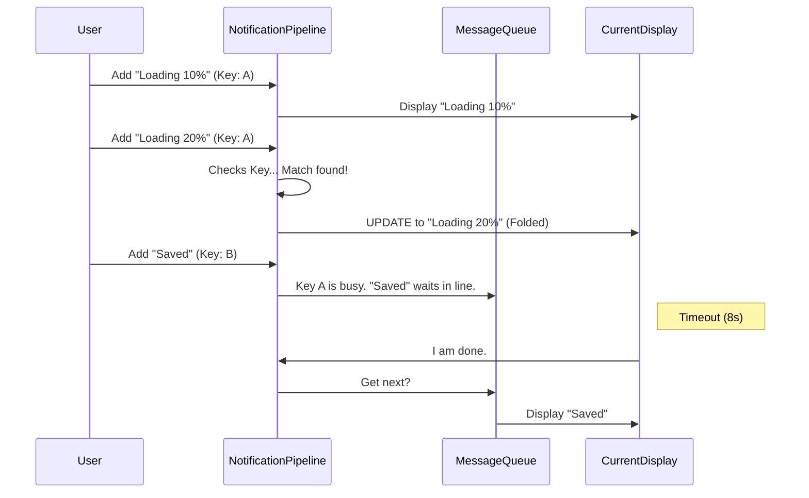

# Chapter 5: Notification Pipeline

Welcome back! In the previous chapter, [Voice State Manager](04_voice_state_manager.md), we built a high-speed sidecar to handle rapid audio updates.

Now that our app can listen and process data, it needs to talk back. But there is a risk. If the app talks too much—or too fast—it becomes annoying.

## The Problem: "The Spammy Waiter"

Imagine a waiter who updates you on every micro-action:
1.  "I am walking to the kitchen."
2.  "I am picking up the spoon."
3.  "I am walking back."
4.  "Here is your spoon."

In a Terminal UI, this looks like a wall of text scrolling by:
```text
Loading 10%...
Loading 20%...
Loading 30%...
Success!
```
This buries important information (like errors) and clutters the screen.

This chapter introduces the **Notification Pipeline**. It acts like a smart Traffic Controller. It knows that "Fire Alarm" is more important than "Radio Music," and it knows how to update a "Loading" message in place instead of spamming new lines.

---

## Part 1: The Traffic Controller

The pipeline manages three things that a standard `console.log` cannot:

1.  **Prioritization:** An error stops the show. A "File Saved" note waits its turn.
2.  **Timing:** Messages appear for a few seconds, then dismiss themselves.
3.  **Folding:** This is the magic. If a message says "Loading 10%" and a new one arrives saying "Loading 20%", the pipeline **merges** them into one notification that updates in real-time.

### Usage Example: Sending a Notification

We use the `useNotifications` hook to access the pipeline.

```tsx
import { useNotifications } from './notifications';

function SaveButton() {
  const { addNotification } = useNotifications();

  return (
    <Button onPress={() => {
      addNotification({
        key: 'save-success', // Unique ID
        text: 'File saved successfully!',
        priority: 'medium',
        color: 'green'
      });
    }}>
      Save
    </Button>
  );
}
```

**What happens?**
A green message appears. If another message is currently showing, this one enters a **Queue** and waits for the current one to finish (timeout).

---

## Part 2: The Magic of "Folding"

Folding solves the "Spammy Waiter" problem. It allows a new notification to absorb an old one if they share the same `key`.

### The Logic
1.  **Old Message:** `key: 'download'`, text: "10%"
2.  **New Message:** `key: 'download'`, text: "20%"
3.  **Pipeline:** "Wait, I already have 'download'. I'll just update the text instead of creating a new popup."

### Usage Example: A Progress Bar

Here is how we create a notification that updates itself.

```tsx
function Downloader() {
  const { addNotification } = useNotifications();

  const updateProgress = (percent) => {
    addNotification({
      key: 'download-job', // Same key every time!
      text: `Downloading... ${percent}%`,
      priority: 'medium',
      
      // The Fold Logic: Replace the old one with the new one
      fold: (prev, next) => next 
    });
  };
  // ... call updateProgress(10), updateProgress(20), etc.
}
```

**Result:**
The user sees a single notification box that animates: `Downloading... 10%` -> `Downloading... 20%`. No scrolling spam!

---

## Part 3: Emergency Interruptions (Priority)

Sometimes, you need to cut the line. If the internet connection dies, you don't want the error message to wait behind "File Saved."

We use `priority: 'immediate'` for this.

```tsx
addNotification({
  key: 'network-error',
  text: 'CONNECTION LOST!',
  priority: 'immediate', // Skips the queue!
  color: 'red',
  timeoutMs: 10000 // Stay longer (10s)
});
```

**What happens?**
1.  Any current message is instantly removed.
2.  The "CONNECTION LOST" message appears immediately.
3.  The previous message is paused and re-queued (if it wasn't finished).

---

## Internal Implementation: How it all connects

Let's look at how the pipeline makes decisions.

### The Flow



### Code Walkthrough: The Queue Processor

Open `notifications.tsx`. The core logic lives in `addNotification`.

#### 1. Handling Immediate Priority
First, the function checks if the new message is an emergency.

```tsx
// notifications.tsx (Simplified)
const addNotification = (notif) => {
  if (notif.priority === 'immediate') {
    // 1. Clear current timeout (stop auto-dismiss)
    clearTimeout(currentTimeoutId);

    // 2. Force update state immediately
    setAppState(prev => ({
       ...prev,
       notifications: {
         current: notif, // Hijack the screen
         // Put the old 'current' back into the queue
         queue: [prev.current, ...prev.queue] 
       }
    }));
    return;
  }
  // ... continue to normal logic
};
```

#### 2. The Folding Logic
If it's not immediate, we check if we can merge it.

```tsx
// notifications.tsx (Simplified)
// Inside setAppState...
if (notif.fold) {
  // Check if the CURRENT message has the same key
  if (prev.current?.key === notif.key) {
    // Run the user's fold function (usually returns 'next')
    const folded = notif.fold(prev.current, notif);
    
    return {
      ...prev,
      notifications: {
        current: folded, // Update in place!
        queue: prev.queue
      }
    };
  }
}
```

#### 3. Auto-Dismissal
We need a way to remove messages after `timeoutMs`. We use a recursive timeout pattern.

```tsx
// notifications.tsx (Simplified)
const processQueue = useCallback(() => {
  setAppState(prev => {
    const next = getNext(prev.queue); // Get highest priority item
    
    // Set a timer to clear THIS notification
    setTimeout(() => {
       // When time is up, clear current and run processQueue again
       processQueue(); 
    }, next.timeoutMs);

    return {
      notifications: { current: next, queue: remaining }
    };
  });
}, []);
```

This ensures that the pipeline never gets stuck. As soon as one message finishes, it wakes up and pulls the next one from the queue.

---

## Summary

In this chapter, we built a polite and efficient communication system:

1.  **Queues:** We prevent message overload by making low-priority alerts wait their turn.
2.  **Immediate Mode:** We allow critical errors to cut the line.
3.  **Folding:** We solved the "Spammy Waiter" problem by updating messages in place using unique Keys.

Our application is now fully interactive. It has visuals, layers, voice input, and a smart notification system.

But how do we know if it's actually working well? Are users hitting errors we don't see? In the final chapter, we will build a system to track the health of our app.

[Next Chapter: Telemetry & Stats Store](06_telemetry___stats_store.md)

---

Generated by [Code IQ](https://github.com/adityasoni99/Code-IQ)