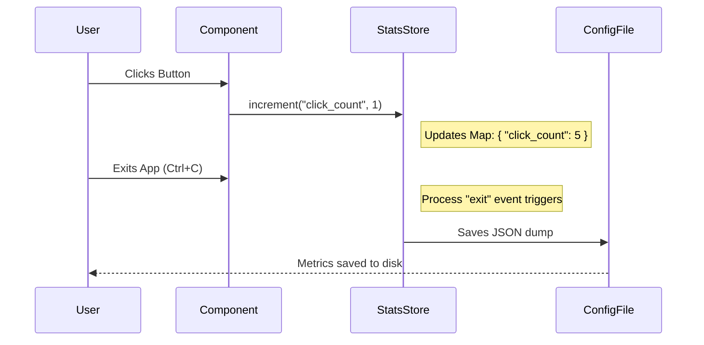

# Chapter 6: Telemetry & Stats Store

Welcome to the final chapter! In the previous chapter, [Notification Pipeline](05_notification_pipeline.md), we learned how to talk to the user.

Now we need to listen to the application itself.

## The Problem: "Flying Blind"

Imagine driving a car with a blacked-out dashboard. You are moving, but you don't know your speed, how much gas is left, or if the engine is overheating.

In software, this happens when you release an app.
*   **Is it slow?** You don't know.
*   **Are users clicking the new button?** You don't know.
*   **Are errors happening silently?** You don't know.

`console.log` is not enough. It scrolls away and doesn't do math (like calculating averages).

This chapter introduces the **Telemetry & Stats Store**. It acts as your application's dashboard, collecting metrics like counters, gauges, and timers to help you diagnose performance and usage.

---

## Part 1: The Three Instruments

Our Stats Store provides three main tools, similar to a car's dashboard:

1.  **Counter:** A simple clicker. Used for counting events (e.g., "Total Errors").
2.  **Gauge:** A needle that moves up and down. Used for current state (e.g., "Memory Usage", "Active Threads").
3.  **Timer (Histogram):** A stopwatch that remembers history. It calculates averages and percentiles (e.g., "How long did the AI take to reply?").

### Usage Example: Counting Events

Let's say we want to count how many times a user presses a "Copy" button. We use `useCounter`.

```tsx
import { useCounter } from './stats';

function CopyButton() {
  // 1. Get a counter function tied to a specific metric name
  const countCopy = useCounter('copy_actions_total');

  return (
    <Button onPress={() => {
      // 2. Increment the counter by 1
      countCopy(1); 
      copyTextToClipboard();
    }}>
      Copy Text
    </Button>
  );
}
```

**What happens?**
Somewhere in the background, `copy_actions_total` goes from 0 -> 1. At the end of the session, you'll see exactly how many times this feature was used.

---

## Part 2: Measuring Performance (Timers)

Timers are more complex. If an operation takes 100ms once, but 5 seconds the next time, an "Average" might mislead you. We need to know the distribution.

Our `useTimer` acts as a **Histogram**. It records values and automatically calculates the "P99" (the 99th percentile—meaning "99% of requests were faster than this").

### Usage Example: Timing an API Call

```tsx
import { useTimer } from './stats';

function AIResponder() {
  // 1. Create the timer tracker
  const recordLatency = useTimer('ai_response_time_ms');

  const generate = async () => {
    const start = Date.now();
    
    await callAI(); // The slow operation
    
    const duration = Date.now() - start;
    // 2. Record the duration
    recordLatency(duration);
  };
  
  // ...
}
```

**Result:**
When the app closes, the logs will show:
*   `ai_response_time_ms_avg`: 450ms
*   `ai_response_time_ms_p99`: 1200ms (This tells you that occasionally, it is quite slow!)

---

## Part 3: Visual Health (FPS Metrics)

In a Terminal UI, if your logic is too heavy, the interface feels "laggy." We call this a drop in **FPS** (Frames Per Second).

The `fpsMetrics` system is a specialized sensor that watches how often the screen repaints.

### Usage Example: The FPS Counter

This is usually displayed in a debug footer.

```tsx
import { useFpsMetrics } from './fpsMetrics';

function DebugFooter() {
  // 1. Get the metrics getter
  const getMetrics = useFpsMetrics();

  // 2. Read the current value
  const fps = getMetrics?.()?.fps ?? 60;

  return <Text color="gray">FPS: {fps}</Text>;
}
```

**Why is this separate?**
FPS updates constantly (every few milliseconds). We keep it separate from the main Stats Store to avoid overhead.

---

## Internal Implementation: How it all connects

How does the data get saved? The Stats Store is an **In-Memory Database** that lives as long as the app runs. When the app exits, it quickly flushes data to a file.

### The Flow



### Code Walkthrough: The Store Logic

Open `stats.tsx`. This file contains the logic for aggregating numbers.

#### 1. The Data Structure
The store is just a collection of JavaScript Maps.

```tsx
// stats.tsx (Simplified)
export function createStatsStore() {
  // Simple counters
  const metrics = new Map<string, number>();
  // Complex timers
  const histograms = new Map<string, Histogram>();

  return {
    increment(name, value = 1) {
      // Get current value, add new value, save it.
      const current = metrics.get(name) ?? 0;
      metrics.set(name, current + value);
    },
    // ... other methods
  };
}
```

#### 2. The Histogram Logic (Math)
When you record a time, we don't just save one number. We add it to a "Reservoir" (a sample list) so we can calculate percentiles later.

```tsx
// stats.tsx (Simplified)
observe(name, value) {
  let h = histograms.get(name);
  if (!h) {
    // Initialize if new
    h = { reservoir: [], count: 0, sum: 0, min: value, max: value };
    histograms.set(name, h);
  }
  
  h.count++;
  h.sum += value;
  // Add to the list of samples
  h.reservoir.push(value);
}
```

#### 3. The Auto-Save Feature
The most important part of telemetry is ensuring data isn't lost when the user quits. We use `process.on('exit')` inside the Provider.

```tsx
// stats.tsx (Simplified)
useEffect(() => {
  const flush = () => {
    const data = store.getAll();
    // Save to disk function
    saveCurrentProjectConfig(cfg => ({ 
      ...cfg, 
      lastSessionMetrics: data 
    }));
  };

  // Listen for the "death" of the process
  process.on('exit', flush);
  
  return () => process.off('exit', flush);
}, [store]);
```

This ensures that even if you press `Ctrl+C`, the application takes a millisecond to dump its stats to your config file before closing.

---

## Summary

In this final chapter, we built the "Black Box" recorder for our application:

1.  **Counters & Timers:** We used `useCounter` and `useTimer` to track *what* users do and *how long* it takes.
2.  **Aggregation:** Instead of logging every single event, the `StatsStore` mathematically combines them into useful summaries (averages, totals).
3.  **Persistence:** We learned how to hook into the process exit signal to save our data at the last possible second.

### Course Conclusion

Congratulations! You have completed the **context** project tutorial. You now understand the core architecture of a complex Terminal User Interface:

1.  [**Overlay:**](01_overlay___input_coordination.md) How to make things float.
2.  [**Modals:**](02_modal___portal_layouts.md) How to handle sizes in virtual windows.
3.  [**Messages:**](03_message_handling___queues.md) How components talk to each other.
4.  [**Voice:**](04_voice_state_manager.md) How to handle high-speed data.
5.  [**Notifications:**](05_notification_pipeline.md) How to queue user alerts.
6.  **Telemetry:** How to track if it all works.

You are now ready to build powerful, performant, and robust terminal applications. Happy coding!

---

Generated by [Code IQ](https://github.com/adityasoni99/Code-IQ)