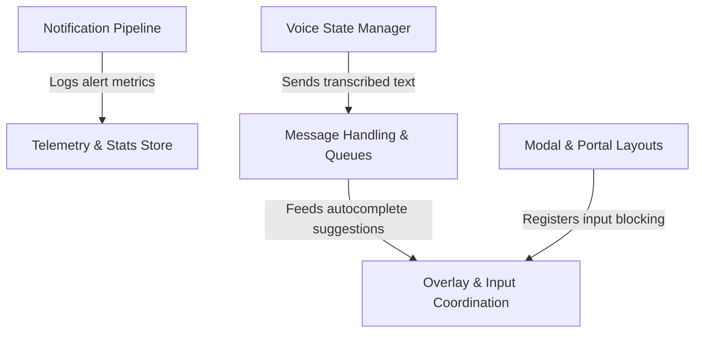

# Tutorial: context

This project provides the foundational **React contexts** and state management infrastructure for a complex **terminal-based user interface**. It orchestrates low-level UI concerns like **z-index emulation** (overlays and modals), captures and processes **voice input**, and manages asynchronous communication via a **notification pipeline** and **message mailbox**. Additionally, it includes a centralized **telemetry system** to monitor application performance and frame rates.

## Chapters

1. [Overlay & Input Coordination](01_overlay___input_coordination.md)
2. [Modal & Portal Layouts](02_modal___portal_layouts.md)
3. [Message Handling & Queues](03_message_handling___queues.md)
4. [Voice State Manager](04_voice_state_manager.md)
5. [Notification Pipeline](05_notification_pipeline.md)
6. [Telemetry & Stats Store](06_telemetry___stats_store.md)

---

Generated by [Code IQ](https://github.com/adityasoni99/Code-IQ)