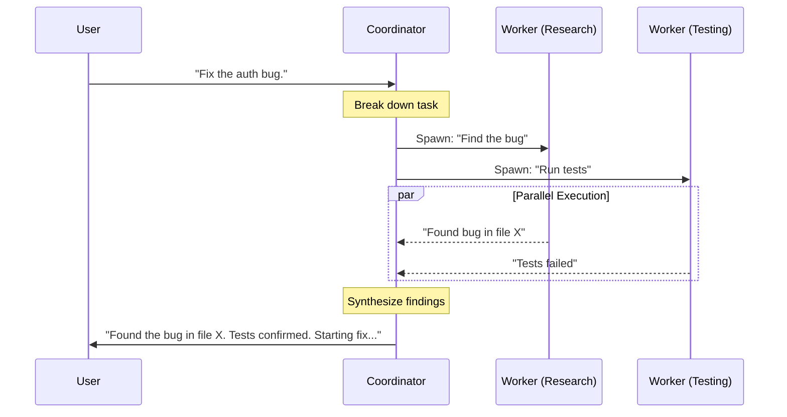

# Chapter 1: Coordinator Role

Welcome to the **Coordinator** project! In this first chapter, we are going to explore the core philosophy behind this system: the **Coordinator Role**.

## The Problem: The Overwhelmed Solo Developer
Imagine you are building a house. If you try to lay the bricks, install the plumbing, wire the electricity, and paint the walls all by yourself, at the exact same time, you will likely make mistakes or get exhausted.

Standard AI coding assistants often act like this "solo developer." They try to hold the entire context of a complex project in one thread, executing tasks sequentially. This leads to:
1.  **Context Overload**: The conversation gets too long, and the AI forgets earlier details.
2.  **Slow Execution**: Tasks happen one by one (linear), even if they could be done at the same time.

## The Solution: The Project Manager
The **Coordinator Role** changes the AI's job description. Instead of being the *solo developer*, the AI becomes the **Project Manager**.

The Coordinator's job is to:
1.  **Plan**: Break a big user goal into smaller tasks.
2.  **Delegate**: Hire "Workers" (sub-agents) to execute those tasks.
3.  **Synthesize**: Read the workers' reports and summarize the results for the user.

### Central Use Case: "Fix the Bug"
Let's say a user reports: *"There is a null pointer error in the authentication module."*

**Without Coordinator:**
The AI reads the code, tries to reproduce it, writes a fix, and runs tests—all in one long, messy conversation.

**With Coordinator:**
1.  **Coordinator**: "I will investigate."
    *   *Spawns Worker A*: "Search the code for null pointer risks in `auth/`."
    *   *Spawns Worker B*: "Run the existing test suite to find failures."
2.  **Workers**: Run in parallel.
3.  **Coordinator**: "Worker A found the bug. Worker B confirmed tests failed. I will now spawn Worker C to apply the fix."

## Core Concepts

### 1. The Orchestrator
The Coordinator does not write files or run shell commands directly (unless they are trivial). Its primary "tools" are **management tools**. It thinks in terms of *delegation*.

### 2. Parallelism
Because the Coordinator delegates work, it can run multiple tasks at once. It can research a bug while simultaneously checking documentation.

### 3. Synthesis
The Coordinator is the only one who talks to the User. Workers report to the Coordinator, and the Coordinator translates that technical data into a helpful summary for the User.

## Implementation: Under the Hood

How does the AI know it's a Coordinator? It all starts with the **System Prompt**. When the session begins, we inject specific instructions that define this persona.

### High-Level Flow

Here is what happens when you ask the Coordinator a question:



### The Code: Defining the Persona

The logic relies on checking if "Coordinator Mode" is active and then supplying the correct "System Prompt" (the AI's core instructions).

*File: `coordinatorMode.ts`*

```typescript
// Checks if the Coordinator feature flag is on
export function isCoordinatorMode(): boolean {
  if (feature('COORDINATOR_MODE')) {
    // Returns true if the env var is set to '1'
    return isEnvTruthy(process.env.CLAUDE_CODE_COORDINATOR_MODE)
  }
  return false
}
```

If this returns `true`, we generate the special System Prompt:

```typescript
export function getCoordinatorSystemPrompt(): string {
  // We define the specific role clearly
  return `You are Claude Code, an AI assistant that orchestrates software engineering tasks...

  ## 1. Your Role
  You are a **coordinator**. Your job is to:
  - Direct workers to research, implement and verify code changes
  - Synthesize results and communicate with the user`
}
```

### The Tools

To act as a manager, the Coordinator needs specific tools. These are defined in the prompt instructions so the AI knows they exist.

```typescript
/* 
   Inside getCoordinatorSystemPrompt(), we list the tools.
   Notice the Coordinator creates workers via AGENT_TOOL_NAME.
*/

// ...
// ## 2. Your Tools
// - **AgentTool** - Spawn a new worker
// - **SendMessageTool** - Continue an existing worker
// - **TaskStopTool** - Stop a running worker
// ...
```

The Coordinator uses `AgentTool` to create a worker. We will cover the lifecycle of these workers in detail in [Worker Lifecycle Management](02_worker_lifecycle_management.md).

### Handling Context

One of the biggest advantages of the Coordinator is **Context Hygiene**. The Coordinator doesn't need to see every line of code read by a worker.

```typescript
// From coordinatorMode.ts
export function getCoordinatorUserContext(...): { [k: string]: string } {
  if (!isCoordinatorMode()) {
    return {}
  }
  
  // We tell the Coordinator what tools its WORKERS have access to.
  // The Coordinator doesn't use these tools directly, but needs to know
  // what its employees can do (e.g., "Workers have access to Bash...").
  return { 
    workerToolsContext: `Workers spawned via the AgentTool have access to...` 
  }
}
```

By separating the "Manager" context from the "Worker" context, we keep the main conversation clean and focused on high-level goals.

## Summary

In this chapter, we learned:
1.  **The Coordinator Role**: An abstraction where the AI acts as a project manager, not a direct executor.
2.  **Motivation**: This solves context overload and allows for parallel work.
3.  **Implementation**: It is achieved by swapping the System Prompt and giving the AI tools to spawn sub-agents (`AgentTool`).

Now that we understand *who* the Coordinator is, we need to learn how it hires and manages its team.

[Next Chapter: Worker Lifecycle Management](02_worker_lifecycle_management.md)

---

Generated by [Code IQ](https://github.com/adityasoni99/Code-IQ)