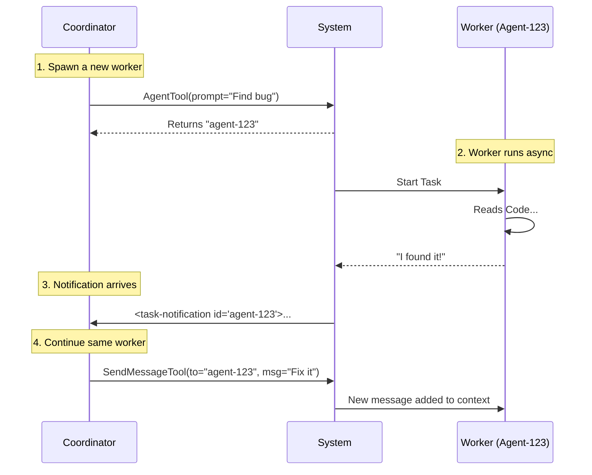

# Chapter 2: Worker Lifecycle Management

In the previous chapter, [Coordinator Role](01_coordinator_role.md), we introduced the Coordinator as a "Project Manager" who delegates work. Now, we will look at **how** that delegation actually happens.

In this chapter, we will learn how to hire, direct, and dismiss the sub-agents known as **Workers**.

## The Motivation: The Pizza Shop Analogy

Imagine you are running a pizza shop.
1.  **Spawning:** You hire a chef to make a pepperoni pizza.
2.  **Async Work:** You don't stand over their shoulder. You go help a customer at the front counter while they bake.
3.  **Notification:** The chef rings a bell: "Pizza is ready!"
4.  **Continuation:** You tell that *same* chef: "Great, now slice it into 8 pieces."
5.  **Stopping:** If the customer cancels, you tell the chef: "Stop baking!"

Without **Lifecycle Management**, you would have to hire a brand new chef just to slice the pizza, which is inefficient because the new chef doesn't know where the pizza is.

## Core Concepts

The Coordinator manages workers using three specific tools. Think of these as the buttons on a manager's control panel.

### 1. Spawning (`AgentTool`)
This is the "Hire" button. You use this when you have a specific task that requires a fresh perspective or a new set of skills.

**Input (Coordinator calls tool):**
```javascript
// Spawn a worker to research a bug
AgentTool({
  subagent_type: "worker",
  description: "Investigate auth bug",
  prompt: "Search src/auth for null pointer exceptions..."
})
```

**Output:**
The system returns a `task_id` (e.g., `agent-123`). The Coordinator must remember this ID to talk to this worker later.

### 2. Monitoring (Async Notifications)
Workers run in parallel. When a worker finishes, the Coordinator receives a **Task Notification**. This isn't a tool the Coordinator uses; it's a message the Coordinator *receives*.

**Input (System sends to Coordinator):**
```xml
<task-notification>
  <task-id>agent-123</task-id>
  <status>completed</status>
  <result>Found the bug in file X...</result>
</task-notification>
```

We will dive deeper into the specific format of these messages in [Task Notification Protocol](03_task_notification_protocol.md).

### 3. Continuing (`SendMessageTool`)
This is the "Reply" button. If a worker has done good work (e.g., found a file) and you want them to do the next step (fix the file), you continue the conversation. This preserves their **Context**.

**Input (Coordinator calls tool):**
```javascript
// Tell existing agent 'agent-123' to apply a fix
SendMessageTool({
  to: "agent-123",
  message: "Great find. Now edit that file to add a null check."
})
```

### 4. Stopping (`TaskStopTool`)
This is the "Halt" button. If a user changes their mind, or if a worker is taking too long/hallucinating, the Coordinator can force them to stop.

**Input (Coordinator calls tool):**
```javascript
// Stop the worker immediately
TaskStopTool({
  task_id: "agent-123"
})
```

## Implementation: Under the Hood

How does the system handle these lifecycle events? Let's look at the flow of a typical "Research and Fix" cycle.



### Defining the Tools

The Coordinator knows these tools exist because they are injected into its System Prompt (as seen in `coordinatorMode.ts`).

Here is a simplified view of how the tools are defined in the code constants:

```typescript
// From tools/AgentTool/constants.ts
export const AGENT_TOOL_NAME = 'AgentTool'

// From tools/SendMessageTool/constants.ts
export const SEND_MESSAGE_TOOL_NAME = 'SendMessageTool'

// From tools/TaskStopTool/prompt.ts
export const TASK_STOP_TOOL_NAME = 'TaskStopTool'
```

### The "Manager's Handbook": When to Spawn vs. Continue

The logic for choosing between `AgentTool` (Spawn) and `SendMessageTool` (Continue) is critical for efficient lifecycle management.

#### Scenario A: High Context Overlap -> **Continue**
If a worker just spent 5 minutes reading documentation to understand a library, you should use `SendMessageTool` to ask them to write the code. They already have the documentation in their "memory" (context).

```typescript
// GOOD: Reusing the expert
SendMessageTool({
  to: "agent-researcher",
  message: "Based on the docs you read, write the connection function."
})
```

#### Scenario B: New Domain -> **Spawn Fresh**
If you just finished fixing a CSS bug and now need to fix a Database bug, spawn a new worker. The CSS context is "noise" that might confuse the Database worker.

```typescript
// GOOD: Clean slate for a new task
AgentTool({
  subagent_type: "worker",
  prompt: "Check the SQL migration files for errors."
})
```

## Summary

In this chapter, we learned:
1.  **Workers are Independent**: They run asynchronously and report back when done.
2.  **Lifecycle Tools**:
    *   `AgentTool`: Hire a new worker (Spawn).
    *   `SendMessageTool`: Give new instructions to an existing worker (Continue).
    *   `TaskStopTool`: Cancel a task (Stop).
3.  **Management Strategy**: Reuse workers when they have relevant context; spawn new ones to keep context clean.

Now that we know how to start and stop workers, we need to understand exactly *how* they talk back to us. How does the Coordinator know a worker finished?

[Next Chapter: Task Notification Protocol](03_task_notification_protocol.md)

---

Generated by [Code IQ](https://github.com/adityasoni99/Code-IQ)