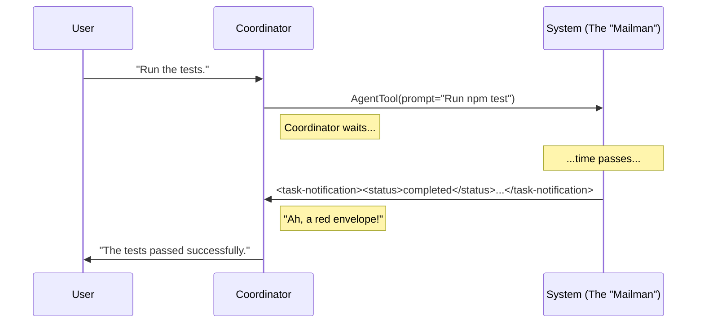

# Chapter 3: Task Notification Protocol

Welcome to Chapter 3! In the previous chapter, [Worker Lifecycle Management](02_worker_lifecycle_management.md), we learned how the Coordinator acts like a manager, hiring (spawning) and directing workers using tools like `AgentTool`.

But once you hire a worker and send them off to do a task, how do you know when they are finished? Do they shout? Do they tap you on the shoulder?

In this chapter, we will explore the **Task Notification Protocol**, the strict "paperwork" system workers use to report their results back to the Coordinator.

## The Problem: The Noisy Room

Imagine the Coordinator is sitting in a room.
1.  **The User** is sitting across the table, asking questions ("Fix this bug!").
2.  **The Workers** are in the back room, running tests and writing code.

If a Worker just walked in and shouted "I'm done!", the Coordinator might get confused. Was that the User speaking? Was that a Worker? Which Worker?

To solve this, we enforce a **Protocol**. Workers are not allowed to just "talk." They must submit a formal report in a specific format.

### Central Use Case: The Asynchronous Callback
When a worker finishes a long task (like running a test suite), the system needs to "wake up" the Coordinator and say: "Hey, Agent-123 finished successfully. Here is the output."

We achieve this by injecting a special message into the chat that looks like this:

```xml
<task-notification>
  <task-id>agent-123</task-id>
  <status>completed</status>
  <result>Tests passed.</result>
</task-notification>
```

## Core Concept: The XML Envelope

The Coordinator is an AI. It understands text. To make sure it doesn't mistake a worker's report for a user's chat message, we wrap the report in **XML tags**.

Think of `<task-notification>` as a bright red envelope. When the Coordinator sees this envelope, it knows:
1.  **Do not reply to the sender** (it's an automated system, not a human).
2.  **Read the contents** to update its internal plan.
3.  **Synthesize the result** for the User.

### The Anatomy of a Notification

Let's look at the structure of a standard notification message.

```xml
<task-notification>
  <!-- 1. Who sent this? -->
  <task-id>agent-researcher-01</task-id>
  
  <!-- 2. Did it work? (completed | failed) -->
  <status>completed</status>
  
  <!-- 3. What is the outcome? -->
  <result>Found the file at src/index.ts</result>
</task-notification>
```

#### 1. `<task-id>` (The Badge Number)
This matches the ID returned when you first called `AgentTool`. This is crucial. If the Coordinator wants to ask follow-up questions, it uses this ID with the `SendMessageTool` (as learned in [Worker Lifecycle Management](02_worker_lifecycle_management.md)).

#### 2. `<status>` (The Traffic Light)
*   **completed**: The worker finished successfully.
*   **failed**: The worker crashed or couldn't complete the instruction.
*   **killed**: The Coordinator stopped the worker manually.

#### 3. `<result>` (The Payload)
This is the text generated by the worker. It might be a summary of code changes, a list of bugs found, or the output of a script.

## The Flow: How It Happens

Here is how the message flows from the System to the Coordinator.



## Implementation: Under the Hood

How does the Coordinator know to expect this XML? It isn't magic; we simply tell it to expect it in the **System Prompt**.

### Defining the Schema

In the file `coordinatorMode.ts`, we define the rules of engagement. We explicitly teach the AI how to parse these messages.

```typescript
// From coordinatorMode.ts
export function getCoordinatorSystemPrompt(): string {
  return `...
  ### AgentTool Results
  
  Worker results arrive as user-role messages containing <task-notification> XML.
  Distinguish them by the <task-notification> opening tag.
  ...`
}
```

By describing the format in the prompt, the LLM learns to treat these messages as data packets rather than conversation.

### The Parsing Logic

The prompt also defines the exact fields. This ensures the AI looks for `task-id` and `result` specifically.

```typescript
// From coordinatorMode.ts - explaining the fields to the AI
/*
Format:
<task-notification>
  <task-id>{agentId}</task-id>
  <status>completed|failed|killed</status>
  <summary>{human-readable status summary}</summary>
  <result>{agent's final text response}</result>
</task-notification>
*/
```

### Handling the "User" Role
Technically, these messages are inserted into the chat history with the role of `user`.

*   **Why?** Most LLM APIs only allow `user` or `assistant` roles.
*   **The Trick:** The Coordinator is trained (via the prompt above) to see that although the message *says* it comes from "User", the content `<task-notification>` means it actually comes from the System/Worker.

## Example: A Full Interaction

Let's look at a concrete example of how the Coordinator processes a notification.

### 1. The Trigger
The Coordinator spawns a worker to check a database.
```javascript
// Coordinator output
AgentTool({ 
  subagent_type: "worker",
  prompt: "Check database connection..." 
})
```

### 2. The Notification
The system inserts this message into the chat stream:

```xml
<!-- Incoming Message (Role: User) -->
<task-notification>
  <task-id>agent-db-check</task-id>
  <status>failed</status>
  <result>Connection refused: Port 5432 closed.</result>
</task-notification>
```

### 3. The Reaction
The Coordinator reads the XML. It sees `status: failed`. It decides to report this to the human user.

```text
// Coordinator output (to User)
"The worker failed to connect to the database. It seems Port 5432 is closed."
```

Notice the Coordinator did **not** say "Thank you for the notification." It simply ingested the data and updated the user.

## Summary

In this chapter, we learned:
1.  **The Protocol**: Workers use XML to communicate, creating a clear distinction between human chat and machine reports.
2.  **The Envelope**: `<task-notification>` is the tag that signals "This is a worker report."
3.  **The Link**: The `<task-id>` inside the notification allows the Coordinator to link the result back to the specific worker spawned in the previous chapter.

Now that the Coordinator can send work out (Chapter 2) and get results back (Chapter 3), we need to figure out: **What exactly does the worker know?** Does it know the whole codebase? Does it know what the user just said?

We will answer this in the next chapter on **Context Hygiene**.

[Next Chapter: Dynamic Context Injection](04_dynamic_context_injection.md)

---

Generated by [Code IQ](https://github.com/adityasoni99/Code-IQ)